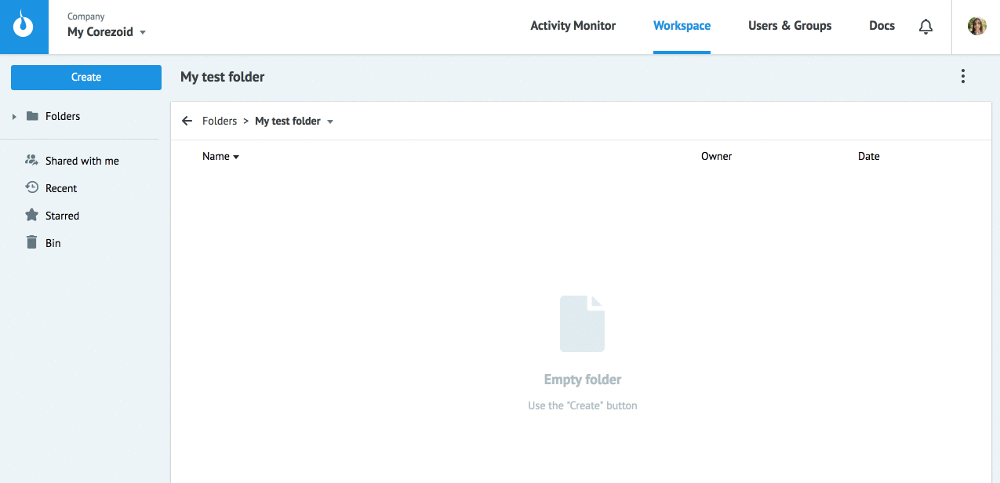
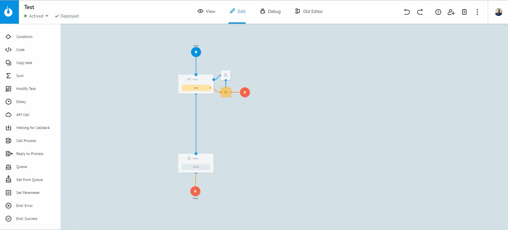
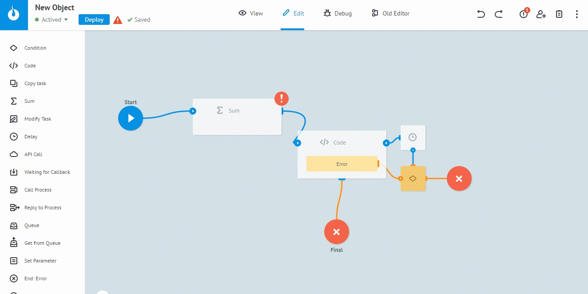
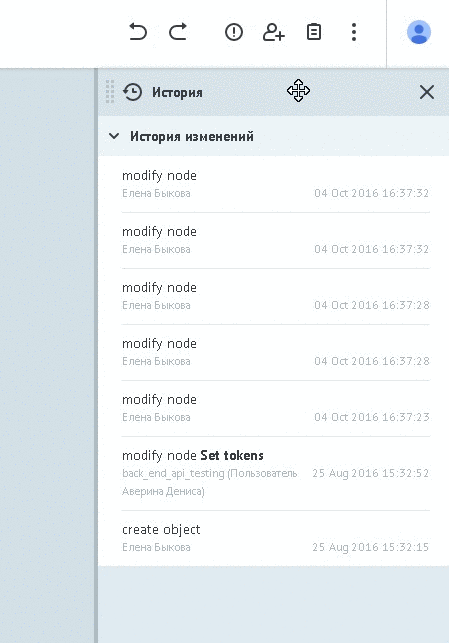
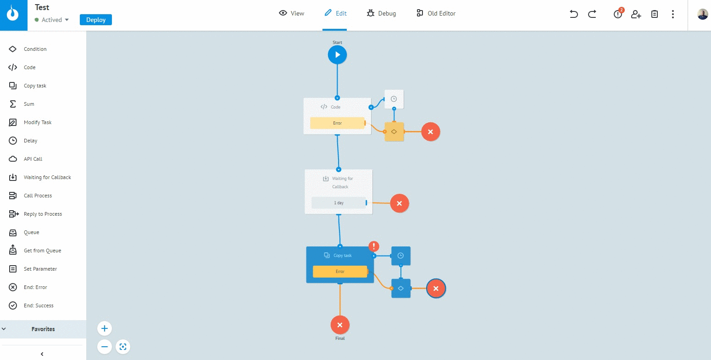

## Process creation

Unlike [state diagram](state-diagram.md), process:
-   has an access to **[the full set of logics](../nodes/README.md)**
-   has a limit on the number of tasks in the process (except final nodes) - 100 000 tasks .

To create process:
* Select **Create** → **Process**
* specify process title, description (optional) and press "OK"

The newly created process contains 2 nodes - start and final.

Click on the start node to open panel with process info.

Press button **Generate connection data**.
`ID Process`, `Login`, `Secret key` are used exclusively for the secure connection as described in section ["Create - new request"](../../api/v1/upload-modify.md)

Buttons `Copy webhook via JSON`, `Copy webhook via XML`, `Copy webhook via NVP` copy direct URL of process to clipboard to upload data into process in different formats.

Connection data and direct URLs are also available in folder with processes.
Select the process, click **View details** → tab **Webhook**:

`URL for JSON`, `URL for NVP`, `URL for XML` - direct links to upload files to process in defferent formats.

## Process editing

* Process changes are fixed only after pressing `Deploy` button
* Saving changes every 10 seconds.
* **Undo/Redo** are applicable for last 20 changes

* changes can be rolled back to the deployed version

* With simultaneous editing by multiple users of the process, a corresponding message displayed about the availability of another version of the process
* Change history of the process

* If there are any any errors (blank fields, lack of links etc) the process can't be saved. `Process Errors` shows the error list.
Click on the error to move the focus to the node with error and edit logic settings

