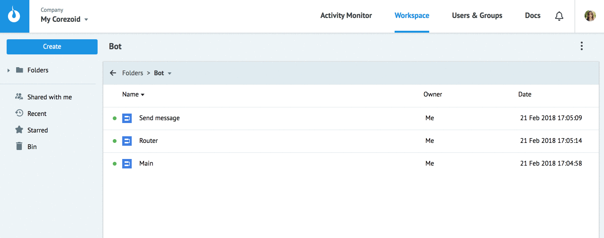
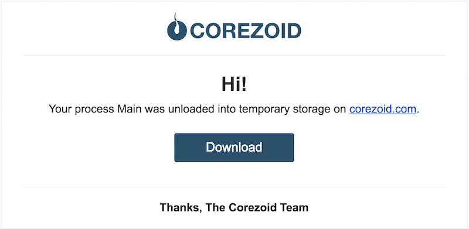
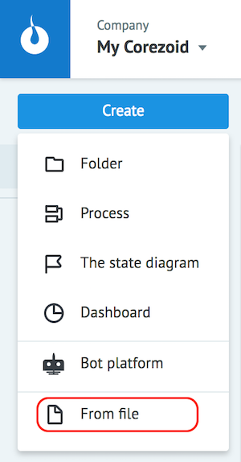

# Objects export / import

## Export

You can export Corezoid objects into **`json`** file.

In order to export the object from Corezoid
1. Select it and press **Download**.
2. Press **to file** in the notification of a successful unloading
3. Select folder and save file

file with the name of the format **object_111111_1519247559.json** will appear on your computer in specified folder, where

* `object` - object type **folder**, **conv** (process or state diagram), **dashboard**
* `111111` - object ID
* `1519247559` - unload time (unix timestamp)

> If the process has links to other processes, you must export the folder that contains the files.

## Import

In order to import object to Corezoid press **Create → From file**

Select **json** file with Corezoid object from your computer.

As a result, an object will be created in the current folder.

