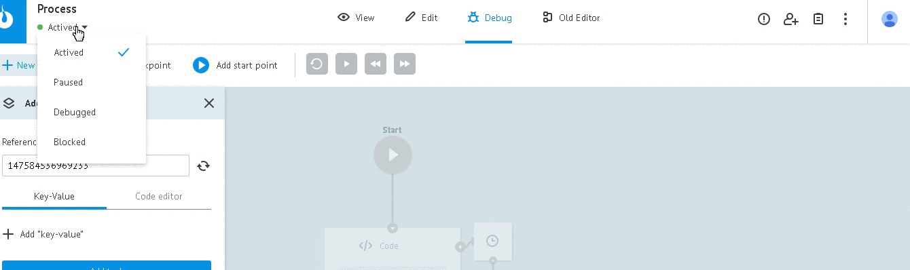
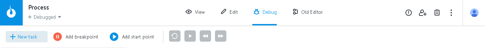
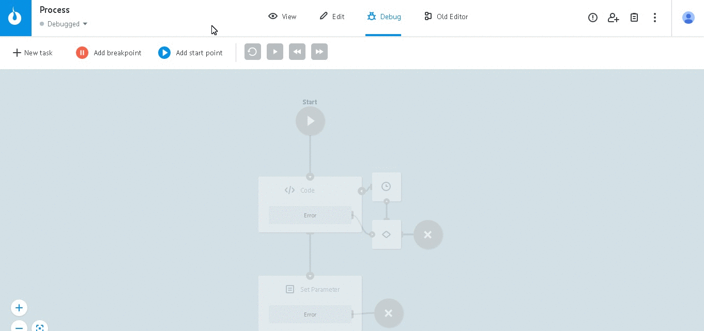
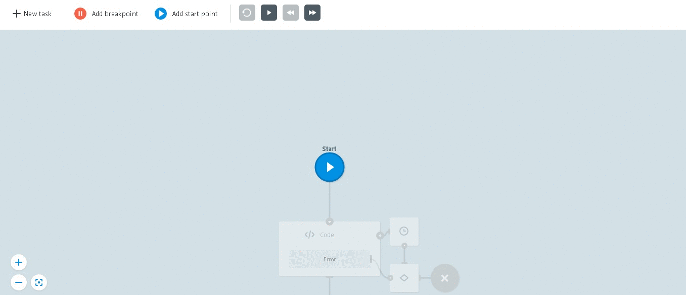
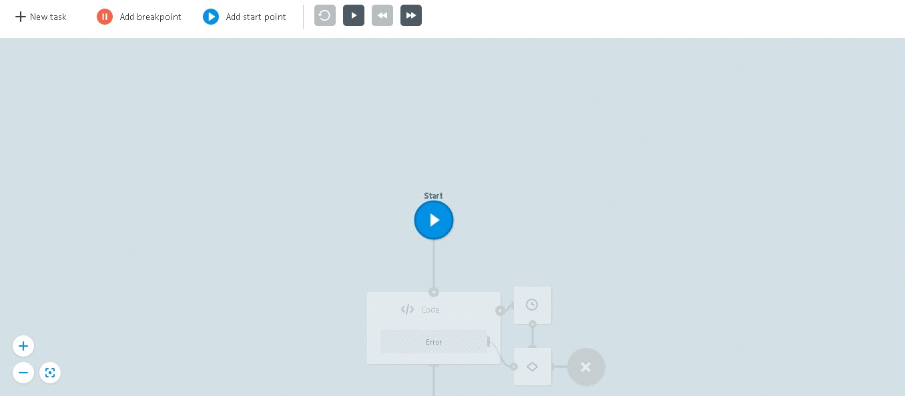
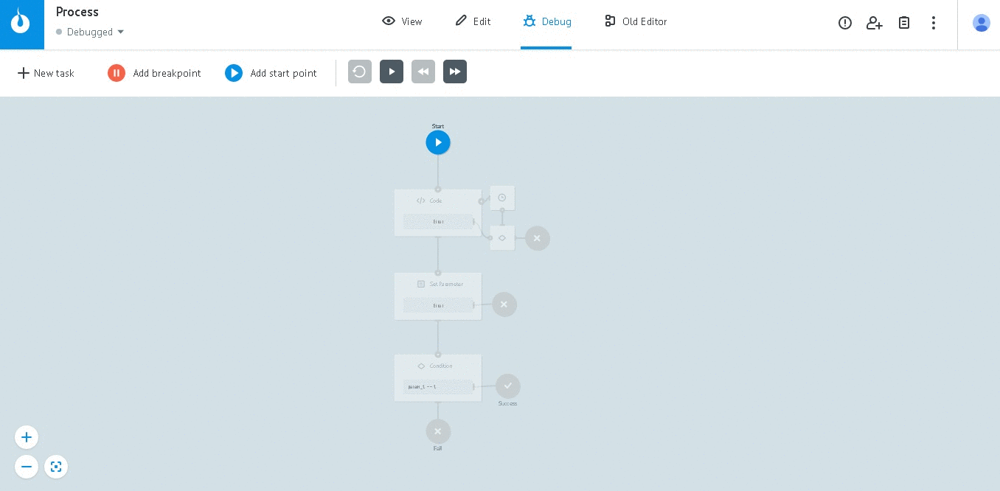
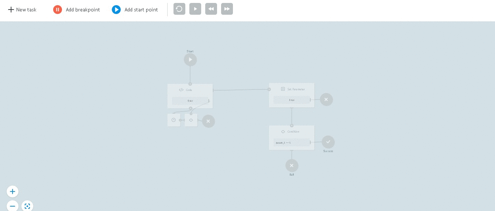

# Process debugging

For process debugging go to `Debug` mode and switch its status to `Debugged`

##Debug tools

* `+ New task` - adding parameters and launch of test task
* `Add breakpoint` - addition "breakpoint" during debugging
* `Add start point` - addition debugging start point добавление точки старта отладки
* `Controls for debugging mode` - Repeat, Start/Stop, Step back, Step forward

####New task

In order to add parameters and send test task:

* press `+ New task`
* press `+ Add "key-value"`
* add required parameters
* in case of need, specify task refrence in `Reference` field
* press `Add task`

Using `controls of debugging process management` you can manage it: step by step moving through process, repeat debugging, start debugging.

Task parameters can be edited directly in debugging process.

####Breakpoint -

It is the point where debugging mode will be paused.

In order to **add breakpoint**, take it from pannel and put it on the right place.

In order to **remove breakpoint**, select it and press Delete button on your device's keybord.

####Start point -

this is new debugging start point.

`Start point` can be added only in one instance.

In order to **add Start point**, take it from pannel and put it on the right place.

In order to **delete Start point**, select it and press Delete button on your device's keybord.

##Debugging with Delay

If there are additional conditions in logic ([Delay logic](https://doc.corezoid.com/ru/interface/nodes/timer.html)),
then you will have to choose a path for next task in the appropriate stage of debugging.

