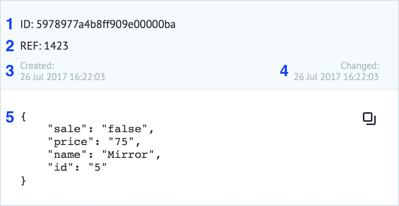

# Tasks
  
**Task** is a set of data in JSON written in key/ value pairs ("key":"value").
  
The maximum task size limit - 128 KB.
  
The example of task in process:
  

  
1 - task ID (a unique value in the entire system)
  
2 - task reference (a unique value in the current process)
  
3 - date and time when the task was created
  
4 - date and time when the task was changed
  
5 - JSON object which contains current task parameters
  
-----

* [Task parameters](task_parameters.md)
* [Adding tasks to the process](adding_tasks.md)
* [Task archive](task_archive.md)
* [Tasks export](export_to_csv.md)
* [Functions](en/interface/functions/README.md)
