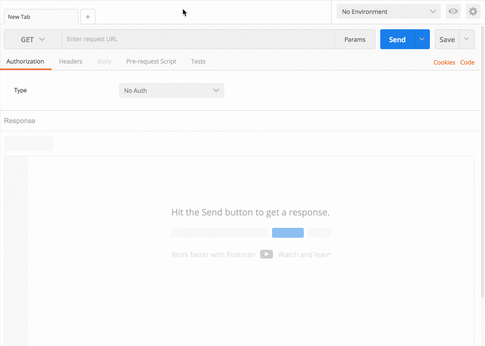

# Loading data via Direct url
  
**Direct url** is used to load data into the process (JSON, NVP, XML).
  
To get the **Direct url** of process:
1. Select start node
2. Copy **Direct url** in the required format from block “Connection data”
  

  
To test how it works use **Postman**.
  
Request example:
* Type - **POST**
* URL - **Direct url** from the clipboard
* Body - request body, for example `{"text":"Hello!"}`
* type of Body - **raw**
* Content/type - **application/json**
  

    
The [response](https://doc.corezoid.com/ru/api/spec.html) will contain task ID (parameter `"obj_id"` of object `"ops"`).

  
