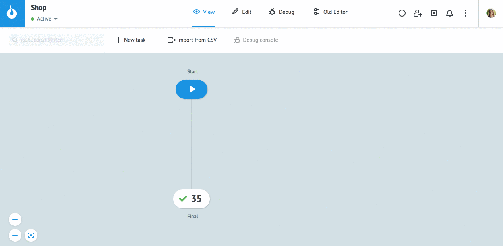

# Tasks export

Switch to **View** mode and select node with tasks.
  
Press **Export to CSV** in **Task archive**.
  
Specify range for tasks export in **Basic settings** (fields **Custom range**) or select one of the preset time intervals.

Range for one export can't exceed **50 000** tasks.

Select [**System Parameters**](https://doc.corezoid.com/en/interface/tasks/task_archive.html#system-parameters) (if necessary).

Click on the checkbox **Select all** or select only the required parameters.

> **Please note!** Parameters `create_time` and `change_time` unload in unix time format.

Press button **Export**.

Click on the link in message **"File download success to file"** and save the file.
  

  
Specific of downloaded file:
* the first row contains parameter names in the appropriate order
* one row = one task
* parameters are separated by "|".
  
> **Please note!** Task export from nodes `End: Error` and `End: Success` in [Process](https://doc.corezoid.com/en/interface/process_and_state/create_process.html) is possible for a short period (until they are deleted). 
For the long-term storage should use [State diagram](https://doc.corezoid.com/en/interface/process_and_state/state_diagramm.html).
