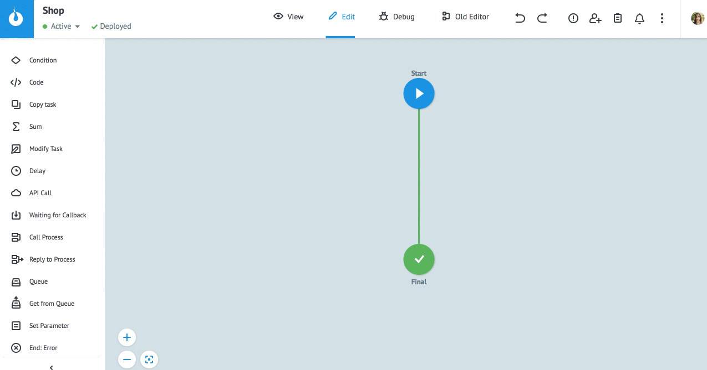
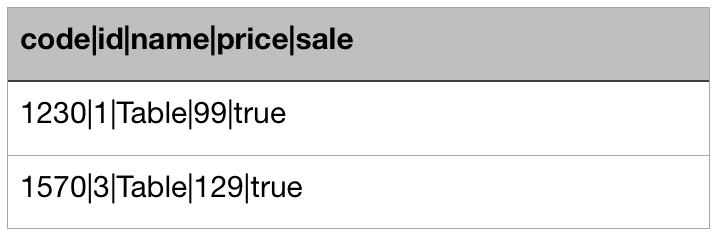
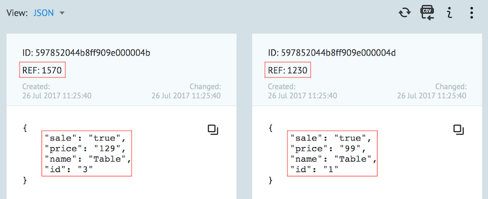

# Import from file

Press **Import from CSV** in View mode.

Click on **Select a file** and select [CSV file](#file-requirements) on disk. 

Specify:
* **Divider** - column separators
* **Encoding** - file encoding

Press **Next**.

> **Please note!** If you've chosen wrong delimiter in the previous step, table contents will not be divided into columns. Press **Back** and select correct delimiter.

Enable option **"Parameters names are in first row"** if the first row of your file contains parameter names. 
If this option is disabled new tasks will be added with parameter names "key1", "key2", …
    
To specify task reference:

* in advance, include the field to the file 
* click on this parameter name 
* replace it with `Reference`  
* press **Import**
  

  
Message with the result of loading data from a file contains the number of tasks:

**Success** - loaded into the process

**Error** - not loaded due to an error

**from** - total in file

In case of import errors you get CSV file with errors description.
Fix errors and try to repeat import.

----------------------------------------------------------------------------
### File Requirements
  
File format - **CSV** (a simple file format used to store tabular data).

Allowed delimiters:
  
* ,
* ;
* |
  
The first row of the file is the parameter names.

The columns under the parameter names are their values.

1 row in file (except the first) = 1 task in process

The maximum number of rows - **100 000**.

The parameter name cannot contain spaces.

**The example of CSV file** with three rows:
* the first row contains parameters’ names
* the other two rows - two future tasks with reference from column `code`
  

  
Task in the process after file was imported:
    

