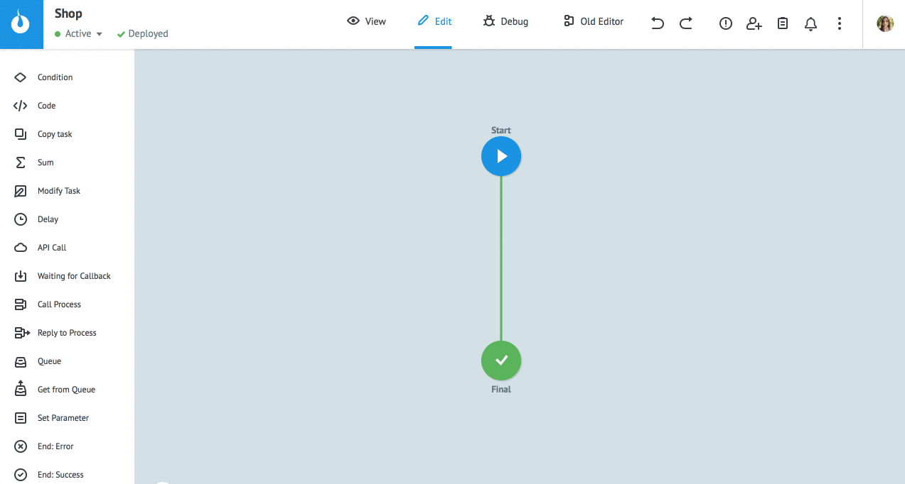
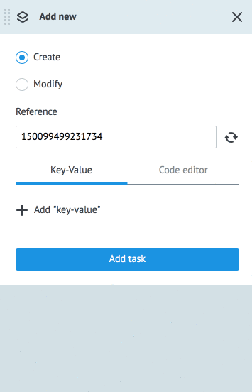

# Manual adding task
  
To add new task:
1. Switch to the **View** mode.
2. Press `New task`.
3. Specify Reference if necessary (otherwise it will be generated by the system).
4. Add parameters and their values. If process parameters are [described](task_parameters.md), they will be automatically substituted into new task.
5. Press Add task.
  
> **Please note!** Task reference is a unique value in process. If the reference of the new task is non-unique, system will show an error “not unical reference”.
  

  
**Add task** displays values of previously added task.
Press button **Clear "values"** for clearing parameter values.

Use `Code editor` to add task parameters in JSON format.
  

