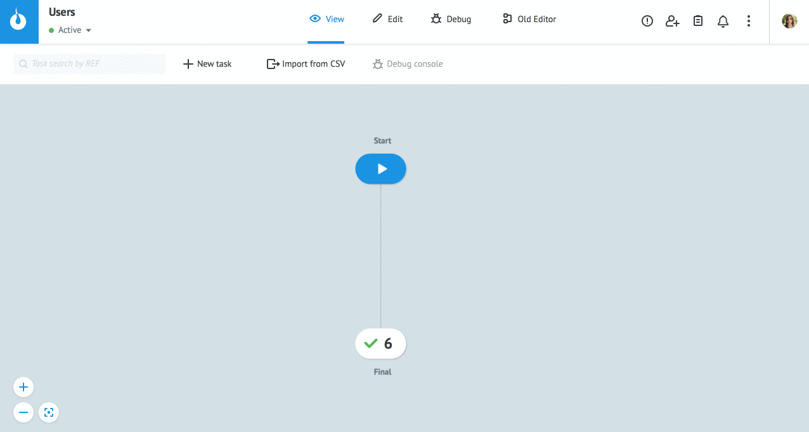
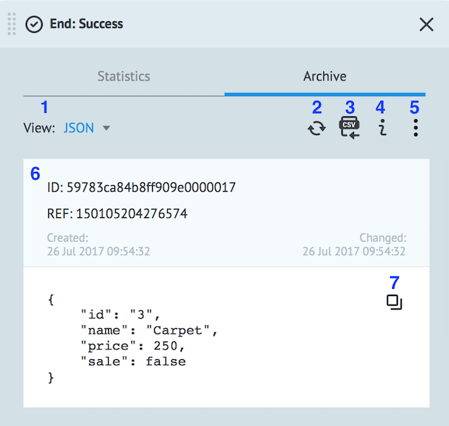
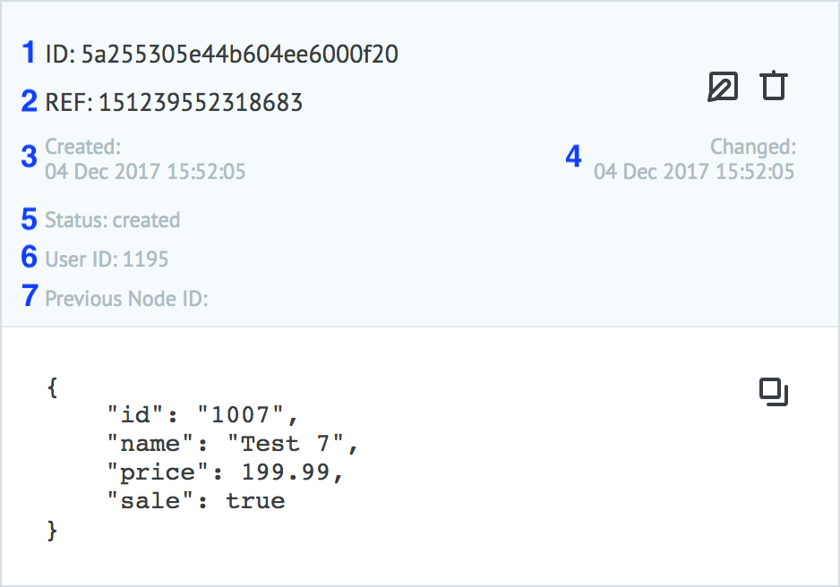
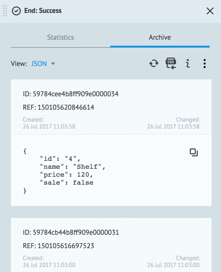

# Task archive
  
To open Task archive switch to `View` mode and select node.

  
  
## Archive mode
  

1 - **View** - select format for displaying data (JSON, Table)

2 - **Refresh** - refresh task archive

3 - **Export to CSV** - export tasks to CSV file

4 - **Show node info** - show node name and ID  

5 - **More actions** - additional features:

* **Set scroll** - switch the mode of scrolling task archive (↕ - vertical, ↔ - horizontal)
* **System Parameters** - display of system parameters of the task
* **Delete tasks** - delete all tasks from archive (except `End: Success` and `End: Error`).

6 - task content

7 - **Copy to buffer** - copying a task as JSON object to clipboard
  
Time for storage of tasks in [Process](https://doc.corezoid.com/en/interface/process_and_state/create_process.html) is limited (about a day). 
But node counters are saving and accumulating all the time.
  
For the long-term storage and work with tasks should be used [State diagram](https://doc.corezoid.com/en/interface/process_and_state/state_diagramm.html).

### System Parameters

When **System parameters** is enabled, the extended system information about the task is displayed:

1 - task ID (a unique value across the system)

2 - task reference (a unique value in current process)

3 - date and time of creation the task

4 - date and time of change the task

5 - status of the task (created or processed)

6 - user ID (who modified the task last time)

7 - previous node ID
  
## Statistics mode
  
Display statistic incoming and outgoing requests of the node for the selected period or in real-time.
  
