# Task parameters

* **Input** - task parameters which come to the start node of the process
* **Local** - internal frequently used parameters for fast and convenient use in logic
* **Output** -  task parameters, which are the result of a process

Task parameters menu is designed to describe task parameters of the process:

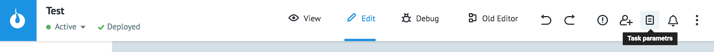

**Task parameters** interface:

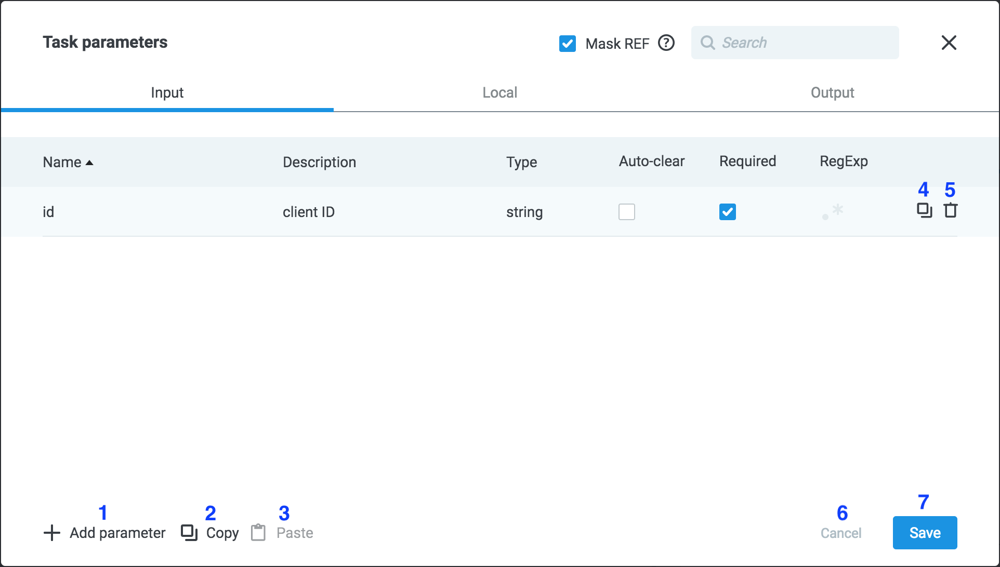

1 - **+ Add parameter** - add empty fields to describe a new parameter

2 - **Copy** - copy all parameters from the current tab

3 - **Paste** - paste parameters (this button is inactive while there are no parameters in the clipboard)

4 - copy parameter

5 - delete parameter

6 - **Cancel** - close window without saving changes

7 - **Save** - close window with saving changes.

You can also open **Task parameters** when specifying parameters to the logic.
By default, the parameter is added to **Local**:

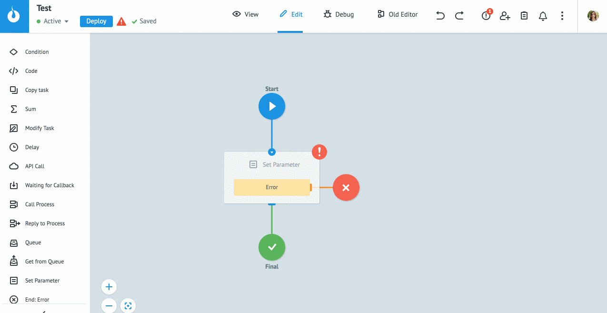

**Task archive** (**Table** mode) displays already described parameters highlighted.
To specify the new ones, click **"+"** next to the parameter.

The parameter is added to the **Local** tab, **Name** and **Description** fields are filled in, the data type is determined automatically. If necessary, edit the description and click **Save**.

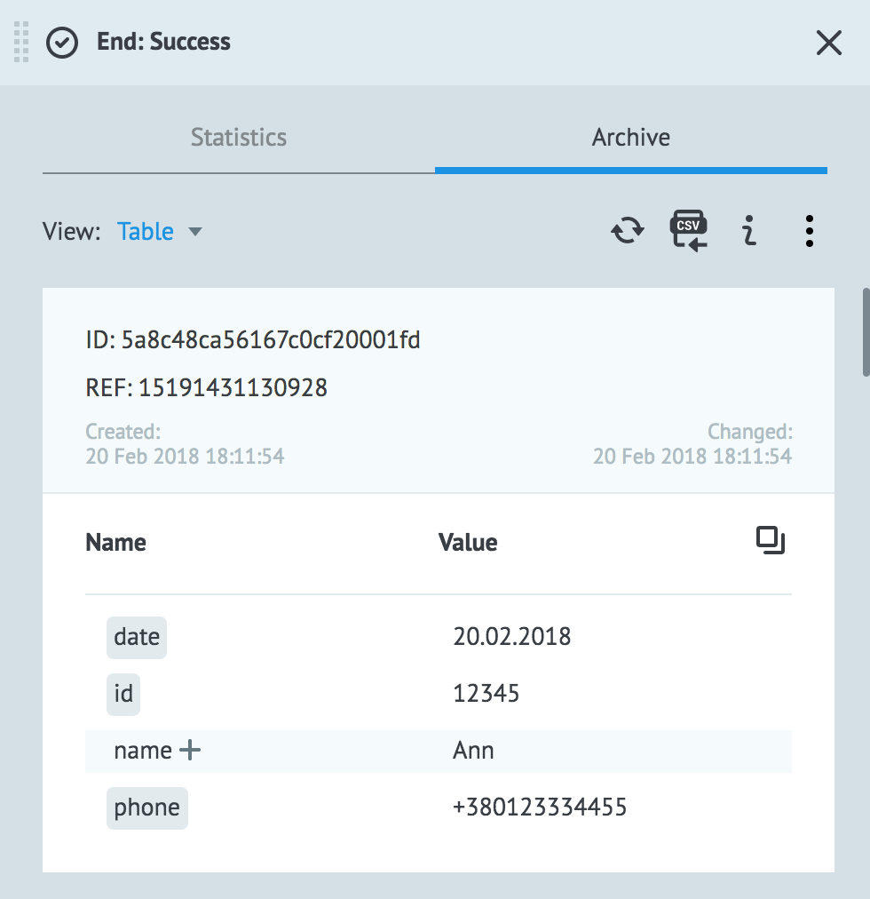

## Describing Parameters

To add a description of the task parameters:

* click **Task parameters**
* select the tab according to the use of the parameter (**Input/Local/Output**)
* press button **+ Add parameter**
* enter parameter **Name**
* enter short **Description** (optional)
* select data type
* specify the parameter:
    * **Auto-clear** - hides parameter value (displays as "***") in **Task archive**
    * **Required** (for **Input** and **Output** parameters)
    * [**RegExp**](https://doc.corezoid.com/en/interface/tasks/task_parameters.html#how-to-use-regexp) - parameter validation using regular expressions (only for **Input** parameters)
* press **Save**

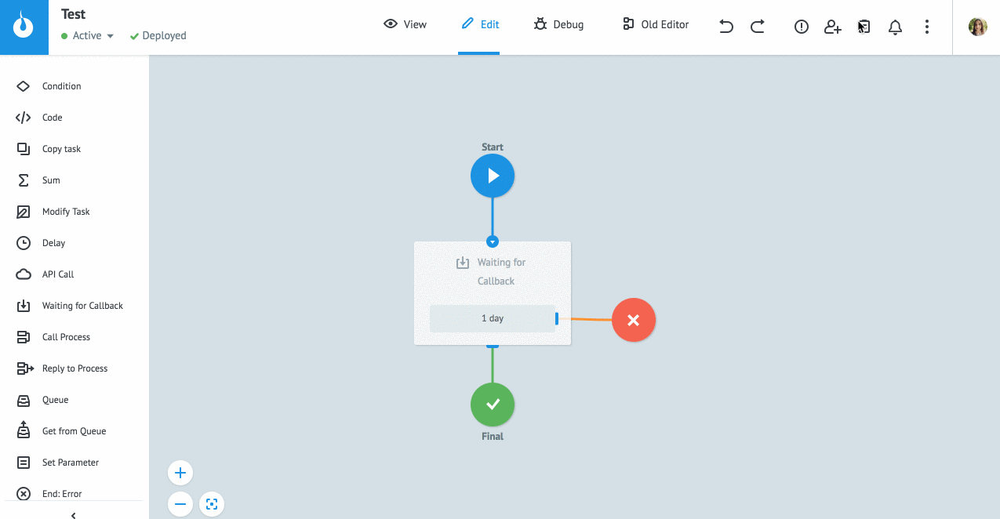

Parameters pass validation when adding.

Possible **errors**:

***Parameter `"<name>"` is already exist*** - duplicate parameter in one of the tabs

***Name is empty*** - Parameter name field is not filled (required)

***Invalid parameter name*** - contains invalid characters.


### Parameter Name

Parameter name must be unique for all tabs.

It may contain:
* big and small Latin letters
* numbers
* characters  `"_", "#", "@", "$", "\", "[", "]", "."`

> **Escaping special characters in parameter name**

> If parameter name contains characters `"."`, `"["` or `"]"` you must escape it with a backslash.

> For example

> `phone[0]` - element of the array `"phone"`

> `phone\[0\]` - parameter `"phone[0]"`

Examples of valid parameter names:

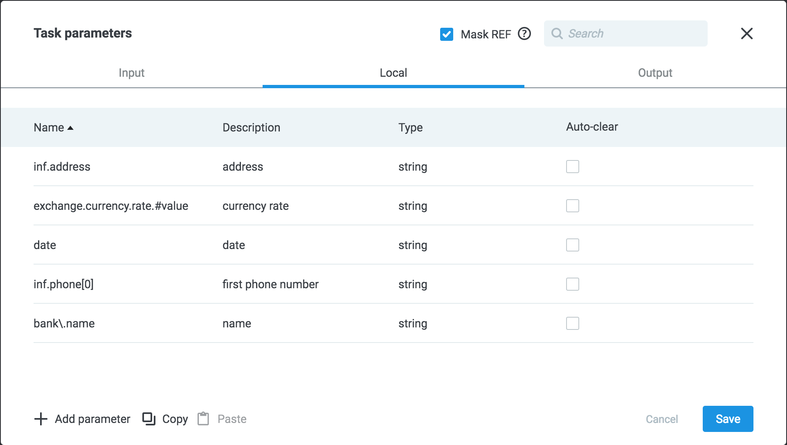

### Parameter Type

**String**:
```
{
"name": "John"
}
```

**Number** (integer, float):
```
{
"card_number": 123456789,
"bonus": 10.50
}
```

> **Please notice!**

> The maximum value for type **Number** - 2ˆ53 = 9 007 199 254 740 992. For large values, you must use **String**.

**Boolean** -  `true` or `false`:
```
{
"send_notifications": false,
"subscribed": true
}
```

**Array**:
```
{
"phones": [
        "+380991234567",
        "+380661234567"
    ]
}
```

**Object** - set of "key-value" pairs:
```
{
"address": {
        "city": "Odessa",
        "zip_code": 65000
    }
}
```


### How to use RegExp

[Regular expression](https://ru.wikipedia.org/wiki/%D0%A0%D0%B5%D0%B3%D1%83%D0%BB%D1%8F%D1%80%D0%BD%D1%8B%D0%B5_%D0%B2%D1%8B%D1%80%D0%B0%D0%B6%D0%B5%D0%BD%D0%B8%D1%8F) is a good way to validate parameter value of task parameter in process.
It can be validation of text fields such as names, addresses, phone numbers, etc.

Adding the parameter description, select **RegExp**.

Enter:

* **Regex for validation of value** - regular expression
* **Text of the response in case of error regexp** - error text if validation failed

Press **Save**.

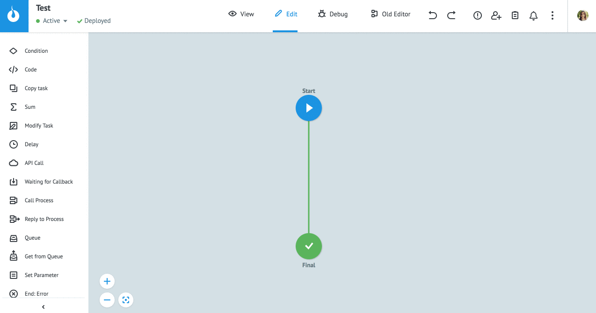

This option is available only for **Input** parameters.

The parameter is validated by the added regular expression at the input to the process. If validation failed, an error specified in **Text of the response in case of error regexp** occurs.


### Masking Values

Parameters values and task references, which consist of a set of digits and are similar to the format of:
* bank account / card number
* CVV code
are masked in Task Archive (displayed as "***").
To disable masking values specify process parameters.

To disable masking task references switch off the checkbox **Mask REF** in **Task parameters**.

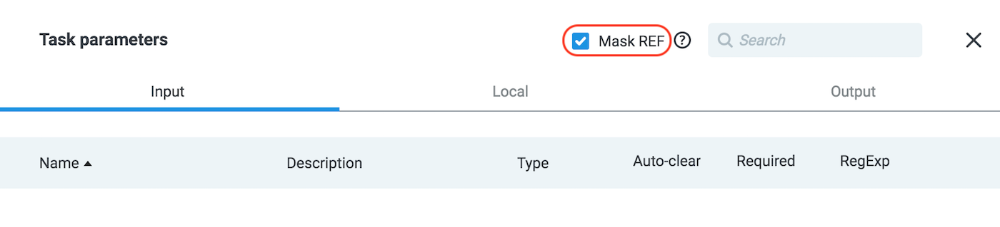
  
### Why describe the task parameters?

**Input** parameters are substituted to new task automatically.

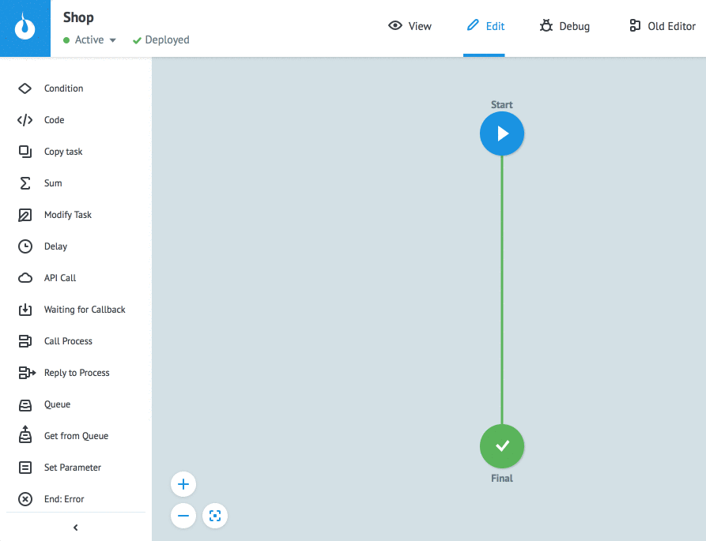

When adding [`Call Process`](https://doc.corezoid.com/ru/interface/nodes/rpc/logic_rpc.html), [`Copy Task`](https://doc.corezoid.com/ru/interface/nodes/copy.html), [`Modify Task`](https://doc.corezoid.com/ru/interface/nodes/logika_modify_task.html) logic to the process, the **Input** parameters of the selected process are automatically substituted.

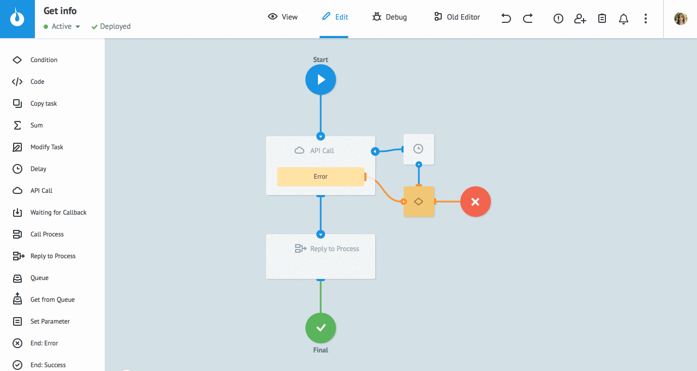

**Output** parameters are used to configure the logic [`Reply to Process`](https://doc.corezoid.com/ru/interface/nodes/rpc/logic_rpc_reply.html):

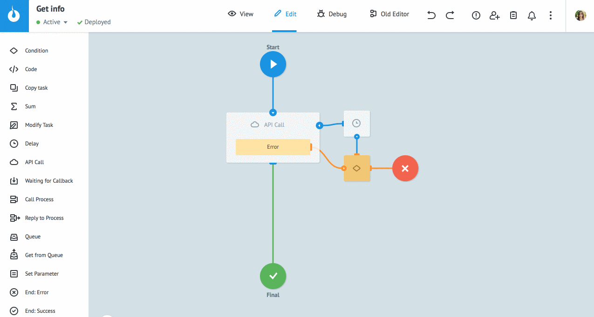

Also described parameters can be selected in all logics from the dropdown list. The drop-down list is called by clicking on the field to enter a variable.
For example, in logic [`Condition`](https://doc.corezoid.com/ru/interface/nodes/if.html):
  
