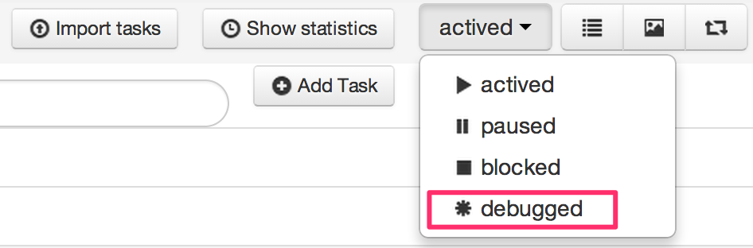
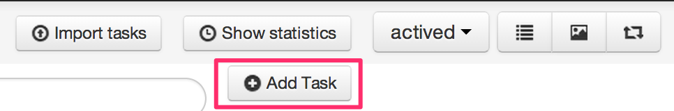
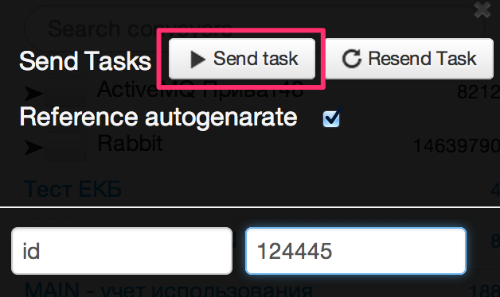
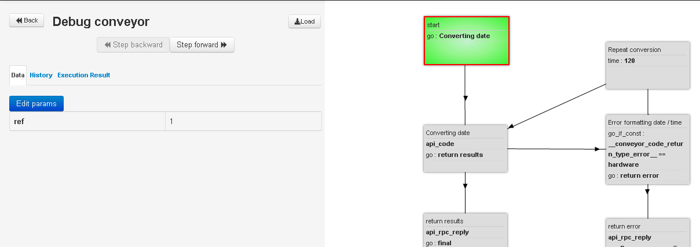

# Testing of process

Transfer process to the mode "Debugged"

Add new request

Enter values of variables in request and click on "Send task"

Sended testing request "is stucked" in starting node and wait for being operated by user

Possible debuggings:
*   Step forward.  Executing of all logics in the node, except for `time`
*   Step backwards. Returning of the request to the previous node.
*   Editing of parameters to the request. Button `Edit params`
*   Adding of new parameters to the request. Button `Add param`
*   Highlighting of green/red color of executed and unexecuted conditions in the previous node
*   Displaying history of nodes path and changing data by request
*   Displaying results of wor of the previous node. For example request/response to external API

> After debugging do not forget return in status `actived`. Otherwise requests will be frozen in the starting node
