# Access management

Access for Corezoid objects can be given to:
* users - **Users**
* group of users - **Groups**
* keys to work with Corezoid objects through API - **API keys**

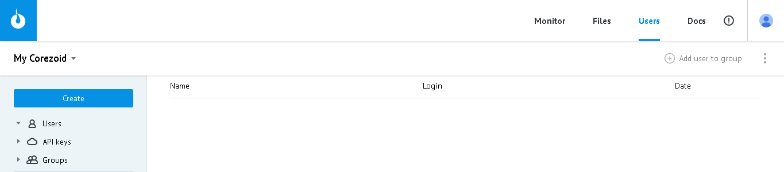

##Users

**Users** - this is the list of users who is available when adding access rights to objects .

In order to (add) invite user in your Corezoid enviropment (My Corezoid) or company, follow this way:

`Users -> Create -> User -> Enter user's email (login) -> OK`

After this action, invited guest will recieve a mesage to specified e-mail.

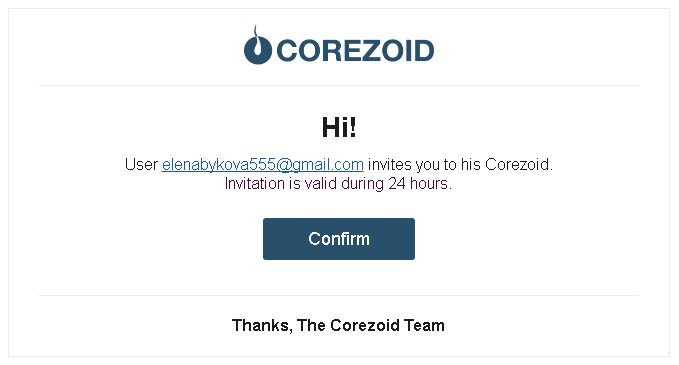

In case of invatation confirmation user will appear in your list.

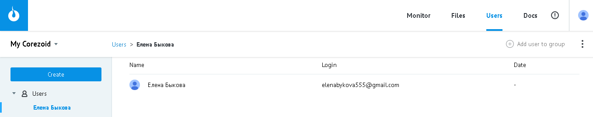

>Invatation is available during 24 hours.

##Groups

**Groups** - there are users united into groups.

* Access, opened for the group, open it for everyone who's in group.

* If the group has already got access for object, then access will be automatically given to any new members in case if they are. 

* If user has been added to group, he will not be displayed in `Users`.

**Create a group**:

`Users -> Create -> Group -> Enter group name -> OK`

**Add user to group**:

`Select a group -> Add user to group -> Enter user's email (login) -> OK`

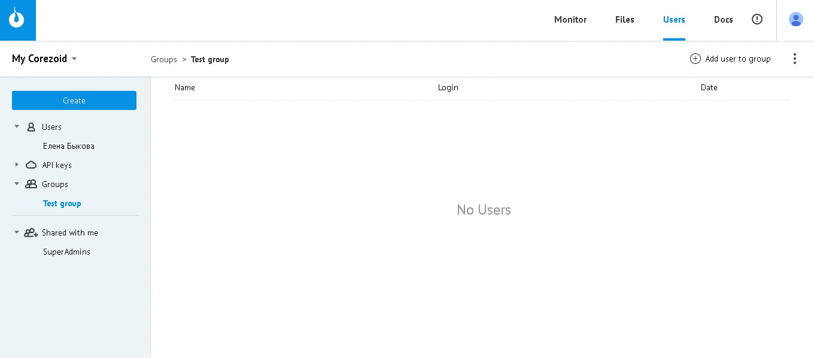

##API keys

**API keys** - login and secret key to work with Corezoid objects using API

To create API keys, follow this way:

`Users -> Create -> API key -> Enter name -> OK`

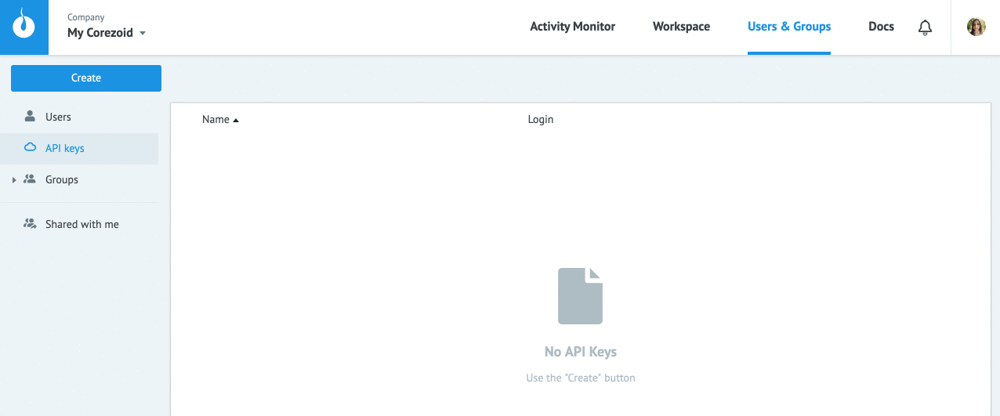

Accesses for API keys for other users are available only through the the group. Any other key transfer is unsafe.

##Providing access to the object

To open access to the object:
* press "Share objects" button

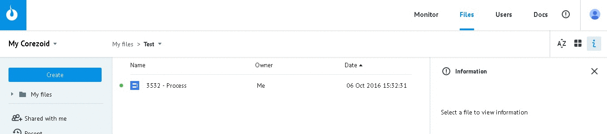

* In `"Invite user or group"` field put the user's name, group name or API keys of those who needs to get access.

If the user has been already added to your list, his search could be made with forst three name symboles or email.

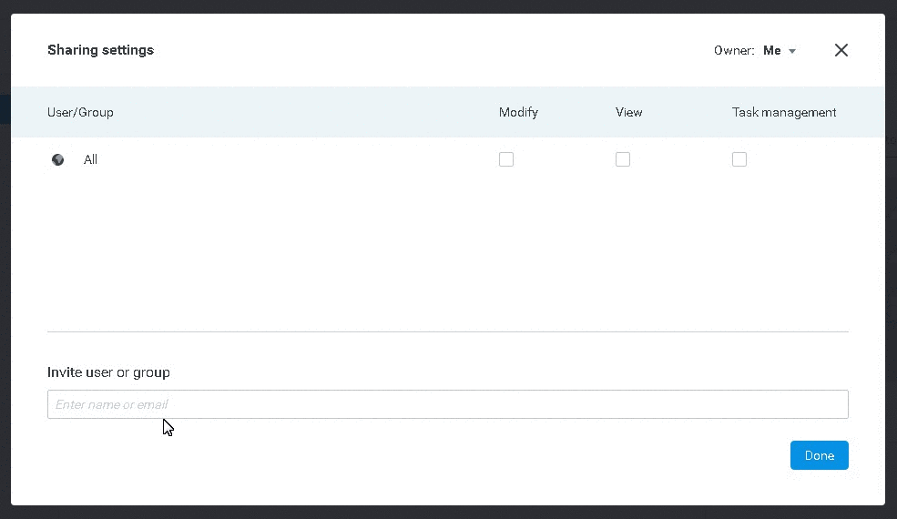

If user is not on your list, he will be marked with "envelope"

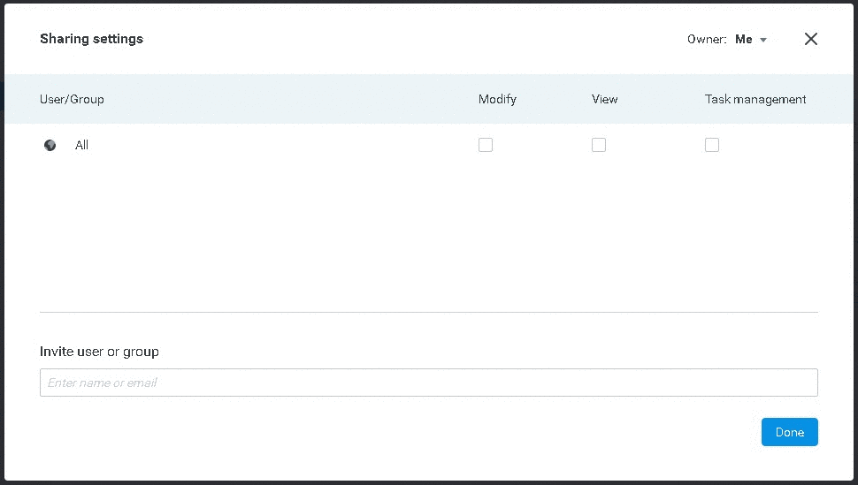

"Envelope" will be there until user accepts invitation, that will be sent to him in appropriate notification about object sharing.

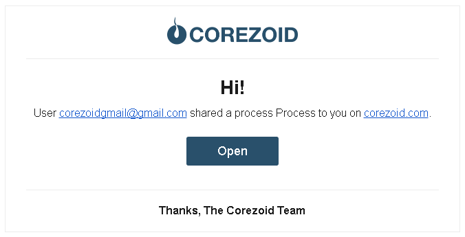

* select access rights for every user

   * **Modify** - request. process editing and removing
   * **View** - requests and process viewing
   * **Task management** - making a request

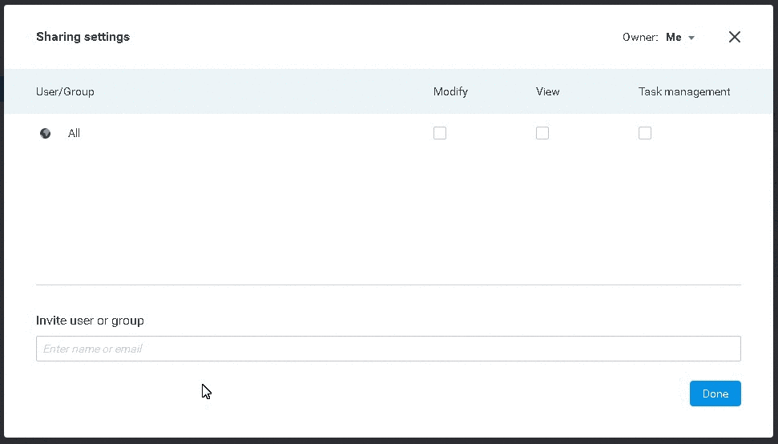

* press `"Send invitation"`

##Transfer of authorship on objects

To transfer object authorship, select user in `"Owner"` field and press `"Done"`

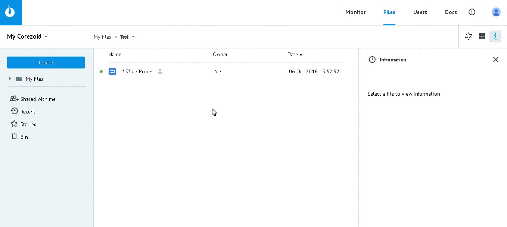

>You can give authorship only to that user who had such access before.

