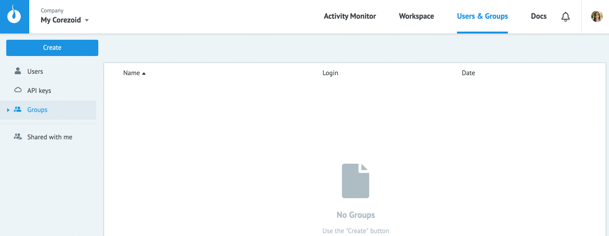

# Access management

Access for Corezoid objects can be given to:
* users - **Users**
* group of users - **Groups**
* keys to work with Corezoid objects via API - **API keys**

## Users

**Users** - this is the list of users who is available for adding access rights to objects.

In order to (add) invite user in your Corezoid environment (My Corezoid) or company, follow this way:

`Users -> Create -> User -> Enter user's email (login) -> OK`

After this action invited guest will receive a message to specified e-mail.

After confirmation user will appear in your user list.

> This invitation is available during 24 hours.

## Groups

**Groups** - there are users united into groups.

* Sharing object to the group you provide the same access rights for every user from this group.

* If the group has already got access for object, then access will be automatically given to any new members in case if they are. 

* If user has been added to group, he will not be displayed in `Users`.

**Create a group**:

`Users -> Create -> Group -> Enter group name -> OK`

and **add user to group**:

`Select a group -> Add user to group -> Enter user's email (login) -> OK`

## API keys

**API keys** - login and secret key to work with Corezoid objects via API

To create API keys, follow this way:

`Users -> Create -> API key -> Enter name -> OK`

Accesses for API keys for other users are available only through the the group. Any other key transfer is unsafe.

## Providing access to the object

To open access to the object:
* select object
* press **"Share"** button
* enter user name, group name or API key name to the field "Invite user or group"
* select access rights for every user
   * **Modify** - to modify objects and tasks
   * **View** - to view process logic and tasks
   * **Task management** - to create tasks
* press **"Send invitation"**

Notifications about sharing objects are switched on by default. In order to switch off e-mail notifications about changes in the access to Corezoid objects, please use the check-box **Send notification about updates by email"**.

If the user has been already on your list, you can search by the first three symbols of name or email.

If user is not on your list, he will be marked with "envelope".

"Envelope" will be there until user accepts invitation, that will be sent to him in appropriate notification about object sharing.

## Change ownership

To change owner of object select another user in `"Owner"` field and press `"Done"`.

> You can give ownership only to that user who had such access before.

