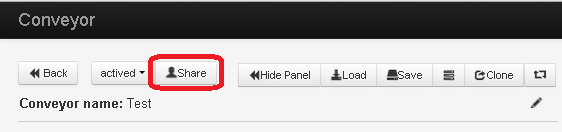
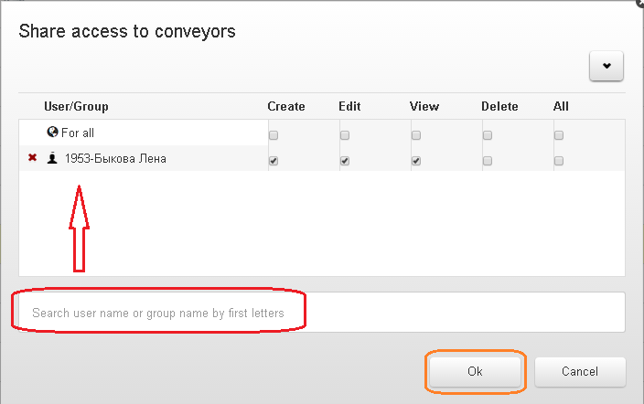

# Granting access to the process

For adding access to process click on `Share`on the control panel of process in the mode of editing

or in the list of process choosing necessary one.

In the opened window choose a group of users by name whom you need to grant access.

Mark giving access - `Creat`, `Edit`, `View`, `Delete`, or `All` and then ckick on `Ok`.

