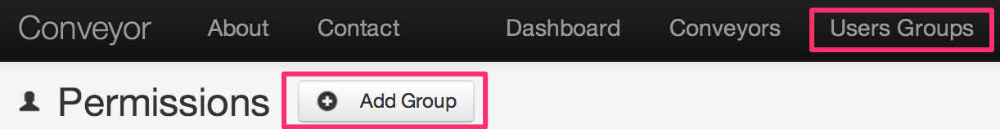
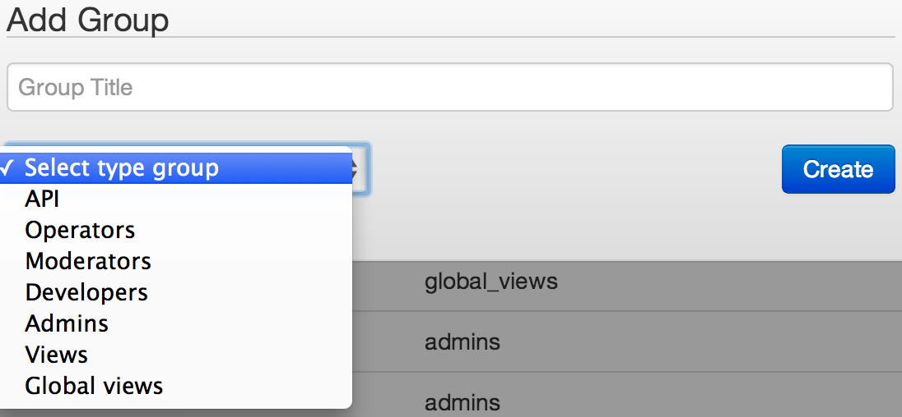
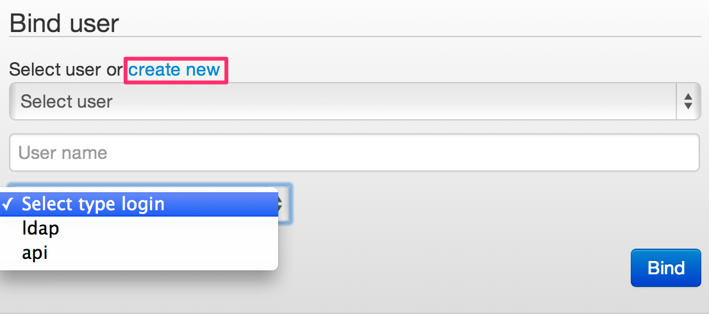
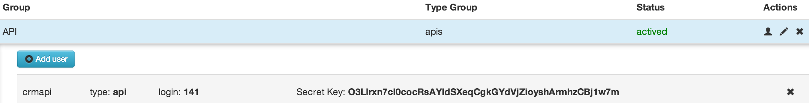

# Creating users groups

Type of group access::
*   **API** - external systems
*   **Operators, Moderators** - operators, may process request by means of forms
*   **Developers, Admins** - process developers
*   **Views** - access to browsing
*   **Global Views** - access to browsing process by link

| Group name | API | Operators, Moderators | Developers, Admins | Views | Global Views |
| -- | -- | -- | -- | -- | -- |
| Browse process| + | + | + | + | + |
| Remove (process, group, node) | - | - | only process creator | - | - |
| Create process| + | - | + | - | - |
| Edit process, nodes, groups of users | + | - | + | - | - |
| “Share” process with a group of users | + | - | + | - | - |

Login types:
*   ldap
*   api
*   facebook
*   google

In case of adding user with API type, the result will be: user ID and a key that have to be used for sending requests to process.

