# GoogleSpeadSheetBot

**GoogleSpeadSheetBot** in **Telegram** allows to read data from a cell or range of cells chosen by user and also to record different data to the cells of **Google Sheet** page you specified.

Clone  [folder with processes "Telegram_GoogleSpreadSheetBot"](https://admin.corezoid.com/folder/conv/124602).

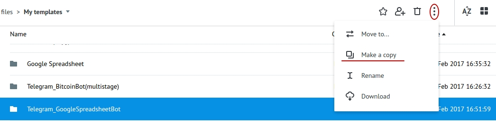

Connect **Main** (main) process to the Telegram by specifying the key of your Bot:

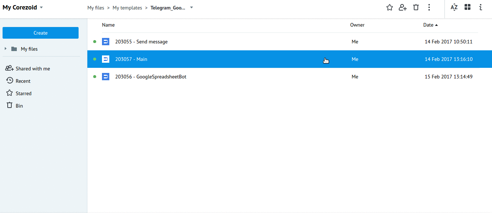

To receive Bot key, you need to send `/newbot`command to the chat with **BotFather**. Next, specify the name and the name of Bot's user. You will get:

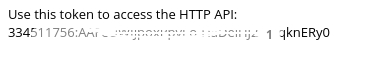

It is required to specify your Bot key - **telegram_token** in the **Main** process in the "Set telegram_token and spreadsheetId" node.

## OAuth authentication

All requests to the API Google support autorization only through OAuth 2.0.

Every request to the API must contain in **Header**:

`Authorization : Bearer {{conv[ID_DIAGRAM].ref[REFERENCE].access_token}}`

where:

*   `ID_DIAGRAM` - diagram ID `State token`, where is `access_token`

*   `REFERENCE` - you set while generating`access_token`.

To receive **access_token** you need to follow the instructions which are given here - [https://doc.corezoid.com/ru/plugins/google/oauth.html](https://doc.corezoid.com/ru/plugins/google/oauth.html).

After receiving **access_token** in  **GoogleSpreadsheetBot** process, in "Set Authorization for API" node, specify received parameters:

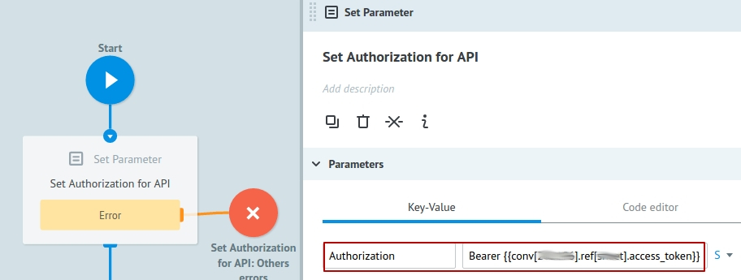

## Processes description

**Main process**

Receives all messages, comeing to the Bot's chat and firstly tries to renew the request in the **GoogleSpreadsheetBot** process.

Renew the request in **GoogleSpreadsheetBot** = continue the chat with user within unique chat id.

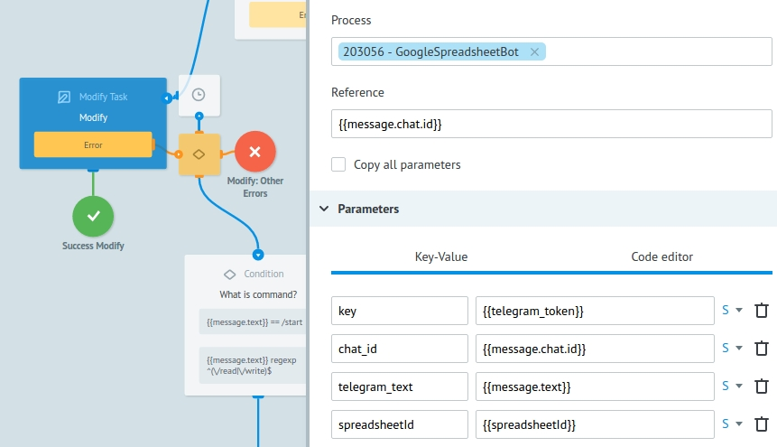

It becomes possible because of creation of new task in **GoogleSpreadsheetBot** process, where user send `/read or /write` command. This request is created with refrence equal to chat's id \(`{{message.chat.id}}`\).

If there are no such request when it renews, it means that we have no open dialogs in this chat yet - no requests in **GoogleSpreadsheetBot** process. Then check, whic command has been received from user.

In case of receiving `/start` command, send the message with information about Bot. In case if `/read or /write` command is received - create task in **GoogleSpreadsheetBot** \(as it was described above\).

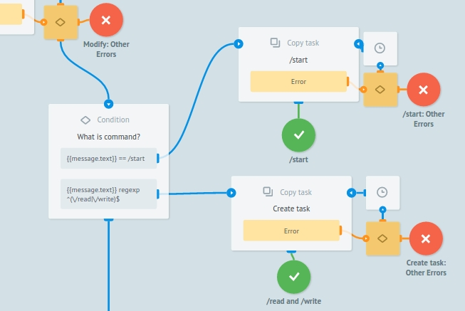

If you received something defferent from  `/start, /read or /write`, define the command and notify user abоut that with appropriate message.

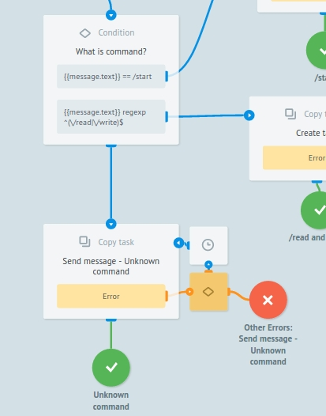

In order to work with already created Google Spreadsheet, we need to specify its **ID** `(spreadsheetId)`.

For this, copy ID from your page URL (marked with yellow light)

It is required to specify **ID** of your **Google Sheet**  - `spreadsheetId` in **Main** process "Set telegram_token and spreadsheetId". 
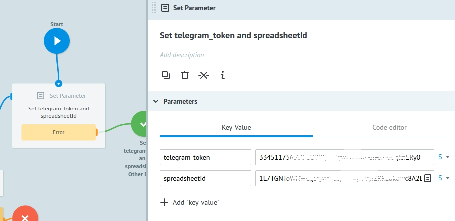

**Process GoogleSpreadsheetBot**

In this process there are requests coming from **Main** process if user send `/read или /write`, and for the first step, there's a message sending with offer to select the operation(reading or recording to the cell or range).

We are reminding that request refrence in this process is unique chat id `{{message.chat.id}}`.

It allows to receive updates (new commands or messages from user to the Bot's chat) from **Main** process, when request is in the node with [CALLBACK logic](https://doc.corezoid.com/ru/interface/nodes/callback.html).

So after sending the message with offer to select the operation, request is going to wait for this selection.

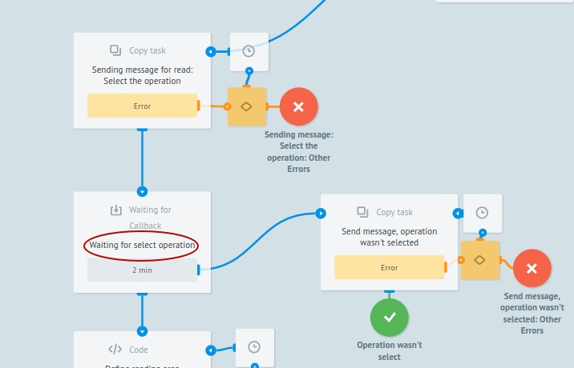

If the selection is not made in 2 minutes (task in not renewed from **Main** process) then send a message about  wait time expiration.

If the selection was made, we can offer to the user to specify Goggle Spreadsheet name, cell or range name in specified format or to type the cell's value.

After every offer to the user, we are waiting in the nodes with CALLBACK and just like this, if there are no appropriate selection, send a message about wait time expiration.

With incorrect cell address input, name of Googe Spreadsheet page ot cell's value, send to the user an appropriate message.

If there is a `/read` command and the choice is made, receive the value of selected cell or range and send in message. 

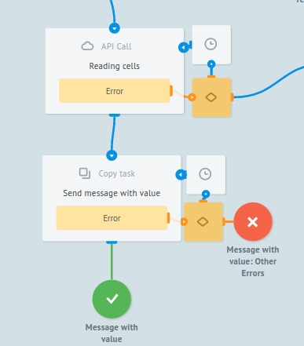

If there was a `/write` and selection is made, record a value to the specified cell or the range and send a message about successful record. 

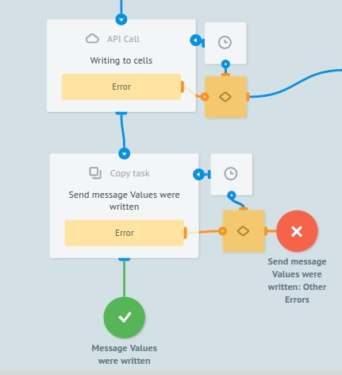

**Send message process**

Send messages in Telegram.

Both processes **Main** and **GoogleSpreadsheetBot** are communicating to this through [Copy task logic](https://doc.corezoid.com/ru/interface/nodes/copy.html).

## Testong and launch

Just add your Bot to the Telegram and start the chat.

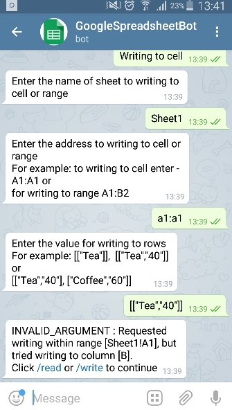

Go to `View` or `Debug` mode to see the request flow, its movement and distributing to the process nodes.

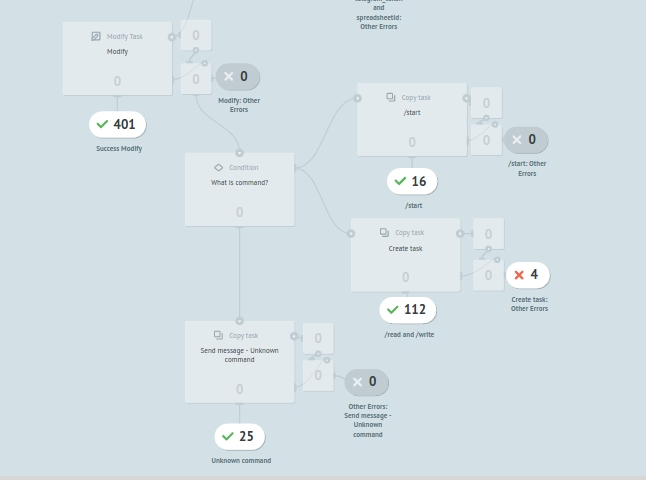

