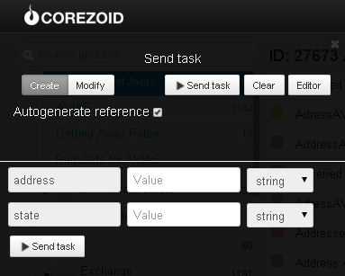

# Receiving gas station addresses

Clone ["Getting filling stations addresses" folder](https://admin.corezoid.com/folder/conv/5954) to receive process and dashboard.

Go tot he work.

For process testing go to `dashboard`mode and press `Add task`button - add the task.

In appeared window, specify:
*   `address` - Ukraine city
*   `state` - Ukraine region

Then, press `Send task` button - send a request.

**In case of success** parameter will be added to the task:

* `Addresses`- list of addresses "Avias" gas stations

**In case of error** task will go to escalation node with parameter:
* `Error` - error description
