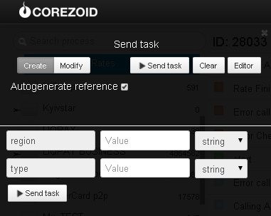

# Receiving fuel rates

Clone ["Getting fuel prices" folder](https://admin.corezoid.com/folder/conv/5954) to receive process and dashboard.

Go to process.

To test the process, go to `dashboard` mode and press `Add task` button - add the task

In appeared window, specify:
*   `region` - region ID
*   `type` - fuel's type

Then, press `Send task` button - send the task.

**In case of success** parameter will be added to the task:

* `price`- fuel rate

**In case of error** task will go to escalation node with parameter:

* `Error` - error description

**Possible values of `region` parameters by region:**

* **27** - Vinnytsia
* **28** - Volyn
* **04** - Dnepropetrovsk
* **05** - Donetsk
* **06** - Zhytomyr
* **07** - Transcarpathian
* **08** - Zaporizhia
* **09** - Ivano-Frankivsk
* **11** - Kiev
* **12** - Kirovohrad
* **18** - Rivne
* **19** - Sumy
* **20** - Ternopil
* **21** - Kharkiv
* **22** - Kherson
* **23** - Khmelnytsky
* **24** - Cherkasy
* **25** - Chernihiv
* **26** - Chernivtsi
* **30** - Ukraine

**Possible values of `type` parameter:**

* **A80** - A-80
* **A92** - A-92
* **A95** - A-95
* **DT**  - Diesel fuel
