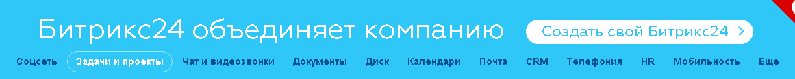
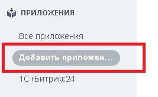
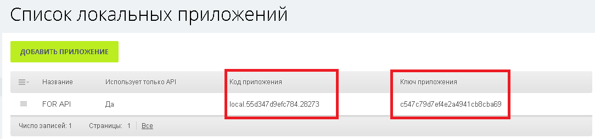
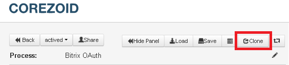
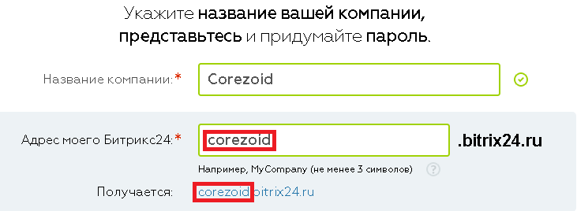
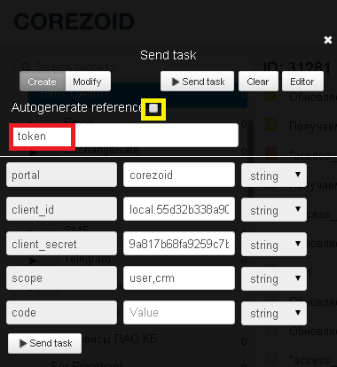

# Application authorization in requests to REST API Bitrix

Create your **Bitrix24** on [https://www.bitrix24.ru](https://www.bitrix24.ru)



Add your application to Bitrix24 for private usage or for publication in the catalog.




After adding you will receive a code and key of your application. 




To receive "access_token" and authorize you application in requests to REST API Bitrix, clone ["Bitrix OAuth" process template](https://www.corezoid.com/admin/edit_conv/31281/8316).



## Description of incoming process parameters

* **portal** - your Bitrix24 portal that was specified with registration. For example, if the address of your Bitrix24 - https://corezoid.bitrix24.ru, then the name of the portal - `corezoid`



* **client_id** - application code
* **client_secret** - application key
* **scope** - available permissions for application (more than one, separate by commas). [List](https://dev.1c-bitrix.ru/learning/course/index.php?COURSE_ID=43&LESSON_ID=2280) of available SCOPE values.
* **code** - first authorization code

## How to receive `"code"` incoming parameter value

In browser address line, paste the link:

```
https://{{portal_name}}.bitrix24.ru/oauth/authorize/?response_type=code&client_id={{application_key}}
```

where,

**{{portal_name}}** - Your Bitrix24 portal,
**{{application_code}}** - application code

For example,
```
https://corezoid.bitrix24.ru/oauth/authorize/?response_type=code&client_id=local.55d32b338a90f0.23817
```

Browser redirects you to the application's URL and transfers authorization's code - **code**.

As a result, in address bar you will see next link:

```
https://apps-b1001609.bitrix24-cdn.com/b1001609/app_local/e38e9f7db4fa858f9e1b92e91e699811/index.html?code=6dm7bdbh6akpc9tax2lp3fih05m5gtf2&domain=имя_портала.bitrix24.ru&member_id=a3238bc7698db8257e62cf799e88b58e
```

>code=6dm7bdbh6akpc9tax2lp3fih05m5gtf2

**Attention!** Lifetime of "code" received parameter - 30 sec!


## Process launch

**1)** Go to `dashboard` mode and press `Add task` button - add request.


In appeared window, specify the required parameters:
*   portal
*   client_id
*   client_secret
*   scope

and uncheck the box next to the `"Autogenerate reference"` field in order to specify task reference name = token.



**2)** Go to browser and get the "code" parameter from link below 

**3)** Specify the value of obtained parameter in added task 

**4)** After all parameters are specified, press `Send task`.

>**It is enough to create a request only once.**

## Process result

In case of success, received token will be kept in `"access_token"` request parameter.

You can receive its value in other processes by using [contruction](../../interface/functions/getParamFromApp.md):

```
{{conv[cloned_process_ID].ref[token].access_token}}
```

In ["Bitrix OAuth" process](https://www.corezoid.com/admin/edit_conv/31281/8316) `"access_token"` will be renewed every 25 mins.


## If "access_token" is not renewed

In case if you will get an error when token is renewed, task will go to `"access_token" doesn't update. Escalation to the process author"` node.

In this node you are able to customize the escalation using [PRC logic](../../interface/nodes/rpc/README.md) and call the process of sending notification about error to the process author:

* **SMS** through [Twilio](../twilio/sms.md), [MessageBird](../sms/messagebird.md), [UniSender](../email/send_sms_unisender.md)
* **Email** through [Mandrill](../email/mandrill_v2.md), [UniSender](../email/send_email_unisender.md)
* **Message to [Telegram](../telegram/README.md)**