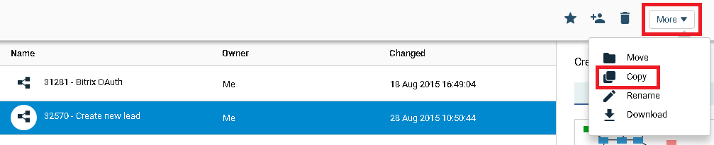
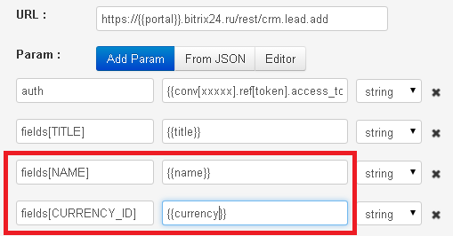
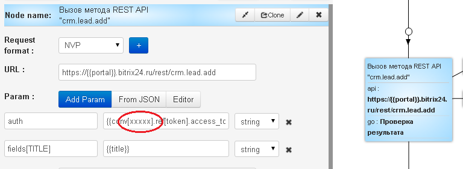
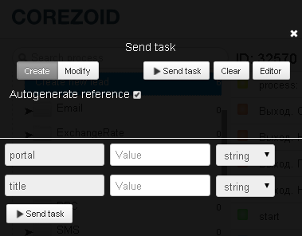

# New lead creation

For [new lead creation](https://dev.1c-bitrix.ru/rest_help/crm/leads/crm_lead_add.php) Bitrix go to [the link](https://admin.corezoid.com/folder/conv/8316) and clone the template of `"Create new lead"` process.

## Description of incoming process parameters

* **portal** - Your Bitrix24 portal that was specified with registration. For example, if the address of your Bitrix24 is https://corezoid.bitrix24.ru, then portal name will be `corezoid`
* **title** - new lead name 

To create new lead it is required to specify it's name (title).

Value of other parameters is transferred to the API similarly:

- fields[NAME] - new lead's name
- fields[CURRENCY_ID] - currency
- etc.

Parameters description on [website](https://dev.1c-bitrix.ru/community/blogs/chaos/crm-sozdanie-lidov-iz-drugikh-servisov.php).

Description of [crm.lead.fields method](https://dev.1c-bitrix.ru/rest_help/crm/leads/crm_lead_fields.php) "Getting fields of lead".

## Process launch

**1)** For request authorization, paste your process ID what receives and keeps Bitrix `access_token` in value of `auth` parameter instead of **"xxxxx"**.

*[Process description](autorizatoin.md), that receives and keeps `access_token`*

**2)** Go to `dashboard` mode and press `Add task` button.

**3)** In appeared window you need to specify the required parameters:
*   portal
*   title

**4)** After all parameters are specified, press`Send task`.

## Description of outcoming process parameters 

**In case of success** the parameter will be added to the task
* `lead_id` - ID of created lead

**In case of error**, task will go to escalation node and the parameter will be added 
* `Error` - error description

