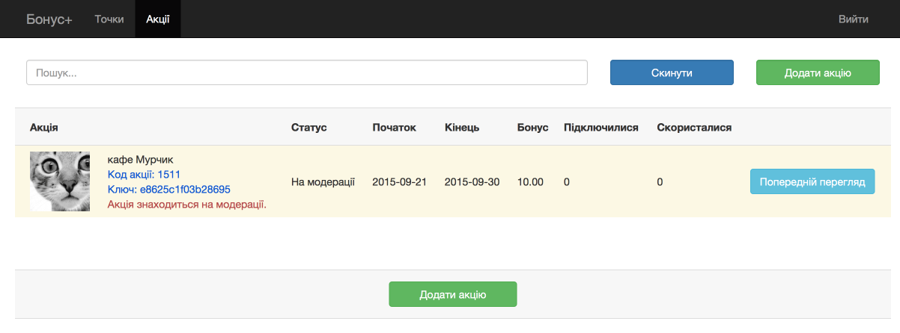

##Bonus Plus promotional offers

**Promotional offer as part of «Bonus Plus»** loyalty program is an offer from the partner of “Bonus Plus” program to the customer with PrivatBank card to receive the higher personal interest rate for bonus within the period stipulated in the offer on condition of payment of goods / services at the merchant outlet specified in the terms.

**Customer access to promotional offer is provided in two ways:**
**1)** Online self check for promotional offer by the customer on Bonus Plus web-site

**2)** Customer registration for promotional offer by the partner. For example, the partner initiates promotional offer, registers his customers for the offer, and notifies thereof, e.g., via SMS.

When the partner registers the customer, **Promotional offer code** and **Key** should be obtained:

Clone Bonus Plus folder. **Customer registration for promotional offer**

To register the customer for promotional offer, use the process [*"Registration in action Bonus Plus"*](https://www.corezoid.com/admin/edit_conv/35644) and provide parameters as below:
* promo – promotional offer code
* phone – customer phone number (in 38 or +38 format)
* key_promo - key

Answer for RPC:
* status_promo = “Y” (customer registered for promotional offer)
* status_promo = “N” (customer NOT registered for promotional offer, main reason – the customer has no PrivatBank cards)

**Getting promotional offer parameters**

To get the promotional offer parameters, use the process [*"Details of the action Bonus Plus"*](https://www.corezoid.com/admin/edit_conv/35645) and provide parameters as below:
* promo - promotional offer code

Answer:
**url_details_ukr** - url of the page with the customer region promotional offers (Ukr. language),
**url_details_rus** - url of the page with the customer region promotional offers (Rus. language),
**url_promo_ukr** - url of promotional offer (Ukr. language),
**url_promo_rus** - url of promotional offer (Rus. language),
**category_rus** - promotional offer category (Rus. language),
**category_ukr** - promotional offer category (Ukr. language),
**end_time** - promotional offer ending time,
**start_time** - promotional offer starting time,
**date_end** - promotional offer ending date,
**date_start** - promotional offer starting date,
**bonus_old** - standard amount of bonus,
**bonus** - promotional amount of bonus,
**name_rus** - name of promotional offer (Rus. language),
**full_name_rus** - full name of promotional offer (Rus. language),
**name_ukr** - name of promotional offer (Ukr. language),
**full_name_ukr** - full name of promotional offer (Ukr. language),
**image_new** - url of promotional offer banner

**Example of registration for promotional offer and sending SMS to customer**

For example, the partner of Bonus Plus Program has its own customer base; it intends to connect the customers to Bonus Plus promotional offer and notify them via SMS. Firstly, register the customer for the promotional offer, and after successful registration communicate about it. Example of such process is provided in template [*“Example of registration for Bonus Plus promotional offer and SMS sending via UniSender”*](https://www.corezoid.com/admin/edit_conv/38727)

