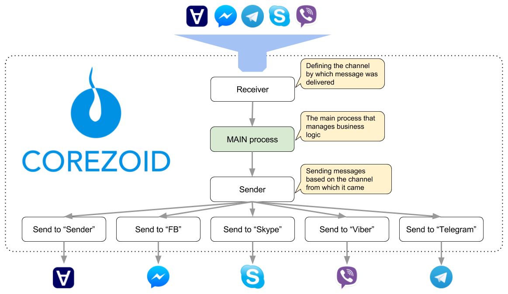
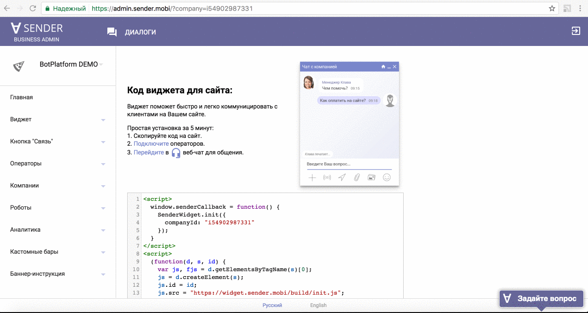
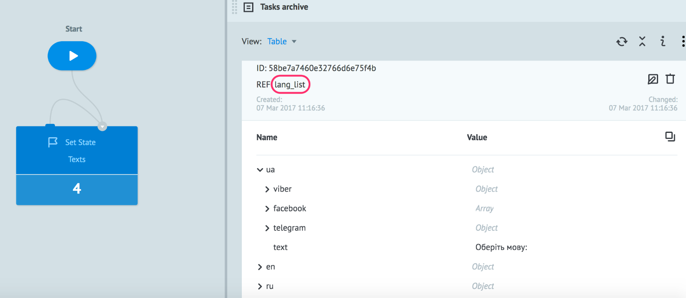
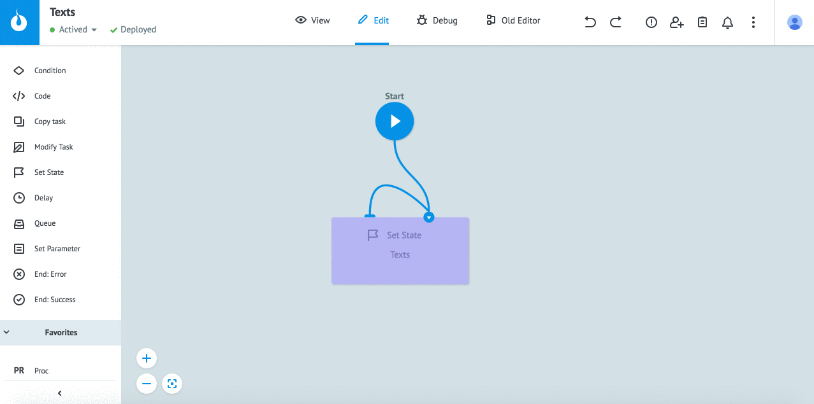
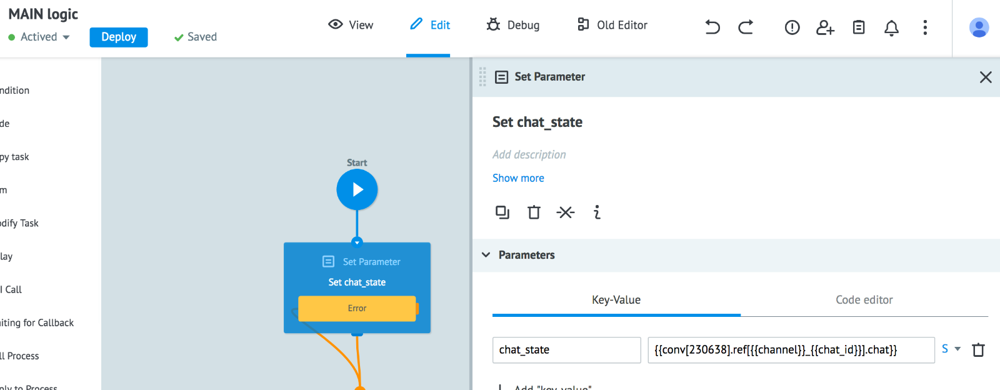

# Bot platform
  
* [What is Bot platform](#what-is-bot-platform)
* [What Sender company is and why choose it?](#what-sender-company-is-and-why-choose-it)
* [Manage message texts](#manage-message-texts)
* [Messengers connection](#messengers-connection)
* [Description of the objects in the folder Bot](#description-of-the-objects-in-the-folder-bot)
  
  

## What is Bot platform
  
**Bot platform** creates multi platform robot for user’s message processing in Sender, Skype, Telegram, Facebook Messenger, Viber in your account.
  
**Multi platform robot** is a pack of Corezoid processes which are released 4 main principles:
1. Receiving messages from users from different messengers
2. Reduction of received data to common format
3. Data processing according to main logic of Bot
4. Sending messages based on that channel (messenger) from which it came
  
  

  
  
While connecting, each messenger connect to one receiving process [Receiver & Route message](#receiver-and-route-message) for obtaining webhooks.
  
In case, after you created multi platform robot you need to add another messenger or change keys for existing robot, you could do this as follows:
  
* Select process  Receiver & Route message  (receiving process)
* Switch over to tab Webhook
* Press the Connect to messenger
* Connect or renew keys for bot for proper messenger
  

  
  

### For creating multi platform bot
  
Choose [company in Sender](#what-sender-company-is-and-why-choose-it) -> Press Create -> Bot Platform -> Choose needed messengers and add their keys
  

    
In your account will form [folder "Bot" with processes](#description-of-the-objects-in-the-folder-bot). In processes have been realized 3 logics in [MAIN logic process](#main-logic):
* Sending greeting message: “Please, send me /lang for setting language and /chat for operator connecting!”
* Setting language for communication
* Operator connecting
  

  
In order to realize your Bot with Bot platform, you need to set up only one process - [**MAIN logic**](#main-logic)!

Other functionality (getting Webhook, routing, sending messages) have already implemented. 
  
  
## What Sender company is and why choose it?
  
For implementing functional of connecting operators to chat with users of your Bots.
Because [Sender](https://sender.mobi/ru/) is messenger which is a workplace for operators of your company. Messages from users of different messengers are processed in a single interface.
  

  
For basic setting and testing go to [Sender administrative environment](https://admin.sender.mobi/), create a company and add operators to it.
  

  
Connecting the operator and routing messages from the messengers to the operator's Sender chat is done using Logic "Sender action" - Category "Widgets" - Robot "Send Message For Bot Platform"
  
To receive answers from operators receiver process connects to Sender event "Receiving messages from Bot platform" (automatically when BotPlatform is created).
  

  
Sending messages from operator to user’s messenger is performed using common call to API of the desired messenger.
  
If multiplatform robot is created without preliminary choice of company, at the first step you will be proposed to choose one from the list, or to create a new one “+ Add company”.

Even if you don’t plan to configure the logic of operator connection at the creation stage, choosing a company will help you to do it easily later.
  
  
## Manage message texts
  
Все тексты сообщений и объекты, описывающие кнопки содержатся в диаграмме состояний Texts. 
  
All message texts and objects that describe buttons are contained in the Texts state diagram. 
  
1 message to user = 1 request in state diagram with unique reference.
  
Task unique reference = text_id - unique message identifier.
  

  
Task with reference **lang_list** contains 3 objects - **ua**, **ru**, **eng**.
  
Every object contains 4 parameters:
  
* **text** - text of message 
* **viber** - object that describes the buttons for sending a message to viber
* **facebook** - object that describes the buttons for sending a message to facebook
* **telegram** - object that describes the buttons for sending a message to telegram
  
This allows to:
  
1) manage messages easy (text editor, add new message, delete, etc) in one place
  

  
2) specify only **text_id** when you create task to send a message to the [Send message](#send-messages) process. 
Instead of "loading" processes with nodes to send multiple message texts for multiple messengers in different languages.
  
For example, in order to send message about choosing language you need only 1 node and it looks like this:
  

  
But it could be like this:
  

  
And this is only one process. Feel the difference. :)
  

  
## Messengers connection
  

### Skype
  
Choose Skype in the list, add Client ID and Client Secret of your app in corresponded fields.
  
After bot has been successful created you will receive URL of receiver process.
  
Add recieved URL to field "Messaging endpoint" in Skype bot registration process.
  
More: [https://doc.corezoid.com/ru/plugins/skype/weatherbot.html](https://doc.corezoid.com/ru/plugins/skype/weatherbot.html).
  
  
### Telegram
  
Choose Telegram in the list and add access for your page in corresponded fields.
  
Bot is created successfully if you set up successfully webhook from Telegram Bot.
  
  
### Facebook Messenger
  
Choose Facebook Messenger in the list and add access for your page in corresponded fields.

After bot has been successful created you will receive URL of receiver process.

Add recieved URL in webhook setting in facebook app and indicate it in field "Returned URL-path".

More [https://doc.corezoid.com/ru/plugins/facebook/weatherbot.html](https://doc.corezoid.com/ru/plugins/facebook/weatherbot.html).

  
### Viber
  
Choose Viber in the list and add Token of your Public Account in corresponded fields.
  
Bot is created successfully if you set up successfully webhook from Viber Public Account.
  
#### Viber Welcome message
  
If it is necessary, setup Greeting message for your Public Account:  

* Choose process "Receiver & Route message"
* Go to tab "Webhook"
* Press the "Connect to messenger"
* Choose "Viber" and press the button "Set Welcome message"
* Choose type of greeting message - text and picture with text
  

## Description of the objects in the folder Bot

### Receiver and Route message

All starts with this process. All webhooks connect to this process.
 
Logic of Receiver & Route message:
  
* It receives messages from users of your Bots in different messengers and operator’s answers from active dialogues in Sender
* It converts received data to a single format:
  * channel - sender / skype / telegram / facebook / viber
  * user_text - user’s text message
  * user_name - user name
  * chat_id - chat (or user) ID
  * token - messenger token
  * action - reply (in the case of operator actions in operator’s chats)
* It transmits data to [**MAIN logic**](#MAIN logic)
* It creates user with unique reference `{{channel}}_{{chat_id}}` or updates his data in state diagram [**Users**](#users)
  
  
### MAIN logic
  
This process is used to control Bot’s logic.
  
There are template processes, which are automatically added to your account and help to demonstrate the principle of implemented in Corezoid Bot’s operation.
They implement the following logic:
* sending welcome message "Send me /lang to set the language of communication and /chat to connect operator!"
* set Bot’s language of communication
* operator connection
  

  
1. Get the current state of the chat - **chat_state**
2. Checking the received data for specified conditions
3. **user_text** contains **/start** или **start** - create user in [**State diagram**](#state-diagram)
4. Set the text of the welcome message
5. Data transfer to the process [**Operators calling**](#operators-calling), when **chat\_state = active** and when **user\_text** or **button\_id** contains one of the signs that user wants to connect to operator
6. Set variable **copy_proc_id** - ID of the process, which process the command /lang
7. Creating the task in multi-step process, which ID is defined by variable **copy_proc_id**. The reference  `{{channel}}_{{chat_id}}` of this task is unique and used to modify it on the steps of the process.
8. Modifying the task in multi-step process with attribute **action = cancel** to lead out it from node with callback to final node. This used in case of error **not\_unical\_ref** in the previous step. This error means that Bot’s user has not completed multi-step process and started from the beginning.
9. 30 seconds delay before retrying to create task in multi-step process which ID is defined by variable **copy\_proc\_id**.
10. Retrying to create task in multi-step process which ID is defined by variable **copy\_proc\_id** (repeat 7). There can be many multi-step processes (**copy\_proc\_id**), but nodes for creating, modifying and retrying to create task (7, 8, 9, 10) - only in one copy.
11. If none of the given in node 2 conditions worked, then get **proc_id** of multi-step process from [**State diagram**](#state-diagram) using unique ref = `{{channel}}_{{chat_id}}`.
12. Checking if **proc_id** is empty
13. If **proc_id** isn’t empty, we modify task in multi-step process (which ID is defined by variable **proc_id**) by task reference = `{{channel}}_{{chat_id}}`
14. If **proc_id** is empty, we set the text "Here should be your text for logic that is not provided by the process "MAIN logic"
15. Transmitting data to [**Send message**](#send-messages) to send message to the user
  
### Send messages
  
The process, which receives data for sending messages.
  
* it checks if the parameter `{process_state}}` transmitted. If the parameter transmitted process updates the chat state in [**State diagram**](#state-diagram) with **action** = `{{process_state}}`
* receives attribute of user's communication language from state diagram [**Users**](#users) If there is no attribute, it is set **ru** by default.
* if received task contains parameter **text_id**, the process receives object **text_object** from state diagram **Texts**:

* It receives text message (**text**) and keyboard (**keyboard**) from **text_object*
* It transmit task to another process to send message using API of messenger according to parameter `{{channel}}`
  
### State diagram
  
State diagram is used to store the current chat state of a unique messenger user and a messenger's token.
  

  
An example of getting the chat state (chat_state) of Telegram user with id = 10438 from state diagram 230538.
  
`{{conv[230638].ref[telegram_10438].chat}}`
 
or set up ref `{{channel}}_{{chat_id}}`
   
Result:
  
{
  
"chat_state": "inactive"
  
}
  

  
Tasks of state diagram are created and updated from:
  
1. [**Main logic**](#main-logic) - Create user in State diagram
2. multi-step processes such as **Сommand Lang** (setting Bot’s language of communication) and [**Operators calling**](#operators-calling) (operator connection)
3. process [**Send message**](#send-messages) after receiving `{{process_state}}`. It is often the last message of multi-step process with process_state = finish
4. process [**Receiver & Route message**](#receiver-and-route-message), when operator finishes chat or the chat ends forcibly at the end of time in inactive session
5. **by timer = 2 minutes** (changable), when user is inactive (except operator’s chat) 
  
  
### Users
  
State diagram used to collect data about users of different messengers. This data is used to build dashboard to show statistic of different channels.
 
It is also used to store the attribute of language of the user's communication with a Bot (lang). Process [**Сommand Lang**](#command-lang) adds it when user makes a choice. 
This parameter is used to choose object with text and buttons in process [**Send message**](#send-messages).
  
  
### Texts
  
State diagram for storage and control of text messages and buttons.
More details in section [**Manage message texts**](#manage-message-texts).
  
  
### Operators calling
  

  
1. Modifying the task in [**State diagram**](#state-diagram) by **ref** = `{{channel}}_{{chat_id}}` and transmitting the attribute **chat = active**.
2. Creating the task in [**State diagram**](#state-diagram) with **ref** = `{{channel}}_{{chat_id}}` and transmitting the attribute **chat = active** in the case of error **not\_found\_task** of logic 1.
3. Calling the logic Sender action - Category "Widgets" - Robot "Send Message For Bot Platform" for sending user’s message to operator’s chat.
4. Calling the logic Sender action - Category "Widgets" - Robot "Register User For Bot Platform" in the case of error **user\_not\_found** of logic 3.
6. Checking if user registration is successful. If user registered successfully - repeat logic 3
7. Checking if sending message to operator’s chat is successful.
  
  
### Command Lang
  

  
1. Modifying task in [**State diagram**](#state-diagram) by **ref** = `{{channel}}_{{chat_id}}` with transmission of attribute of the current process (**proc\_id**), command (**command = lang**) and messenger’s token (**token**)
2. Creating task in [**State diagram**](#state-diagram) with **ref** = `{{channel}}_{{chat_id}}` with transmission of attribute of the current process (**proc\_id**), command (**command = lang**) and messenger’s token (**token**), in the case of error **not_found_task** of logic 1.
3. Data transmission to [**Send message**](#send-messages) for sending message with **text\_id = lang\_list**
4. Waiting for the user to select the language of communication - pressing the button (modifying the task)
5. Analysis of modified task. If **action = cancel** - task go to final node. Otherwise - go to step 6.
6. Data transmission to [**Send message**](#send-messages) for sending message with **text\_id = lang\_set** and attribute of finishing multi-step process **process_state = finish** for updating [**State diagram**](#state-diagram) 
7. Modifying task in [**Users**](#users) - passing parameter **lang** = `{{button_id}}` (ID of the button pressed by the user)
  
  
### Statistic
  
Dashboard which shows statistics on the number of sent messages and by users in the context of channels.
  
### Telegram
  
Folder with processes:
  
* **Send message** - sending messages to Telegram
* **Hide inline keyboard** - hiding keyboard
* **Get IMAGE URL** - getting link to image from message

### Facebook
  
Folder with processes:
  
* **Send message** - sending messages to Facebook Messenger
* **Set FB Bot Welcome Message** - setting welcome message for Facebook Messenger Bot

### Sender
  
Folder with processes:
  
* **Send message** - sending messages to Sender

### Viber
  
Folder with processes:
  
* **Send message** - sending messages to Viber
* **Viber events** - identifying of the received event 
* **Message statuses** - tracking the status of sent messages

### Commands processes
    
System process required for setting **process id** [**Сommand Lang**](#command-lang) in node **Set lang copy\_proc\_id** of process [**MAIN logic**](#main-logic).
