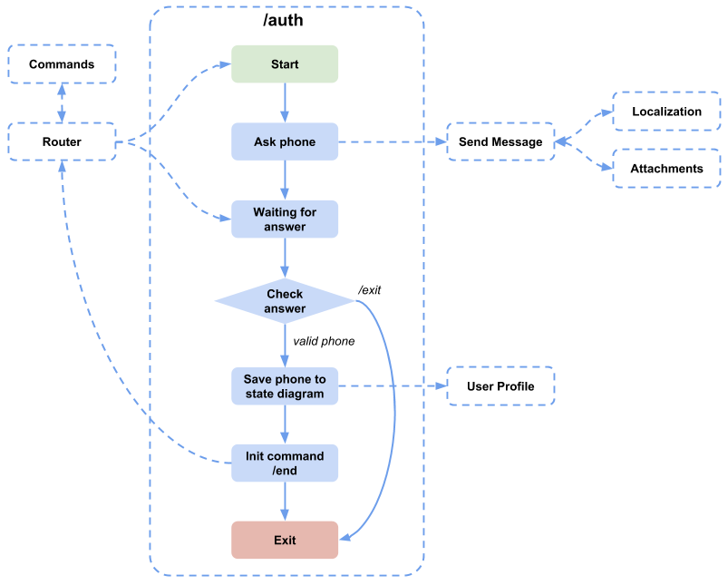
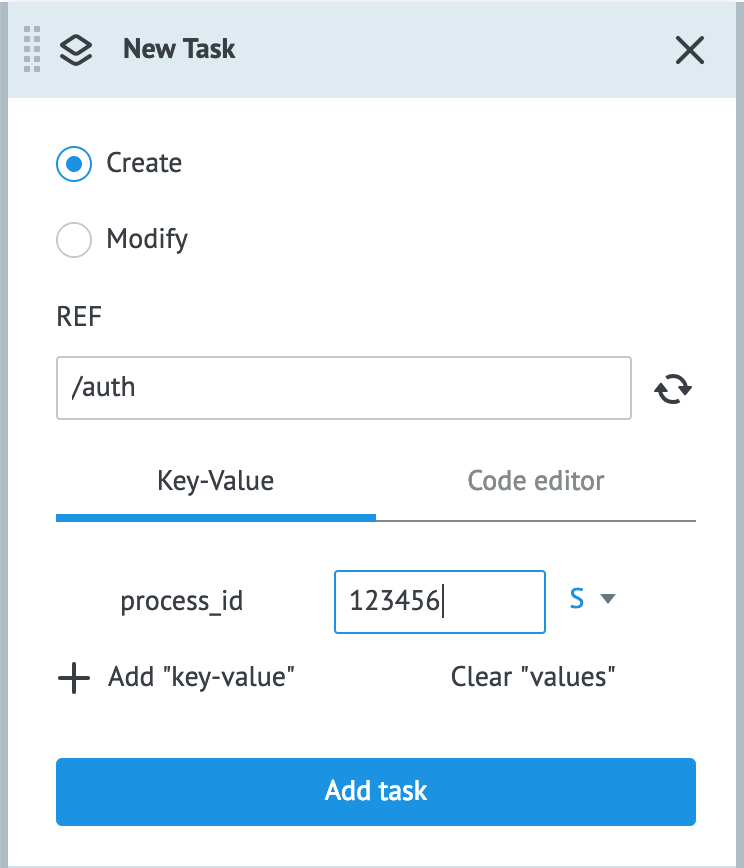

# Extending Bot Functionality


- [Adding a New Command](#adding-a-new-command)

- [Setting up Bot Platform](#setting-up-bot-platform)

  - [Commands](#commands)

  - [Localization](#localization)

  - [Attachments](#attachments)

## Adding a New Command

Very often for granting access to features and data, it is necessary to receive a user’s data and to confirm the user’s personality - authorize the user. The most common method is to get the user’s phone number and to send a one-time password (OTP) in an SMS, but we’ll use the native phone-sharing features of messengers to authorize the user.

Let’s extend the standard bot features with a new command: authorization by phone number.

Go to the **Sample Bots** folder and create a new process with the **/auth** name. This new Process has only two standard nodes, which we will fill with logic later.

## Setting up Bot Platform

For adding the authorization logic, we need to change some standard Bot Platform Processes. The general algorithm of the authorization process is shown in the following figure.




### Commands

Each bot consists of a set of features. In the Bot Platform 2.0 paradigm, each feature is a single Process that can be launched via commands. The launching command template is the following: : **`/ {{commandName}}`**. 

A Process is launched by the **Router** process, that refers to the **Commands** state diagram for retrieving `command: process_id` data binding, where `process_id` is the ID of a process to be launched.

According to this template, the command launching authorization feature (Process) will have the **/auth** name.

To empower the **/auth** command to launch the authorization process, we need to add to the **Commands** state diagram a task that will keep the corresponding `/auth: process_id` binding.

**To create this binding, we need to add a configuration task:**

1. In the **Configs** folder, open the **Commands** state diagram.
2. Switch to the **View** mode.'
3. Click **+ New task**. 
4. Fill in the new task:
    
    - Enter **/auth** (the name of the command) in the **REF** field.
    - Enter the **ID** of the **/auth** process in the **process_id** field.
5. Click **Add task**.

Now, sending the **/auth** command to the bot makes the **Router** process to receive the ID of the **/auth** process from the **Commands** state diagram and, consequently, to launch the **/auth** process.
  

### Localization

A conversation with a bot follows the question-answer pattern. To receive a user’s phone number, the bot must ask the user for it, and the user must give it.


Edit the Task with texts in the **Localization** state diagram: add to the task the following texts of the message and the button requesting a phone number:

        {
            "askPhone": {
                "ru": "Пожалуйста, нажмите кнопку для отправки номера телефона",
                "ua": "Будь ласка, натисніть кнопку для відправки номера телефону",
                "en": "Please press the button to share your phone number"
            },
            "sharePhone": {
                "ru": "Отправить мой номер телефона",
                "ua": "Надіслати мій номер телефону",
                "en": "Share my phone number"
            }
        }

### Attachments

The messengers provide an ability to receive a phone number if a user clicks the dedicated button:

| Messenger | Parameter | Button example |
|---|---|---|
| Viber |"ActionType":"share-phone"|```{"Columns": 6,"Rows": 1,"BgColor": "#F3F3F3","Text": "{{t'sharePhone}}","ActionType": "share-phone","ActionBody": "phone"}```|
|Telegram |"request_contact":true|```{"request_contact": true,"text": "{{t'sharePhone}}"}```|
|Facebook Messenger|"content_type":"user_phone_number"|```{"content_type": "user_phone_number"}```|

 
To use this ability, you need to add to the **Attachments** state diagram a template of an attachment with two buttons:

- Share phone number
- Exit to the main menu  

Thus, you need to add to the **Attachments** state diagram a new task with the following content:
  
**`REF: sharePhone`**

        {
            "facebook": {
                "type": "quick_replies",
                "buttons": [{
                        "content_type": "user_phone_number"
                    },
                    {
                        "content_type": "text",
                        "title": "{{t'/exit}}",
                        "payload": "/exit"
                    }
                ]
            },
            "telegram": {
                "type": "keyboard",
                "buttons": [
                    [{
                        "request_contact": true,
                        "text": "{{t'sharePhone}}"
                    }],
                    [{
                        "text": "{{t'/exit}}"
                    }]
                ]
            },
            "viber": {
                "type": "keyboard",
                "buttons": [{
                        "Columns": 6,
                        "Rows": 1,
                        "BgColor": "#F3F3F3",
                        "Text": "{{t'sharePhone}}",
                        "ActionType": "share-phone",
                        "ActionBody": "phone"
                    },
                    {
                        "Columns": 6,
                        "Rows": 1,
                        "BgColor": "#F3F3F3"
                        "Text": "{{t'/exit}}",
                        "ActionType": "reply",
                        "ActionBody": "/exit"
                    }
                ]
            }
        }

> **Note!** Earlier, we used the `sharePhone` key to add the text of the button for sharing phone number to the **Location** state diagram. We will use this key for inserting localized text in our buttons:

`"text": "{{t'sharePhone}}"` - for Telegram 

and 

`"Text": "{{t'sharePhone}}"` - for Viber

When a user clicks this key, the **Receiver** Process of the corresponding messenger will receive an object containing the user’s phone number, which can be used further for user authorization or other business processes.

---

Next section: [User Authorization with a Phone Number ](authorization.md)

