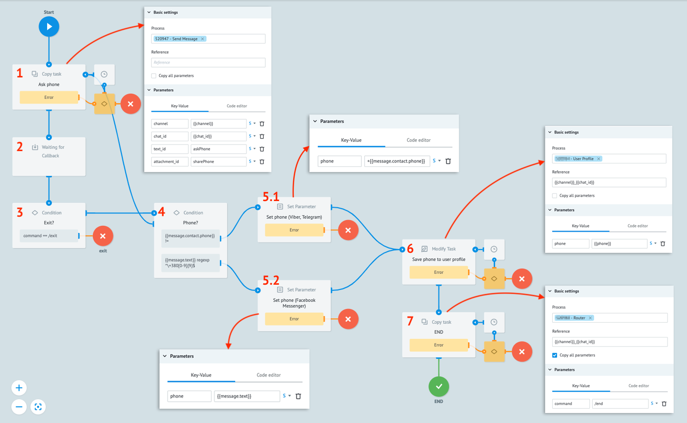
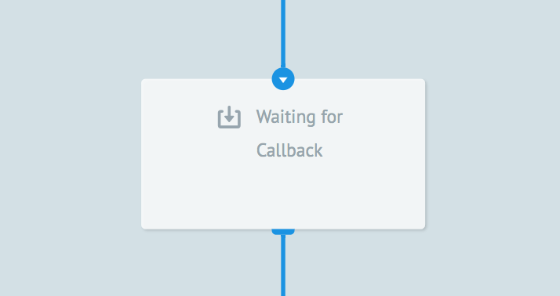
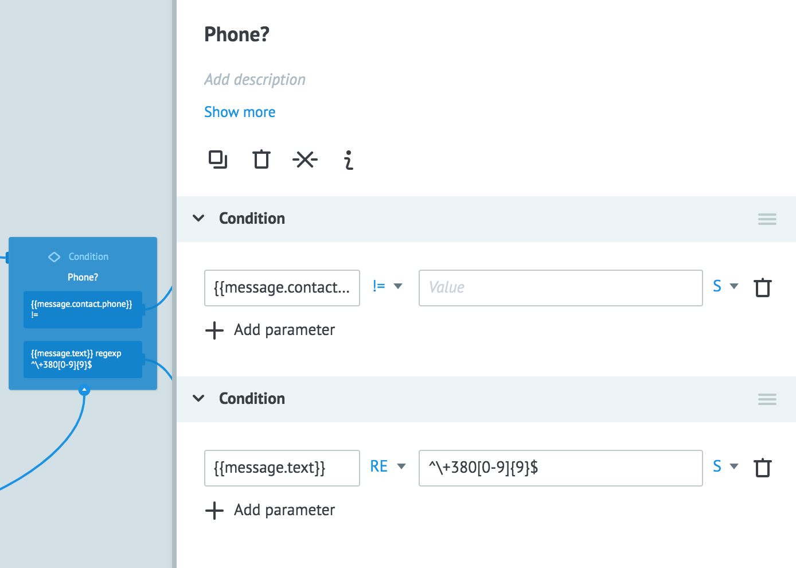
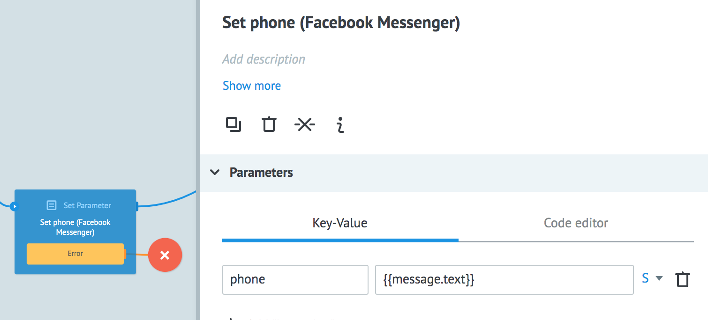

# User Authorization with a Phone Number 

When the setting up process is completed, let’s fill the **/auth** process with the authorization logic using the following procedure:



  

**1. Sending a message to a user**

For a bot to send a message to a user, a task should be copied to the **Send Message** Process. Thus, you need to add the **Copy Task** node that calls **Send Message** Process with the following parameters:

-   **channel**:```{{channel}}```
-   **chat_id**:```{{chat_id}}```
-   **text_id**: `"askPhone"` 
-   **attachment_id**: `"sharePhone"`


    
**2. Waiting for the user’s reply**

After sending a message, the bot is waiting for the user’s actions. The waiting job is on the **Waiting for Callback** node. In case of any reply of the user, the Task will be changed and go to Node 3.



**3. Checking whether to exit from the process**

For correct bot running and convenient navigation, it is recommended to provide a button with the **/exit** command, that cancels the current process and leads the user to the main menu. This practice requires a Node with the **Condition** logic that will check against exit conditions.


  

**4. Validation of the received phone number**

If the user didn’t use the Exit button for cancelation, the **/auth** process uses the **Condition** node to validate the received phone number. In our case, if the user entered a wrong value (wrong phone number, etc.), we will offer to enter the phone number or to click the Share Number button one more time.

>**NOTE!** The regular expression below works with ukrainian numbers. For other numbers you need to adjust it. It is possible to extend this logic to show an error notification or prompt.



  

**5.1. Saving the phone number from a message with contact details (Viber, Telegram)**

If the previous condition succeeded and we received the `message` object with contact details, we save the phone number into the `phone` parameter.


  

**5.2. Saving the phone number from a text message (Facebook Messenger)**

If the previous condition succeeded and we received the `message` object with a text matching a phone number regular expression, we save the `phone` number into the phone parameter.


  

**6. Adding the phone number to the user profile**

The received earlier value of the `phone` parameter is added to the user data in the **User Profile** state diagram. It is possible to use this value in other processes.


  

**7. Process completion**

The **/end** command is used to complete the process and to return to the main menu. Pass the `"command": "/end"` statement to the **Router** Process using the **Copy Task** logic.


When the authorization process is ready, we need to set up validation whether the user is authorized in the bot:
  

1.1. In the [Router](https://doc.corezoid.com/en/plugins/bot_platform/v2/objects-description.html) Process add the **Set Parameter** node between the **"GET last_command & process_id"** and **"Check Command"** nodes. Then, use the [CONV](https://doc.corezoid.com/en/interface/functions/getParamFromApp.html) function to set up receiving the `phone` parameter from the **User Profile** state diagram. 

1.2. If the phone number receiving procedure failed, record the `phone: “”` value.


2.1. In the **Check Command** node, add validation for having a phone number kept using the `phone: “”` construction.  

2.2. If this validation succeeded, the parameter has a blank value of `phone: “”`. Then, direct the task into the **Set Parameter** node, and use the `command: /auth` statement to assign the **/auth** value to the **command** parameter.  


2.3. Direct the task into the **GET process id by state** node that will direct the task into the necessary process using the command name for the **process_id** identification.


  

3.1. Between the **Delete callback** and **text_id = main menu** nodes, add another **Condition** node with the same validation for having a phone number kept using the `phone: “”` construction.

3.2. If this validation succeeded, the parameter has a blank value of `phone: “”`. Then, direct the task into the **Set Parameter** node, and use the `command: /auth` statement to assign the **/auth** value to the command parameter.

3.3. Direct the task into the **GET process id by state** node that will direct the task into the necessary process using the command name for the **process_id** identification.


  
  
We set up validation whether a user is authorized or not.
For authorized users, all the bot features are accessible.
For users not authorized, only authorization is accessible.

> **Note!** For authorization validation logic, it is possible to use an additional parameter instead of **phone**, for example, `auth: true/false`.

**Congratulations! You've successfully exnteded your bot!**
