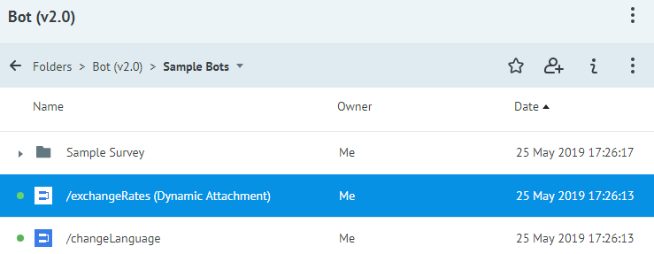
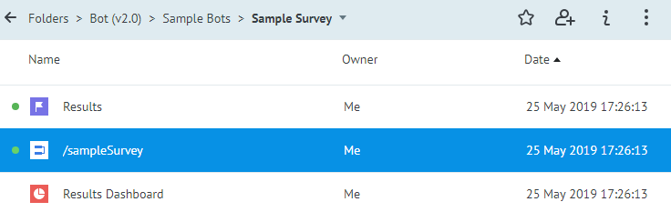
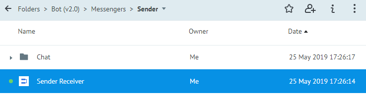
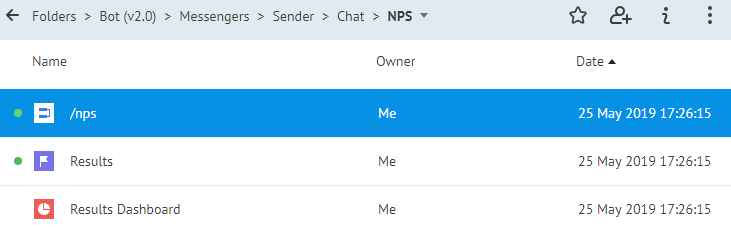

# Built-in features of Bot Platform 2.0

## Exchange Rates

It is the **/exchangeRates (Dynamic Attachment)** process located at **Folders > Bot (v2.0) > Sample Bots**.

Clicking the **Exchange Rates** button in the main menu at your bot shows a carousel with the current US Dollar rate to other currencies.

## Changing the Conversation Language

It is the **/changeLanguage** process located at **Folders > Bot (v2.0) > Sample Bots**.

A bot offers a user to select the conversation language from the following options: `en`, `ru`, and `ua`. 
The user’s choice is saved in the **User Profile** state diagram to be used in the future for localization of the bot texts and attachments.

## Sample Survey

It is the **/sampleSurvey** process located at **Folders > Bot (v2.0) > Sample Bots > Sample Survey**.

A bot offers to evaluate itself with the **“Do you like this bot?”** question and **“Yes”** or **“No”** answers.

The survey results are copied to the **Results** state diagram, where nodes are [metrics](https://doc.corezoid.com/en/interface/dashboard.html) of Results Dashboard. The Process, State Diagram, and Dashboard are in the same folder.

## Connecting with an Operator

The **Sender Action** node with the following parameters: **Actions > Category: "Widgets" + Robot: "Send Message For Bot Platform"** provides establishing connections with Operators and routing messages from the messengers to chats with Operators. 

Answers from Operators are received with the help of the Sender Receiver process located at **Folders > Bot (v2.0) > Messengers > Sender**. During the Bot Platform creating, this process is automatically connected to the **Receiving messages from Bot Platform Sender** event.

Operators in Sender are discussed in the [Creating a New Company in Sender](get-started.md#step-2.-creating-a-new-company-in-sender) section.

## NPS Survey

It is the **/nps** process located at **Folders > Bot (v2.0) > Messengers > Sender > Chat > NPS**.  

This process is used for evaluation of chats with Operators. As soon as such a chat is completed, a bot asks, **“The chat is over. Please, tell whether your issue was solved?”** A user’s answer is sent to the Sender [analytics](https://doc.sender.mobi/adm_panel_analytics.html) Sender. There are a State Diagram and statistics Dashboard, like in the [sample survey](#sample-survey).

---

Next section: [Components of Bot Platform 2.0](components.md)