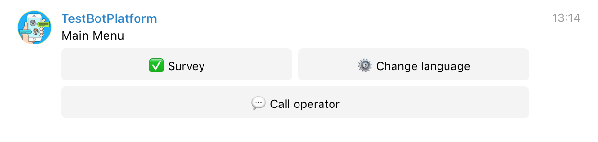
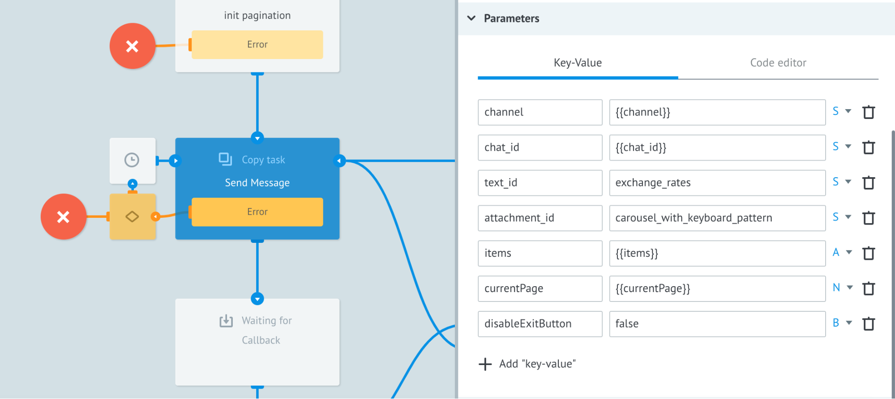
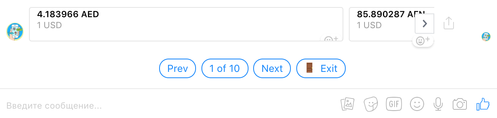

# Components of Bot Platform 2.0

The root folder located at **`Folders > Bot (v2.0)`** keeps all the necessary basic Processes required for **Bot Platform 2.0** grouped in subfolders.

  - [The Viber/Telegram/Facebook Receiver Process](#the-viber/telegram/facebook-receiver-process)

  - [The Main Process](#the-main-process)

  - [Event](#description-of-the-event-types)

  - [The Router Process](#the-router-process)

  - [The Send Message Process](#the-send-message-process)

  - [The Configs Foleder](#the-configs-folder)

    - [Tokens](#tokens)

    - [Command](#commands)

    - [Attachments](#attachments)


## The Viber/Telegram/Facebook Receiver Process

The **Viber Receiver**, **Telegram Receiver**, **Facebook Receiver** processes are located in the folders of each messenger at **`Folders > Bot (v2.0) > Messengers > {{Messenger Name}}`**.


These processes are work starting points of each bot: a **_messenger_** [Webhook](https://en.wikipedia.org/wiki/Webhook) connects to the **_same-messenger-name_ Receiver** process during Bot Platform creation. 


**The Receiver processes do the following:**

- Receives events (messages and files sent, buttons clicked, links followed, etc.) from users.
- Converts received data to the unified standard data structure:
	- `channel` - the message channel. Available options: `telegram`, `facebook`, `viber`.
	- `chat_id` - identifier of a chat, user, etc.
	- `event` - event type.
	- `message` - message object.
- Transmits the converted data to the [Main](#the-main-process) process.
    

> Note!

_If you need to attach another bot to an existing project at Bot Platform, you need to connect a webhook of this bot to the corresponding **Receiver** process manually:_

1. Click the corresponding **`{{Messenger Name}} Receiver`** process and then click **View details**.
   
    
   
2. In the **`{{Messenger Name}} Receiver`** pane appeared on the right, go to the **Webhook** tab.

    

3. Click the **Connect to messenger** button. The **Connect to messenger** dialog box appears.

    

4. Click the **_corresponding messenger_** button. A blank **text box** field appears in the **Connect to messenger** dialog box.

     

5. Enter an access **token** to the new bot in the text box field and then click **ОK**.

6. Update the token in the [Tokens](#tokens) state diagram. The Task **`REF`** should have the token name. 

  
Нажмите кнопку **Connect to messenger**, выберите мессенджер и укажите новый токен для подключения webhook к процессу. Также необходимо обязательно актуализировать токены в [диаграмме состояний Tokens](#tokens). `REF` заявки должен называться **token**.


## The Main Process

The **Main** process receives the converted data from the messengers and runs the initial business logic of the bot before routing tasks to sub-processes.

**Input JSON Example**

    {
	    "channel": "viber",
	    "chat_id": "12312321",
	    "event": "message",
	    "message": {
	    "type": "text",
	    "text": "Lorem ipsum..."
		}
    }

#### Description of the incoming data parameters to the Main process

|Parameter|Type|Required|Description|
|---|---|---|---|
| channel  | string  | +  | A name of a messenger from which a user wrote |
|  chat_id |  string | +  | A unique identifier of a user |
|  event | string  |  + | An event type. Available options: `start`, `context`, `message`, `command`  |
| message  |  object | +  |  A message object |
| first_name  | string  | -  | A user’s first name |
|last_name  | string  |  - |  A user’s last name |
| gender  | string  | -  | A user’s gender |
|  user_picture |  string | -  |A link to a user’s profile picture|
|  country |  string | -  | A country where a user is currently in and detected by a messenger automatically |
| language  |  string |  - |  A language set on the user’s device |
| timezone  |  string |  - | A time zone  |
| context  |  string | -  | Data of the `context` event  |

  

### Description of the event types

|Type of event|Description|
|---|---|
| start   | It is initiated when a user connected to a bot for the first time; in Viber — each time a chat dialog is opened|
| context | It is initiated if the incoming message has a context. A context is additional parameters that can be added to a link leading to a bot, like a command launching, reference link, etc |
| message | It is initiated when a user sent a message |
| command | It is initiated when a user sent a message of the `/commandName` type|


An example of data transmission using **context**.

**Viber** - `viber://pa?chatURI={{public_account_name}}&context={{params}}`

**Facebook Messenger** - `http://m.me/{{bot_name}}?ref={{params}}`

**Telegram** - `https://telegram.me/{{bot_name}}?start={{params}}`

## The Router Process

This process fulfills the main logic of processing Bot Platform events. All the [event](#description-of-the-event-types) types can be processed here.


## The Send Message Process

This process is responsible for sending messages to users. It receives text templates, [attachments](#attachments), and argument values to compose them together dynamically into a single ready-for-sending message. Also, it does message localization.


#### Description of outcoming message parameters of the Send Message process
| Parameter     | Type    | Required                                 | Description |
|---|---|---|---|
| channel       | string  | +                                        | A name of a messenger from which a user wrote|
| chat_id       | string  | +                                        | A unique identifier of a user in a messenger|
| text_id       | string  | +                                        | A name of a text object to be sent to a user. The [Localization](#localization) state diagram stores the texts.|
| attachment_id | string  | +                                        | A name of an object which describes an attachment to a text message. The [Attachments](#attachments) state diagram stores the attachments|
| items         | array   | Only for Dynamic attachment | An array of objects for dynamic attachment. The objects are inserted as parameters arguments into a message attachment to be shown as a carousel or keyboard to a user|
| currentPage   | integer | Only for Dynamic attachment | Each messenger limits the maximum quantity of items shown in a carousel or keyboard. If an `items` array has more objects than allowed, this array is divided into pages (pagination). By default, the initial page number equals `1`.|

  

**Input JSON Example**

    {
    	"channel": "viber",
    	"chat_id": "12345...",
    	"text_id": "main_text",
    	"attachment_id": "main_keyboard"
    }

  

**Input JSON Example (Dynamic attachment)**

    {
        "channel": "viber",
        "chat_id": "12345...",
        "text_id": "exchange_rates",
        "attachment_id": "carousel_pattern",
        "items": [{
                "name": "AED",
                "value": 4.283634
            },
            {
                "name": "AFN",
                "value": 85.711652
            },
            {
                "name": "ALL",
                "value": 126.118624
            },
            ...
            "currentPage": 1
        }


## The Configs Folder

To store data, Bot Platform 2.0 has the following State Diagrams:

-   **Attachments** - templates of message attachments are stored in JSON.
-   **Commands** - bindings of commands’ names with processes IDs.
-   **Localization** - texts for content localization.
-   **Tokens** - access tokens to bots in messengers.
-   **User Profile** - users’ profiles received from bots.  
      

    
The **Bot Platform** processes interact with the state diagrams using the [dynamic construction](https://doc.corezoid.com/en/interface/functions/getParamFromApp.html) for data receiving. 


### Attachments

Along with text messages, the Messengers support various Attachments to the messages, like buttons, keyboards, carousels, and so on.

The **Attachments** state diagram stores all the objects describing the Attachments. When adding an Attachment to this Diagram, it is recommended to specify the name of  [Task Refecence](https://doc.corezoid.com/en/interface/tasks/) according to the target action for which this Attachment will be used, for example,  `mainMenu` for displaying the **Main menu**, `exit` for a button to exit the current process, etc.  
   
  
This value is given in the `attachment_id` parameter when sending a message to a user.

**To send a message with an Attachment to a user, a bot uses the following logic:**

1. The Send Message process uses [dynamic construction](https://doc.corezoid.com/en/interface/functions/getParamFromApp.html) `{{conv[{{attachment_state_diagram_id}}].ref[{{attachment_id}}]}}` to receive an object that describes all Attachments for all messengers.
2. The attachment parameter gets an Attachment that coincides with the channel parameter.
3. The Attachment is localized. Texts from [Localization](#localization) are put instead of all the `{{t'<key>}}` variables.
4. Values are dynamically inserted into the Attachment. The values of parameters incoming to the **Send Message** Process with a Task are put instead of all the `{{param}}` parameters, which are used in the Attachment description.
5. The composed message is sent to a user.
  

#### Example

By default, the **Attachments** state diagram has samples of ready-made Attachments, for example, `mainKeyboard` - the main menu keys:


**Facebook Messenger:**


**Viber:**


**Telegram:**




**More details on attachment types you can find in the API documentation of each messenger:**

-   [Viber](https://viber.github.io/docs/api/rest-bot-api/#message-types)
-   [Facebook Messenger](https://developers.facebook.com/docs/messenger-platform/reference/send-api/)
-   [Telegram](https://core.telegram.org/bots/api#message)
    

  

**Attachment JSON Example:**

**`REF: exit`**

        {
            "telegram": {
                "type": "inline_keyboard",
                "buttons": [
                    [{
                        "text": "🚪 {{t'exit}}",
                        "callback_data": "/exit"
                    }]
                ]
            },
            "viber": {
                "type": "keyboard",
                "buttons": [{
                    "Columns": 6,
                    "Rows": 1,
                    "BgColor": "#F3F3F3",
                    "Text": "🚪 {{t'exit}}",
                    "ActionType": "reply",
                    "ActionBody": "/exit",
                    "TextVAlign": "middle",
                    "TextHAlign": "center",
                    "TextSize": "regular",
                    "Silent": true
                }]
            },
            "facebook": {
                "type": "quick_replies",
                "buttons": [{
                    "content_type": "text",
                    "title": "🚪 {{t'exit}}",
                    "payload": "/exit"
                }]
            }
        }


  
#### How Does Dynamic Attachment Work?

When developing a bot, there is often a need to display data of a homogeneous structure, like a catalog of products, a cart with selected goods, a list of current special offers, etc.

The **Send Message** Process supports the creation of Attachments using a template for a variable quantity of items.


##### Adding a Template

Let’s discuss how to add a template using an included-in-attachment template for displaying exchange rates.
  

**JSON Example (Dynamic attachment)**

**`REF: carousel_pattern`**

     {
         "attachment": {
             "facebook": {
                 "type": "carousel",
                 "items": [{
                     "title": "{{value}} {{name}}",
                     "subtitle": "1 USD"
                 }]
             },
             "viber": {
                 "type": "carousel",
                 "carouselRows": "1",
                 "carouselColumns": "6",
                 "items": [{
                     "Columns": 6,
                     "Rows": 1,
                     "ActionType": "reply",
                     "ActionBody": "none",
                     "Text": "1 USD = {{value}} {{name}}",
                     "TextSize": "small",
                     "TextVAlign": "middle",
                     "TextHAlign": "middle",
                     "Silent": true,
                     "BgColor": "#FFFFFF"
                 }]
             }
         }
     }


  

>**Note!** There is no template for Telegram because Telegram does not support this kind of messages.

  

##### The items Sourcing Array

For creating a carousel, an array is needed for providing values to the template:

    "items": [
        {
            "title": "4.183966 AED",
            "subtitle": "1 USD"
        },
        {
            "title": "85.890287 AFN",
            "subtitle": "1 USD"
        }
    ]


 
##### Converting JSON

When calling the **Send Message** Process, it is necessary to pass the following parameters:

    {
        "attachment_id": "carousel_pattern"
        "items": "items"
        "currentPage": 1
        "disableExitButton": false|true (a flag to show the Exit button)
    }

A Code node named **createDynamicAttachment** does all other necessary actions over an object. 



The **Send Message** Process considers messenger limitations and does corresponding pagination automatically: it breaks the array into pages and adds the navigation buttons. The **Exit** button is added if `disableExitButton = false`.


**The Converted JSON:**  

     "message": {
         "quick_replies": [{
             "content_type": "text",
             "title": "🚪 Exit",
             "payload": "/exit"
         }],
         "attachment": {
             "type": "template",
             "payload": {
                 "template_type": "generic",
                 "elements": [
                    {
                         "title": "4.183966 AED",
                         "subtitle": "1 USD"
                     },
                     {
                         "title": "85.890287 AFN",
                         "subtitle": "1 USD"
                     },
                     ...
                 ]
             }
         }
     }


  
  

**Examples of Displaying:**

**Facebook Messenger:**  

  

**Viber:**


### Commands

Clicking a bot button initiates a command. To enable this button to launch a Corezoid Process, you need to bind the name of this **command name** with the **ID of this Process**.


The **Router** Process uses the command name to [retrive](https://doc.corezoid.com/ru/interface/functions/getParamFromApp.html) a value of the `process_id` parameter of a Task from the **Commands** state diagram and launches the process.

>**Note!** The task `REF` should have the exact same name and letters case as your command, for example: `/changeLanguage`.

**JSON Example**

  
**`REF: /changeLanguage`**

    {
    	"process_id": "12345"
    }

  

### Localization

The **Localization** state diagram stores all texts of all messages and attachments in one Task:

**Task example:**

**`REF: localization`**

        {
            "/exit": {
                "en": "Exit",
                "ru": "Выход",
                "ua": "Вихід"
            },
            "mainMenu": {
                "en": "Main Menu",
                "ru": "Главное меню",
                "ua": "Головне меню"
            },
            "no": {
                "en": "No",
                "ru": "Нет",
                "ua": "Ні"
            },
            "yes": {
                "en": "Yes",
                "ru": "Да",
                "ua": "Так"
            },
            ...
        }

  

**This approach enables to:**

1. Manage all bot texts from one place.
2. Send messages by only specifying a **`key`** of the necessary text in the **`localization`** object.
3. Localize bot interface. By default, the texts are in the **`en`**, **`ru`** and **`ua`**, languages, but any language can be added.


To send a text message, you need to specify the key name `key` from the **`localization`** task as a value of the `text_id` parameter.


  

**Example**. To send the Main menu to a bot, you need to provide the **Send Message** process with the following parameters and values:

    {
        "attachment_id": "mainKeyboard",
        "channel": "viber",
        "chat_id": "...",
        "text_id": "mainMenu"
    }

For localization, attachments should have their parameters of UI texts (button names, labels, etc.) to meet the `{{t'<key>}}` template, where `<key>` is the key of a necessary text in the **`localization`** object.
  

**Example.** Localization of the **Exit** button:

    {
        "content_type": "text",
        "title": "🚪 {{t'/exit}}",
        "payload": "/exit"
    }


The **Send Message** process sends a message in the same language as stored for a user in the **User Profile** state diagram. The default language is **`en`** and can be changed in the **Set Parameter** node named **_SET default language == EN_** of the **Send Message** process.


### Tokens
This state diagram stores bots access tokens.

**JSON Example**  
  
**`REF: token`**

    {
    	"telegram": "...",
    	"viber": "...",
    	"facebook": "..."
    }


### User Profile

This state diagram stores users’ data. A new user profile is created when this person refers to the bot for the first time; then this profile is updated in the future activities.

A task with user data is created and edited in the **Main Process** using a reference of the strict template: 

**```{{channel}}_{{chat_id}}```**, where:  
 
- `channel` is the name of a messenger a user referred from
- `chat_id` is unique user identifier in the messenger  

**Example**: `viber_2yOPxC85DSpJCJHpYzjqTw=`


As the `channel` and `chat_id` parameters are required in all the **Bot Platform** processes, the user data can be received and edited at any step.

---

Next section: [Extending Bot Functionality](add-new-functionality.md)