# Brightpearl & Shopify

On-line update of goods delivery period on the website upon change of their availability in warehouses.

##What you need to start:

* copy of [folder with processes](https://admin.corezoid.com/folder/conv/55612)

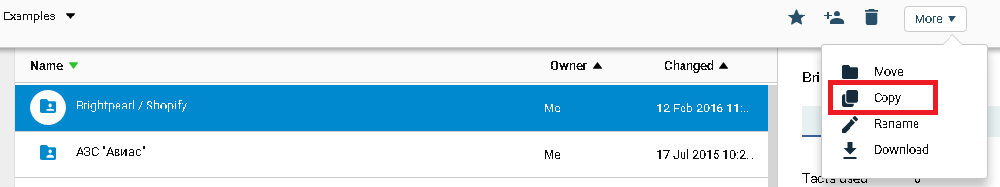

* warehouses with goods on [brightpearl.com](https://www.brightpearl.com/)
* data of [brightpearl.com](https://www.brightpearl.com/)account:
 * brightpearl-app-ref,
 * brightpearl-staff-token,
 * account
* application data on [shopify.com](https://www.shopify.com/)
 * api_key
 * password
 * hostname


##How it works

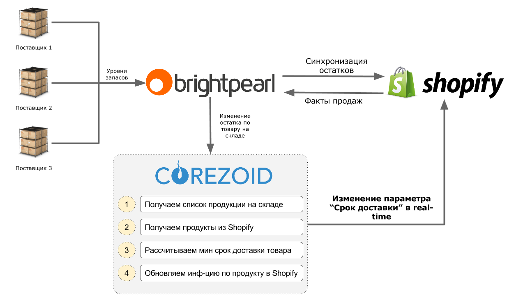

**[Instructions for integration with 1C](#1c)**


## What do you need to know about the processes

* as an example, it is supposed that in the process expedited delivery may be performed from warehouse No.2

* to avoid increased load on API, requests to Brightpearl and Shopify are performed under the procedure of applications queue; this procedure is implemented through QUEUE Logic and GET TASK Logic. According to documentation, 3 requests per 1 second are the norm for Brightpearl and 2 requests per 1 second for Shopify


##Launch

**1)**  Add your keys and Brightpearl account name to the requests queue to API Вrightpearl

Addition path:

`Folder “Brightpearl” - Process “QUEUE” – path node “Copy”`

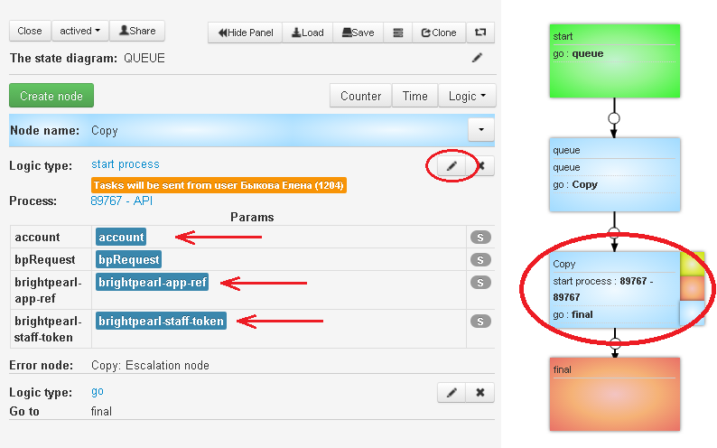

**2)**  Add your Shopify account name, Shopify keys and Brightpearl keys to the requests queue to API Shopify, where necessary.

Addition path:

`Folder “Shopify” - Process “QUEUE” - path nodes “Copy GET”, “Copy PUT_METAFIELD”, “Copy PUT_PRODUCT”, “Copy PUT_VARIANT”`

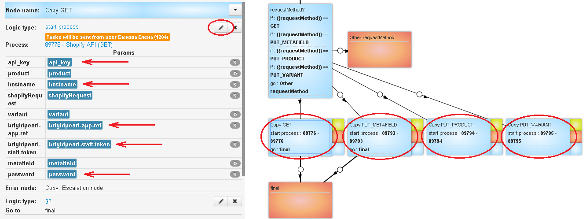

**3)**  Create a webhook on the change of the good’s state in Вrightpearl.

Receive the URL for uploading tasks to the main process. In this regard, highlight the main process and copy its Direct upload.

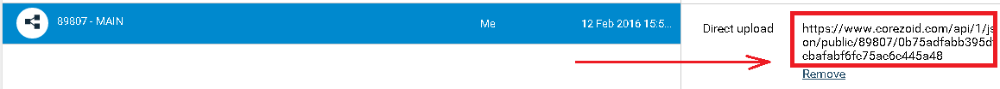

Go to the folder “Вrightpearl”, then to the process “Webhook create” and “dashboard” mode and press the button Add task.

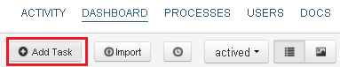

In the pop-up window, specify mandatory parameters of Вrightpearl:

* account – account name
* direct_upload - URL for uploading tasks to the main process
* brightpearl-app-ref
* brightpearl-staff-token

Once all parameters are specified, press the button Send task

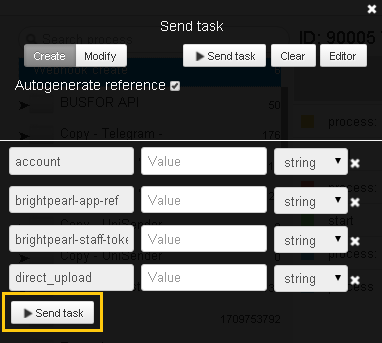

Go to the task archive of the node “final” (Tasks archive). Parameter value "response" will contain id of created webhook
```
{
	"response": 1
}
```

**4)** Start the processes of getting tasks for requests to API.

For two processes “Get task for API” in the folder “Вrightpearl” and “Shopify” it is necessary to perform the following similar actions:

* Switch to the “dashboard” mode and press the button Add task in order to add the task


* Press the button Send task in order to send an idle task

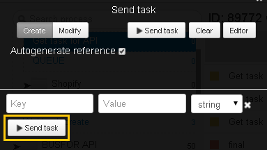


## Integration with 1C {#1c}

Updating a typical configuration for receiving changes from any note in any directory entry of `"Nomenclature"` and sending appropriate events to the process on [Corezoid.com](https://www.corezoid.com/).

###Events
- Purchase Invoice (delivery of goods and services)
- Invoice (sale of goods and services)
- Write-off
- Back from the buyer
- Return to the supplier


###For configuration renewal

**1.** Make a backup of the database.

**2.** Download [plugin](https://github.com/corezoid/1c-plugin/raw/master/1Cv8_CorezoidAdd_v1.2.cf) в любое удобное место.

**3.** Open configurator using administrator rights.

**4.** Check on which side there is configuration support by the presence or absence of a lock in front of its name.

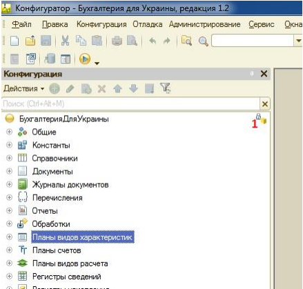

If the lock is not available, skip this step.

If the lock is available, configuration is on the support of provider (franchising firm 1C) - turn on the permission of its editing with save of support in menu `Configuration - Support – Support settings`

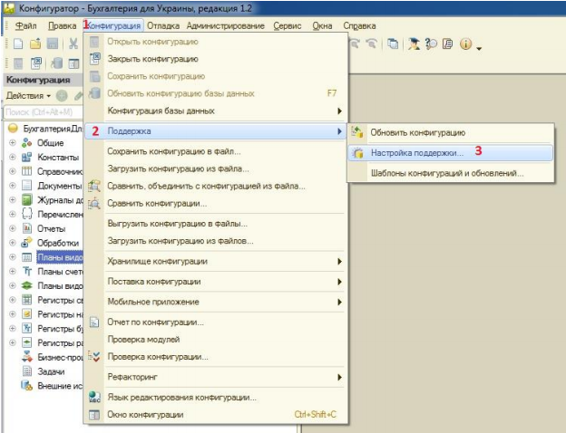


**5.** In appeared window, press `«Enable change possibility»`.

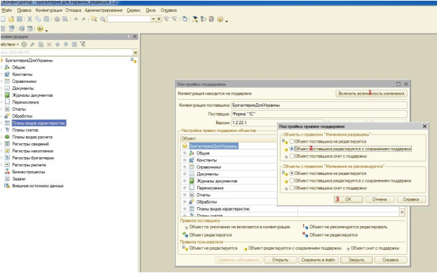

**6.** Save changes in configuration - `F7`.

**7.** Compare and merge the configuration to integrate `1Cv8_CorezoidAdd_v1.2.cf`.

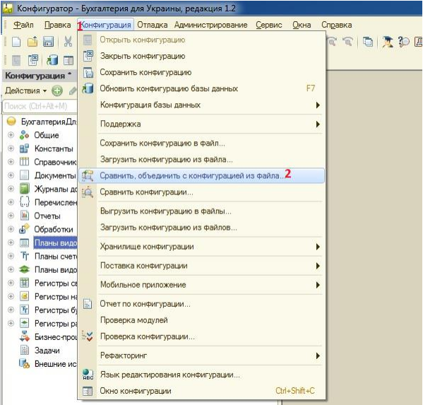

**8.** Make sure that there were **ONLY** three ticks left after compassion/merging - `«Common modules»`, `«Subscriptions for the events»` and `«Settings storage»`.

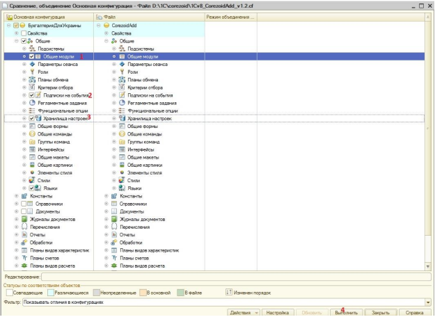

**9.** Save changes and configuration:
`Execute - agree with all questions - F7`

At the time of saving, you will need to shut down all users.

**10.** Launch 1С with administrator's rights.

**11.** If 1C is usual (1C Accountancy and 1C Manufacturing Enterprise Management), then with first launch under administrator's rights, open processing `«FillOutSettingsExchangeCorezoid_usual»` included to the packadge content.

If 1С with web interface (managing a small firm), then processing `«FillOutSettingsExchangeCorezoid_web»`.


**12.** In appeared form, specify price type and URL for downloading tasks to process on [Corezoid.com](https://www.corezoid.com/).

Then, «Execute» or «Save» (for web application).

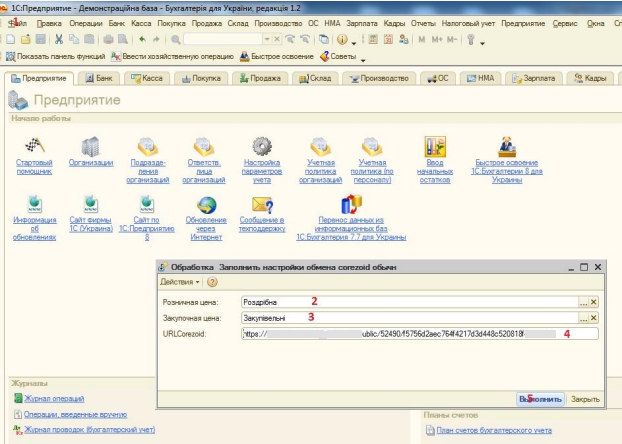

In order to receive URL for task downloading, select required process and copy its Direct upload.


Changes in configuration will start working right after 1C launch - no need in additional settings.

---
### Any questions?

See the answers or leave your question in [FAQ](https://www.corezoid.com/ru/faq).

