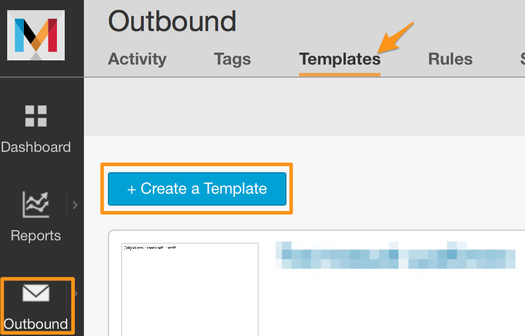
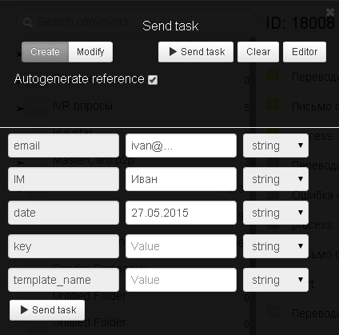

# Happy Birthday greetings

In order to organize email sending with Happy Birthday greetings, [clone the template of the process.](https://admin.corezoid.com/editor/758/18008).


Create a message template with the name of the **template**, which will be used for sending congratulatory emails.



In order to test it, add following variable to the template:
```
*|IM|* - destination name
```

Go to the `dashboard` name and click on `Add task` - sending the request.


Select in the opened window:
*   `key` - access key to API Mandrill
*   `template_name` - template name of emails on Mandrill
*   `email` - recipient email
*   `date` - date of the next birthday in the format dd.mm.yyyy
*   `IM` - destination name



Then click on `Send task`.

After sending an email with happy birthday greetings, the process will calculate the date of birth for the next year and the request will be pending. The email will be sent again next year.

Therefore, this process has no end state - the request does not go to the red node if there are no call error of service.
