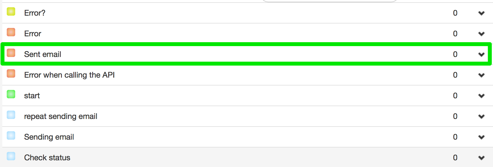

# Mandrill

http://mandrill.com - THE FASTEST WAY TO DELIVER EMAIL.


[Sing up](https://mandrill.com/signup/) - one click registration. Point just your e-mail and password of account.

After registration, create a key of access to API mandrill which will be used in your delivery.


Create a letter template with **template** name which will be used in your email delivery.


Paste next example of template
```
Welcome *|user|*

today *|day|*
```

##Mail sending process

[Clone process template (3435)](https://www.corezoid.com/admin/edit_conv/3435) to send email through Mandrill API.


Go to `dashboard` mode and press `Add task` button - send task.


In appeared window, specify:

|Parameter's name|Parameter's description|
|--|--|
|key|Access key for API Mandrill|
|email|To whom|
|idTemplate|Template name, it is **template** in example|
|user|User's name which will be added to template|
|day|Day which will be pasted to the template|


After specifying task parameters, press `Send task`.

In case of successful email sending, task will go to **Sent email** state.


###Task parameters editing
Test request parameters can be added/changed in API logic through editor. It's enough to press button `Editor`:


You can see the full list of API Mandrill parameters by this link - [https://mandrillapp.com/api/docs/messages.JSON.html#method=send-template](https://mandrillapp.com/api/docs/messages.JSON.html#method=send-template).
