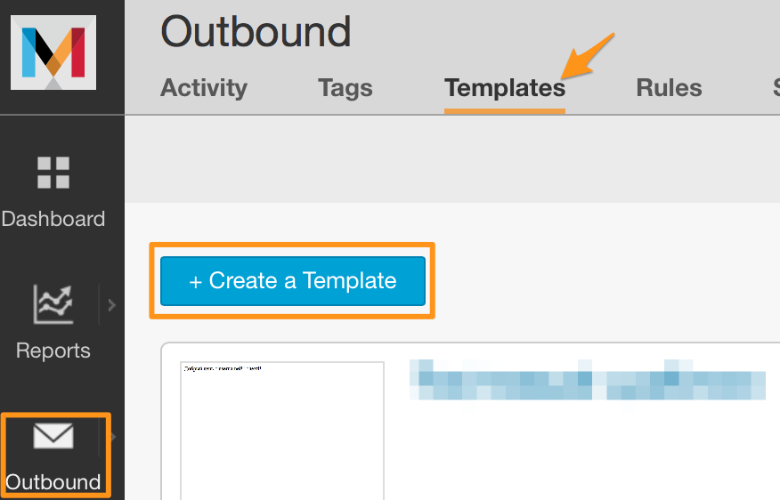
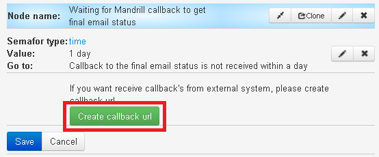
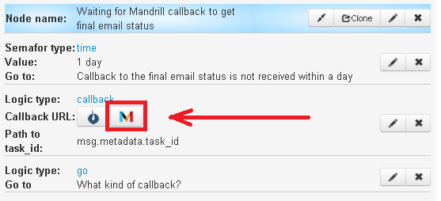
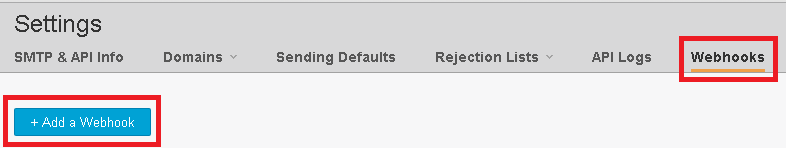

# Calculation of Click-To-Buy indicator

Using this template gives you an opportunity to calculate Использование этого шаблона дает возможность рассчитать по email рассылке показатель CTB (Click-To-Buy).

##Создание шаблона email для рассылки
[http://mandrill.com](http://mandrill.com) - THE FASTEST WAY TO DELIVER EMAIL.

[Registration on website](https://mandrill.com/signup/) -  in one click. Specify only your email and password for account.

After the registration, create an access key to Mandrill API that will be used in your delivery.


Create letter template with **template** name which will be used in your email delivery .



Fill out all fields in `"Template Defaults"` section and put next text to the template for testing
```
Welcome *|user|*

today *|day|*

Webstore *|link to the website|*
```

##Process of Click-To-Buy indicator calculation 

Clone ["Calculation of Click-To-Buy indicator" folder](https://admin.corezoid.com/folder/conv/2391) for email sending through Mandrill API and Click-To-Buy indicator calculation.


Go to the process.

**Generate link for receiving callback from Mandrill**

In the node with CALLBACK logic `"Waiting for Mandrill callback to get final email status"`

**1)** go to editing mode of CALLBACK logic 


**2)** press "Create callback url" button



**3)** go to edit mode of CALLBACK logic and write this value - "msg.metadata.task_id" in the "Path to task id" field and press "Save".


>`msg.metadata.task_id` - this is the path to the field in the request with callback from Mandrill, where the request in process will be renewed.


**4)** press on "Mandrill" button and link will be copied to the clipboard.



**Add received link to the Mandrill settings for receiving callback** - on Mandrill website go to `"Settings"` - `"Webhooks"` and press `"+ Add a Webhook"` button



Then:
* mark the events where the Mandrill will send callback to Corezoid
* paste received in Corezoid link to the `Post To URL` filed
* add Webhook name to `Description` field
* press `Create Webhook` button


**Task renewal**

After Mandrill's delivery, process will go to the nodes where the request needs to be renewed by refrence.

There's  `email` for download and wherein the required condition is - `Task REF = client's email`.

For task renewal it is required to send HTTP requests by POST method to Direct uploadURL of process:


Enter to th private account, `"User logged"` node:

request - `{"ops":[{"type":"modify","obj":"task","ref":"email клиента","conv_id":"id процесса","data":{"state":"login"}}]}`.

Clinet put the goods to the cart, `"Item added to the basket"` node:

request - `{"ops":[{"type":"modify","obj":"task","ref":"email клиента","conv_id":"id процесса","data":{"state":"”basket”"}}]}`.

Client has paid/confirmed the goods, `"Item purchased"` node:

request - `{"ops":[{"type":"modify","obj":"task","ref":"email клиента","conv_id":"id процесса","data":{"state":"”paid”"}}]}`.


For testing template of email sending through Mandrill API and Click-To-Buy indicator calculation, go to `dashboard` mode and press `Add task` button - to add the request.


In appeared window, specify:

|Parameter name|Parameter description|
|--|--|
|key|Access key for API Mandrill|
|email|To whom|
|idTemplate|Template's name, in example it is **template**|
|user|User's name which will be pasted into the template|
|day|Day, which will be inserted into the template|


After specifying task parameters, press `Send task` button.

As a result, task will go through the process and come to the one of end states (red colour node).

Before coming to the end state, task will "freeze" in nodes with CALLBACK logic, waiting for reply about email status and client's actions.


###Editing task parameters
Parameters of test task can be added/changed in API logic through editor. Enough to press `Editor` button:


You can see the full list of API Mandrill available parameters here - [https://mandrillapp.com/api/docs/messages.JSON.html#method=send-template](https://mandrillapp.com/api/docs/messages.JSON.html#method=send-template).
