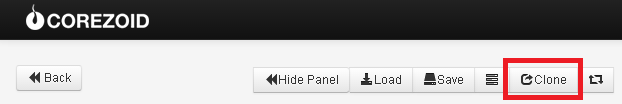
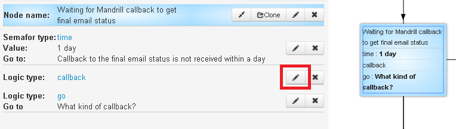
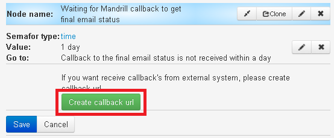
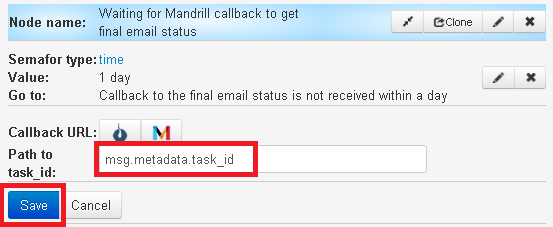
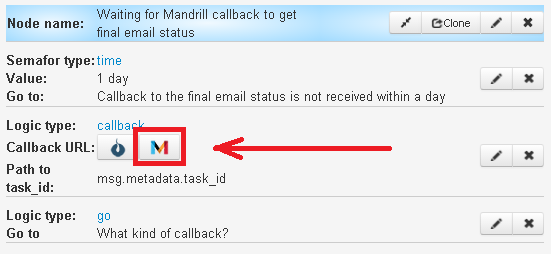
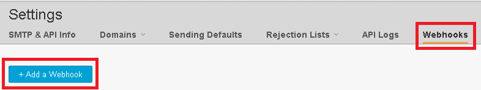
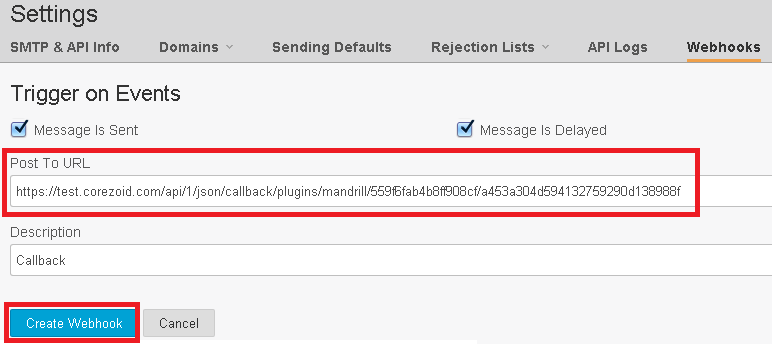
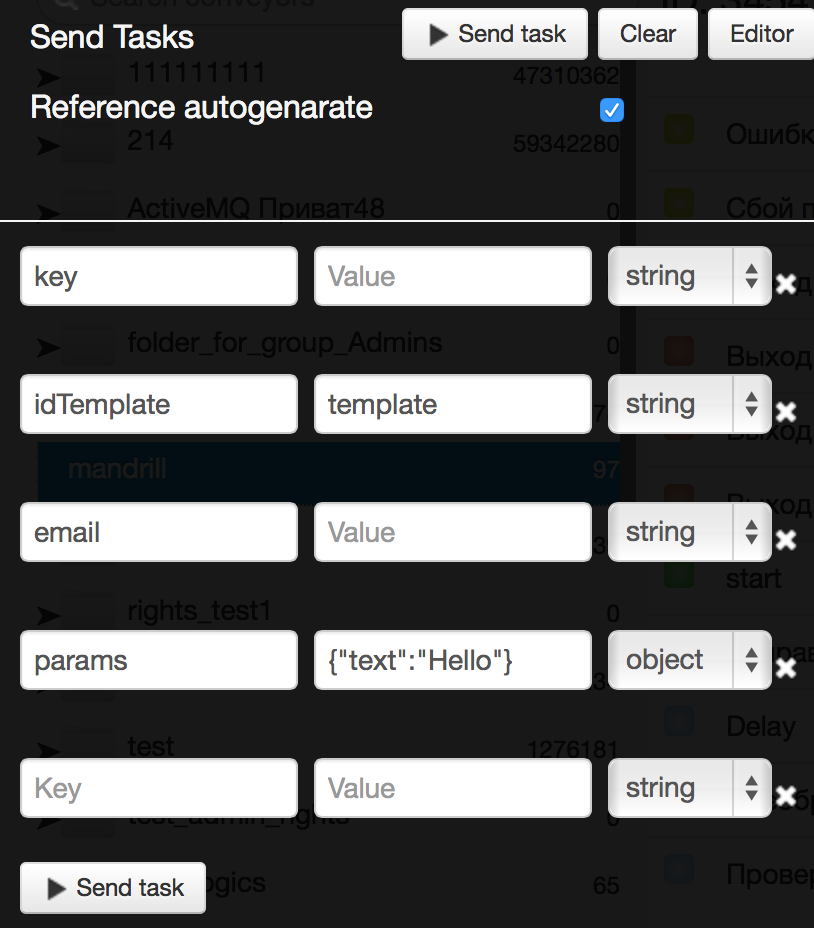
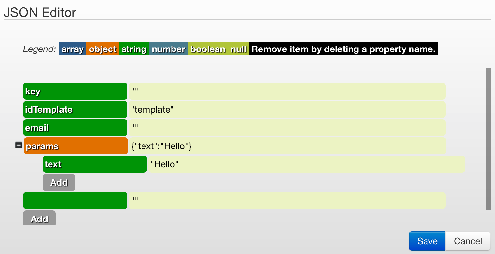

# Mandrill + callback

How to create an email template is described in [p.2.1. Mandrill](mandrill.md).

##The process of sending an email

[Clone process template (27682)](https://www.corezoid.com/admin/edit_conv/27682) for sending email through the API Mandrill.

** Generate a link for getting a callback from Mandrill **

In the node with the logic CALLBACK `"Waiting for Mandrill callback to get final email status"`

**1)** go to the edit mode of Logic CALLBACK

**2)** click on "Create callback url"

**3)** switch to edit mode of CALLBACK Logic and, in the field "Path to task ID", specify the following value "msg.metadata.task_id" and click "Save".

>`msg.metadata.task_id` - is the path to a field in a request with callback from the Mandrill, on which the request will be updated in the process.

**4)** Click on the icon "Mandrill" and the link will be copied into the clipboard.

**Add the received link to Mandrill settings for getting a callback ** - on the website Mandrill go to `"Settings"` - `"Webhooks"` and click `"+ Add a Webhook"`

Hereafter:
* Mark the event based on which Mandrill will send callback to corezoid
* Insert obtained link in Corezoid in the `Post To URL` field
* Add the Webhook name in the `Description` field
* Click on `Create Webhook`

For testing the template of sending an email through the API Mandrill, go to `dashboard` and click` Add task` - to add the request.

In the opened window, specify:

| Parameter Name | Parameter Description |
| - | - |
| key | Access key to API Mandrill |
| email | To whom send |
| idTemplate | template name in this example ** template ** |
| user | username that will be inserted into the template |
| day | Day that will be inserted into the template |

After the parameters of request are specified, click on `Send task`.

As the result, it will be the path of request through process and the transition in one of the final states (red node).

Before getting into the final state, the request may "freeze" in the nodes of the logic CALLBACK waiting for the response from Mandrill about the status of the email.

[Instruction](https://mandrill.zendesk.com/hc/en-us/articles/205583017-Can-I-add-an-automatic-unsubscribe-link-to-Mandrill-emails-), how to add a link for unsuscribing from email and receive a callback with the corresponding status "unsub".

###Editing Application
The parameters of the test requests can be added / edited in logic of API via the editor. Just click on `Editor`:

A full list of available parameters API Mandrill can be found here - [https://mandrillapp.com/api/docs/messages.JSON.html#method=send-template](https://mandrillapp.com/api/docs/messages.JSON.html#method=send-template).
