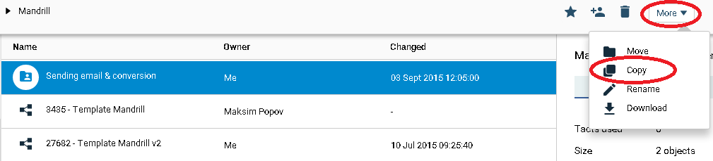
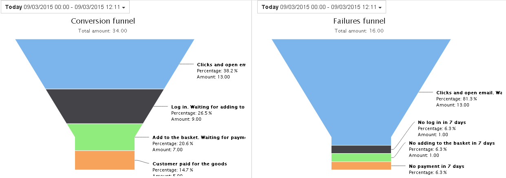
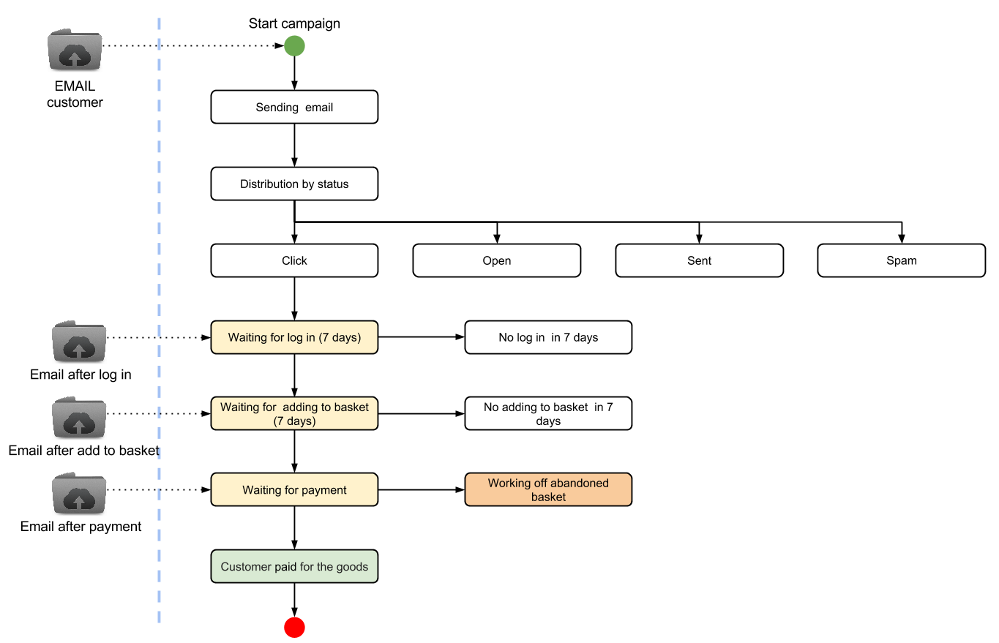
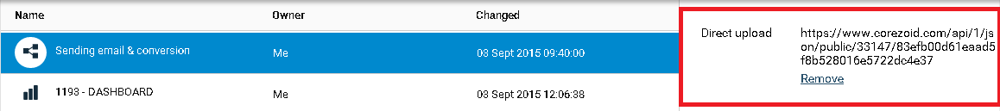

# Calculation of mailing efficiency

Clone [folder "Sending email & conversion"](https://admin.corezoid.com/folder/conv/758).

The process template and dashboards are in the folder.

Using this process allows to calculate the conversion of email delivery via Mandrill and bring it to the dashboards in the form of a funnel.

And also get statistics of final mailing status.

##**Process scheme**

##**How it works**

After sending of email and receiving a callback from Mandrill, which records the transition to the link from e-mail, the request goes to the node with the logic CALLBACK waiting for update.

In the process three requests are waiting for update- consistently on three facts (actions of the client):
  * login or registration on the website
  * adding items to the cart
  * payment for the goods

If within 7 days after going to a link from the email the request is updated upon entry or registration on the website, then it goes to the next node, which is waiting for the next update, etc.

If within 7 days after the going to the link from email there is no update of request, then it goes to the final node, which records of this event.

##**For launching the process:**

**1)** Reference of requests which are  going into the process should be the email of the client * (it will allow to update the request by a single identifier)*.

**2)** it is needed to send the request in the process by the "modify" type (updating)

* on Direct upload of  URL in the process

* in the format corezoid:

Login or registration on the website ("state": "login") -
`{"ops":[{"type":"modify","obj":"task","ref":"{{email}}","conv_id":{{id_процесса}}","data":{"state":"login"}}]}`

Adding goods to the shopping cart ("state": "basket") -
`{"ops":[{"type":"modify","obj":"task","ref":"{{email}}","conv_id":{{id_процесса}}","data":{"state":"basket"}}]}`

Payment for the goods ("state": "paid") -
`{"ops":[{"type":"modify","obj":"task","ref":"{{email}}","conv_id":{{id_процесса}}","data":{"state":"paid"}}]}`

##**Preparation**

**1)** Create a email template, as described in [Section 2.1. Mandrill](mandrill.md).

**2)** Prepare a process for getting a callback from Mandrill, as described in [2.2. Mandrill + callback](mandrill_v2.md).

