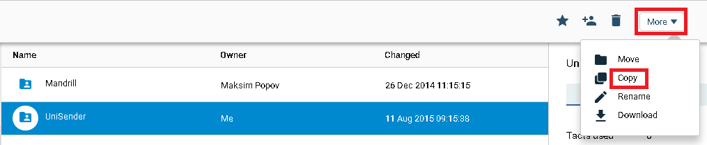
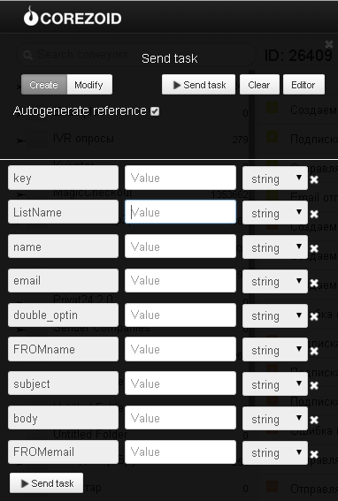

#  E-mail sending

Clone [folder "UniSender"](https://admin.corezoid.com/folder/conv/2391)

In the process of email sending through UniSender you may use process templates individually for each method presented in the folder (createList, subscribe, sendEmail, checkEmail) or call them in succession from the main process "Email sending through UniSender" using [Logic RPC](../../interface/nodes/rpc/README.md).

To test all processes, go to `dashboard` of the main process "Email sending through UniSender" and click `Add task` - to add the request.

In the opened window specify:
*   `key` - API UniSender access key
*   `listname` - new list name for creating a new list
*   `name` - recipient name for subscription of the recipient
*   `email` - е-mail address of the recipient
*   `FROMemail` - е-mail address of the sender
*   `FROMname` - name of the sender
*   `subject` - subject of the message
*   `body` - mail body in HTML format.
When drawing up the text of the mail, pay attention to the opportunity of [substitution of lines in the mail](https://support.unisender.com/index.php?/Knowledgebase/Article/View/35/0/podstnovk-strok-v-pisme).
*   `double_optin` - number from 0 to 3 for the recipient subscription. Whether the recipient confirmed consent is available, and what to do if the limit of subscription is exceeded. Read more on [link](https://support.unisender.com/index.php?/Knowledgebase/Article/View/57/0/subscribe---podpist-drest-n-odin-ili-neskolko-spiskov-rssylki).

After the request parameters are specified, press the button `Send task`.

As a result of process work the request will be passing along the process and then will be transferred to one of the final states (red color node).

If all parameters are stated correctly, e-mail is sent, and the request goes to the finite state with the relevant status of e-mail sent.

In case of error, the request goes to the finite state with the relevant error name.

Full list of UniSender methods and their description is available at [web-site](http://www.unisender.com/ru/features/integration-api/).
