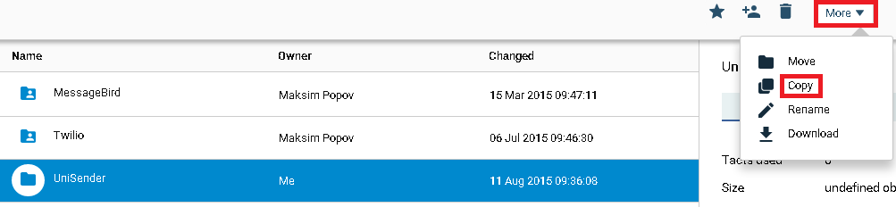
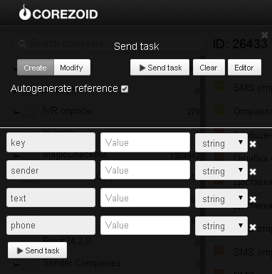

# SMS message sending

Clone [folder "UniSender"](https://admin.corezoid.com/folder/conv/2390)

In the process of SMS message sending through UniSender you may use process templates individually for each method presented in the folder (sendSms, checkSms) or call them in succession from the main process "SMS message sending through UniSender" with the use of [RPC logic](../../interface/nodes/rpc/README.md).

To test all processes go to `dashboard` of the main process "SMS message sending through UniSender" and click `Add task` - to add the request.

In the opened window specify:
*   `key` - API UniSender access key
*   `sender` - sender: phone number, or line of up to 11 Latin letters or digits
*   `text` - message text, up to 1000 symbols.
Example: text=Hello,+it's+a+test+message
*   `phone` - recipient phone number in the international format with the country code (leading “+” can be omitted).

After the request parameters are specified, click `Send task`.

As a result of process work the request will be passing along the process and then will be transferred to one of the final states (red color node).

If all parameters are stated correctly, SMS message is sent, and the request goes to the finite state with the relevant status of SMS message sent.

In case of error, the request goes to the finite state with the relevant error name.

Full list of UniSender methods and their description is available at [web-site](http://www.unisender.com/ru/features/integration-api/).
