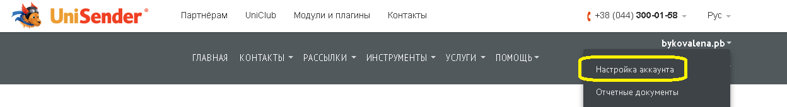
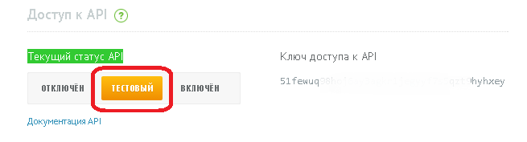

# UniSender

Log in on web-site [UniSender](http://www.unisender.com/).

To get API access key, go to section "Account setup ".

You will find your API access key on the tab “Integration and API".

For API testing, select test mode in front of your access key, and click "Save."

For sending messages through UniSender on Corezoid you have ready-made processes for UniSender method calling available:

- [createList](https://www.corezoid.com/admin/edit_conv/26415) – creation of a new mailing list
- [getLists](https://www.corezoid.com/admin/edit_conv/26412) – getting of mailing lists with codes
- [subscribe](https://www.corezoid.com/admin/edit_conv/26416) – subscription of a recipient to one or several mailing lists
- [sendEmail](https://www.corezoid.com/admin/edit_conv/26417) – Е-mail sending
- [checkEmail](https://www.corezoid.com/admin/edit_conv/26418) – check of Е-mail delivery status
- [createEmailMessage](https://www.corezoid.com/admin/edit_conv/26411) – creation of Е-mail for bulk mailing
- [createCampaign](https://www.corezoid.com/admin/edit_conv/26410) – bulk mailing of Е-mail or SMS messages
- [getCampaignDeliveryStats](https://www.corezoid.com/admin/edit_conv/26414) – receiving a report on message delivery status for the given mailing list
- [sendSms](https://www.corezoid.com/admin/edit_conv/26435) – SMS message sending
- [checkSms](https://www.corezoid.com/admin/edit_conv/26434) – check of SMS message delivery status

**How to work with these methods in Corezoid?**

You may use each process individually (for example, only for checking email delivery status), and call the required methods in succession with the use of [logic RPC](../../interface/nodes/rpc/README.md).

For example, if you want to `create a new mailing list` (createList), `subscribe a recipient to that list` (subscribe), `send email to it` (sendEmail), and then to `check e-mail delivery status` (checkEmail), you have a ready-made process ["Е-mail sending through UniSender"](send_email_unisender.md).
