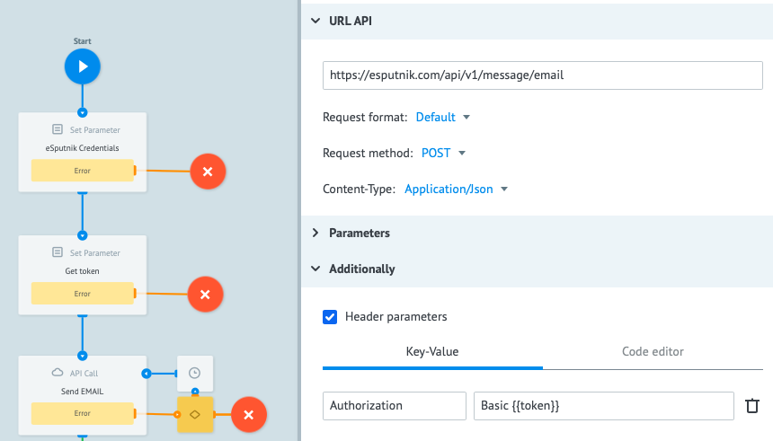

# eSputnik

**eSputnik** is a service for launching e-mailing and SMS-mailing functions.

Before setting up an integration process with **eSputnik API**, we recommend that you read and understand [documentation](https://esputnik.com/api/).


In this tutorial, you will learn how to set up a Сorezoid process with **eSputnik API** call to send email messages to a customer and check the delivery status of your e-mails.

Before we start, let us register at the **eSputnik** service.

### Registration at the service

1. Go to [https://esputnik.com/](https://esputnik.com/) and click the **Sign Up Free** button.

    

2. Fill out the registration form by entering your name, mobile phone number and email address.

    

3. In the appeared window, click the **Check Your Gmail** button to confirm the email address specified at registration.

    

    3.1. Go to your mailbox, find a message from **eSputnik** and click the link to activate your account.

    
    
    After you click the **ACTIVATE** button, you will be forwarded to the **eSputnik** web site to fill in the information about your activities.

    3.2. In the appeared form, fill in your personal information and click the **Activate** button.

    
    
    
4. The next step is to create a message template. To do this, click the **Messages** item and select **Messages** in the list.

    

5. Select an **Email** message type and click the **Create Email** button. 

    

6. For testing, select any of the email message templates provided. We choose the first one.

    

    6.1. Save the email template provided by clicking the **Save** button.

    

    6.2. To launch email sending, it is necessary to enter an html-code of the email message created in one of the parameters. To do this, click the **</>** icon to view the code. 

    

    6.3. Copy the appeared html-code to the clipboard.

    You have successfully registered with **eSputnik** and created a test email message. The next step is to set up the Corezoid process for calling the **eSputnik API**.

### Process for sending email messages via eSputnik

1. Create an **eSputnik** folder

    

2. Go to the **eSputnik** folder and create a **Send Email** process which will send an email message to the user and check the delivery status of your email. 

    

3. Login and sign-on password to your account are used as a key to make an **eSputnik API** call. To avoid entering login and password with each **API** call, add a **Set Parameter** node and name it **eSputnik Credentials**.
    
    
    
    3.1. After you have added the node, click it and add the following parameters in the **Parameters** section:
    - `login` - login to sign in at [esputnik.com](https://esputnik.com)
    - `password` - password to sign in at [esputnik.com](https://esputnik.com)
    
    
    3.2. To call the **eSputnik API**, we will use [token](https://esputnik.com/api/example_v1_auth_token_POST.html). It is generated using **login** and **password** encoded in [Base64](https://ru.wikipedia.org/wiki/Base64). To do this, add a **Set Parameter** node named **Get token** next to the **eSputnik Credentials** node. Add the following parameter in the **Parameters** section: 
    ```
    {
        "token": "$.base64_encode({{login}}:{{password}})"
    }
    ```
    
    3.3. After the **Get token** node, add an **API Call** node, which will call **eSputnik API** for sending an email message.
    3.4. After you have added the **API Call** node, click it and fill in a URL field.
    ***URL***: 
    ```
    https://esputnik.com/api/v1/message/email
    ```
    3.5. Set the following values in the **API Call** node settings:
    ```    
    Request format: Default
    Request method: GET
    Content-Type: Application/Json
    ```
    3.6. Add the following parameters in the **Parameters** section:
    ```    
    {
        "plainText": "{{plainText}}",
        "emails": "{{emails}}",
        "from": "{{from}}",
        "subject": "{{subject}}",
        "htmlText": "{{htmlText}}"
    }
    ```
    where:
     - `plaintext` is ordinary readable text
     - `emails` is email address of a recipient
     - `from` is email-address of a sender (must match with one of the sender’s existing addresses in the system)
     - `subject` is subject of a message
     - `htmlText` is HTML-code of a message
    
    3.7. In the ***Additionally*** section, set a checkbox opposite ***Header parameters***.
    3.8. For authorization using the token, add the following: 
    ```
    {
        "Authorization": "Basic {{token}}"
    }
    ``` 
    

4. In order to ensure that the parameters are filled in automatically each time when you send a request manually, click the **Task parameters** icon and add 5 parameters: `plainText`, `emails`, `from`, `subject`, `htmlText`.

    
    

5. To check the sending status of your email message, add a **Condition** node named **Check status**.

    5.1. Click the node and add a ```{{results.status}} != OK``` condition, which will check the delivery status.

    

6. For test sending of your email message, go to the **View** mode and click the **New task** button.

    6.1. In the **New Task** window, fill in the fields: `email`, `from`, `htmlText`, `subject` as specified in step 3.5 from [Process for sending email messages via eSputnik](#process-for-sending-email-messages-via-eSputnik) chapter and click the **Add task** button.

    

    If your email message is sent via **eSputnik API** successfully, the created request will appear in the **Final** node.
 
### Checking email delivery status

1. To check on the delivery status of your mailing, add a **Delay** node after the **Condition** **Sending status** to set waiting until the delivery status is updated in the esputnik system. An approximate time for the email delivery status update is 2 minutes.
 
    
     
    1.1. Next to the **Delay** node, add an **API Call** node named **Check Email status** which will call the **eSputnik API** for checking an email message delivery status.
    
    1.2. After you have added the node, click it and fill in a ***URL*** field
    
    ***URL***: 
    ```
    https://esputnik.com/api/v1/message/email/status
    ```

    Set the following values in the **API Call** node settings:
    ```    
    Request format: Default
    Request method: GET
    Content-Type: Application/Json
    ``` 
    1.3. Add the following parameters in the **Parameters** section:
    ```    
    {
        "ids": "{{results.requestId}}"
    }
    ``` 
 
    1.4. In the ***Additionally*** section, set a checkbox opposite Header parameters
    
    1.5. For authorization using the token, add the following: 
    ```    
    {
        "Authorization": "Basic {{token}}"
    }
    ```
    
2. Add a **Condition** node named **What’s status?** for processing email delivery status replies
 
    2.1. Create a final node named **delivered**
 
    2.2. Click the **Condition** node to add conditions 
 
    2.3. In the **Condition** node, add a ```{{results.delivered}}  == true``` check and attach the **delivered** node thereto. If there is a ***true*** value in the ***delivered*** parameter, this is considered a fact of successful email delivery. 
 
    2.4. In the **Condition** node, add a ```{{results.failed}}  == true``` check and attach an error node named **failed** to the check. If the delivery is not successful, the **API** will reply with a ***true*** value in the **failed** parameter.
 
    2.5. If there is no reply from the **API**, add the following condition in the **Condition** node:
    ```
    {{results.delivered}} != true
    {{results.failed}} != true 
    ``` 
    with forwarding this task to the **Delay** node
    
 
3. To test the process, go to the **View** mode and click the **New task** button.

    3.1. In the **New Task** window, fill in the fields: `htmlText` (from step 6.3 from [Registration at the service](#registration-at-the-service)), `email`, `plainText`, `from` and `subject` (from step 3.6 from [Process for sending email messages via eSputnik](#process-for-sending-email-messages-via-eSputnik) section) and click the **Add task** button
    
    3.2. If your email is delivered successfully within 2 minutes, your request will be forwarded to the **delivered** node.
    
Congratulations! You have learned how to set up the Corezoid process for sending email messages and checking the delivery status of your emails via **eSputnik API**.
