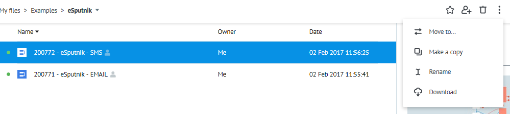
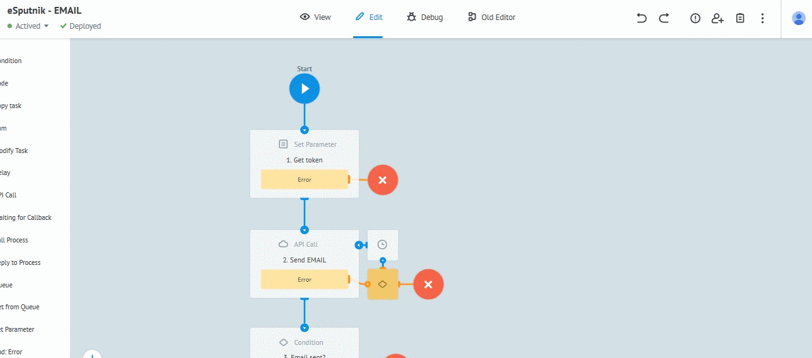
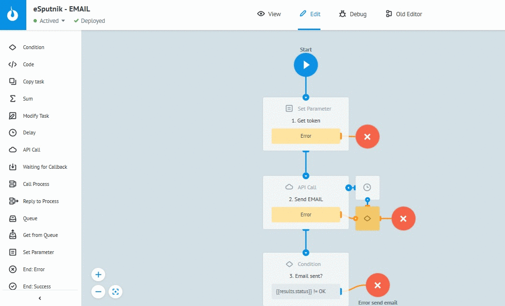

# Email

Clone ["eSputnik - EMAIL" process](https://admin.corezoid.com/folder/conv/121461) into your enviropment

## Description of process steps

**1. `Formation of the token`** - Set Parameter logic 

**2. `Email sending`** - API eSputnik call

**3. `Checking the success of sending`** - Condition logic

**4. `Waiting 2 minutes before checking email status`** - Delay logic

**5. `Checking email status`**  - API eSputnik call

**6. `Distribution by email statuses`** (delivered, failed, other statuses) - Condition logic

## Description of process incoming parameters

* **login** - login for [esputnik.com](https://esputnik.com)
* **password** - password for [esputnik.com](https://esputnik.com)
* **from** - sender's address (should match with one of existed in the system sender's addresses)
* **email** - sender's email address
* **subject** - letter's subject
* **plainText** - message variant in form of simple text
* **htmlText** - message's HTML-code

## Process testing

**1.** Go to `View` mode

**2.** Press `New task`

**3.** Specify values of incoming parameters

**4.** Press `Add task`

