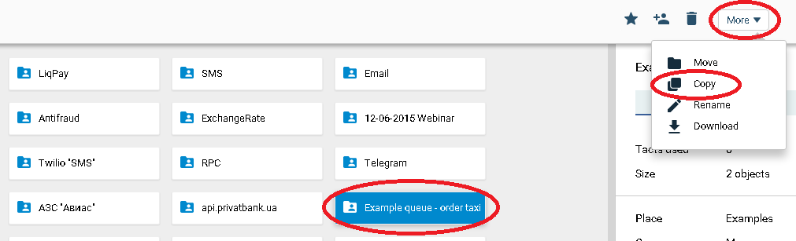

# Working with request queue in processing of taxi orders

Here you will find an example of distribution and processing of the flow of taxi orders on Сorezoid with the use of [Logic QUEUE](../../interface/create/task_queues_operation/queue_logic.md) and [Logic GET TASK](../../interface/create/task_queues_operation/get_task_logic.md).

**Task:**

Arrange sequential processing of orders from the oldest to the new ones by different numbers of operators with the order processing time control.

**Problem:**

Quantity of incoming orders may exceed the number of operators, and they have two buttons only, “Take a new order”, “Order processed”, i.e. there is no opportunity to delay the order.

Furthermore, the orders not taken for processing in 10 minutes from the time of their receipt lose their relevance and do not need processing.

**Solution:**

All new requests are “added together” in a queue and wait until they are taken for processing after the operator presses the button `"Take a new order"`.

Waiting time – 10 minutes.

**To fulfill the task we need two processes:**

First process ["Order acceptance and queue"](https://www.corezoid.com/admin/edit_conv/91383/8074) to save the order in a queue and to control the time of its processing

Second process ["Receiving the order from the queue for processing"](https://www.corezoid.com/admin/edit_conv/91384/8074) – to receive the order from the queue after the operator presses the button `"Take a new order "`.

##Testing

Clone the folder ["Example queue - order taxi"](https://admin.corezoid.com/folder/conv/1833)

**Test request queuing up **

Go to `dashboard` of the first process "Order acceptance and queue" and click `Add task` - to add the request.

In the opened window specify two conventional parameters `param1` and `param2`.

Further click on `Send task` - to send the request.

The request will be queued, waiting for processing for 10 minutes.

If within 10 minutes the request is not processed, it will go to the archive node "New request in the queue, not processed for 10 minutes".

**Receiving the request from the queue**

In the same way, create in the process "Receiving the order from the queue for processing" a request with the single parameter `URL` - URL, to which the request for processing in interface should be sent.

If there are no requests in the queue "Order acceptance and queue", the request goes to the node "No requests in the queue."

If requests are in the queue, all parameters of the order will be received together with the request from the queue.

**Order processing time control**

**Data loading to processes**

You may create work requests in the processes by simple sending of data in JSON format by POST method to Direct URL.

