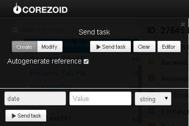

# Archive of PrivatBank and NBU exchange rates

Clone [process template](https://www.corezoid.com/admin/edit_conv/27938) to get archive exchange rates of PrivatBank

Go to `dashboard` and click `Add task` - to add the request

In the opened window specify:
*   `date` - date for which the rates should be received

Next, click on `Send task` - to send the request.

**In case of success** the following parameters are added to the request:

NBU buying rate:
* `buy_USD_NBU`- US dollar
* `buy_CAD_NBU`- Canadian dollar
* `buy_GBP_NBU`- British pound
* `buy_CHF_NBU`- Swiss franc
* `buy_PLZ_NBU`- Polish zloty
* `buy_EUR_NBU`- Euro
* `buy_RUB_NBU`- Russian ruble
* `buy_XAU_NBU`- Gold

NBU selling rate:
* `sale_USD_NBU`- US dollar
* `sale_PLZ_NBU`- Polish zloty
* `sale_EUR_NBU`- Euro
* `sale_RUB_NBU`- Russian ruble
* `sale_CAD_NBU`- Canadian dollar
* `sale_GBP_NBU`- British pound
* `sale_CHF_NBU`- Swiss franc
* `sale_XAU_NBU`- Gold

PrivatBank buying rate:
* `buy_USD`- US dollar
* `buy_GBP`- British pound
* `buy_CHF`- Swiss franc
* `buy_PLZ`- Polish zloty
* `buy_EUR`- Euro
* `buy_CAD`- Canadian dollar

PrivatBank selling rate:
* `sale_USD`- US dollar
* `sale_GBP`- British pound
* `sale_CHF`- Swiss franc
* `sale_PLZ`- Polish zloty
* `sale_EUR`- Euro
* `sale_CAD`- Canadian dollar

**In case of error** the request is transferred to the escalation node with the parameter:
* `Error`- Error description
