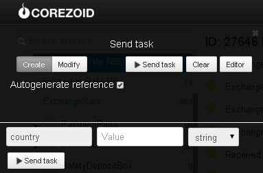

# Exchange rates and precious metal rates of NBU and CB of RF

Clone [process template](https://www.corezoid.com/admin/edit_conv/27936) to get exchange rates and precious metal rates of NBU and CB of RF

Go to `dashboard` and click `Add task` - to add the request

In the appeared window, specify the value of incoming parameter `country` - the bank's country identifier.

`country` may take the values below:

* **ua** - to get NBU rates for major currencies (RUB, USD, EUR)
* **ua&full** - to get NBU rates for all currencies including precious metals
* **ru** - to get rates of the Russian Federation’s Central Bank for major currencies (USD, EUR)
* **ru&full** - to get rates of the Russian Federation’s Central Bank for all currencies including 
precious metals 
* empty value of `country` parameter returns NBU rates

Further click on `Send task` - to send the request.

**In case of success** the following parameters are added to the request:

If `country` = **ua**:
* `buy_USD`- US dollar buying rate
* `buy_EUR`- Euro buying rate
* `buy_RUR`- Russian ruble buying rate
* `sale_USD`- US dollar selling rate
* `sale_EUR`- Euro selling rate
* `sale_RUR`- Russian ruble selling rate

If `country` = **ua&full** we get purchase rates for currencies listed below:
* `buy_UZS` - Uzbekistani som
* `buy_PLZ` - Polish zloty
* `buy_EUR` - Euro
* `buy_CNY` - Yuan Renminbi
* `buy_RUR` - Russian ruble
* `buy_PKR` - Pakistani rupee
* `buy_MNT` - Mongolian tugrik
* `buy_JPY` - Japanese yen
* `buy_IQD` - Iraqi dinar
* `buy_ILS` - Israeli shekel
* `buy_PEN` - Peruvian new sol
* `buy_MDL` - Moldovan leu
* `buy_INR` - Indian rupee
* `buy_HUF` - Hungarian forint
* `buy_HKD` - Hong Kong dollar
* `buy_XAG` - Silver
* `buy_LBP` - Lebanese pound 
* `buy_EGP` - Egyptian pound
* `buy_CAD` - Canadian dollar
* `buy_XPT` - Platinum
* `buy_XPD` - Palladium
* `buy_KWD` - Kuwait dinar
* `buy_AUD` - Australian dollar
* `buy_XDR` - Special borrowing rights
* `buy_SYP` - Syrian pound
* `buy_NOK` - Norwegian krone
* `buy_XOF` - Malian franc CFA
* `buy_MXN` - Mexican new peso
* `buy_LYD` - Libyan dinar
* `buy_KGS` - Kyrgyzstani som
* `buy_XAU` - Gold
* `buy_SAR` - Saudi Arabian riyal
* `buy_NZD` - New Zealand dollar
* `buy_KRW` - Won of the Republic of Korea
* `buy_DKK` - Danish krone
* `buy_TJS` - Somoni
* `buy_SEK` - Swedish krona
* `buy_KZT` - Kazakhstani tenge
* `buy_ISK` - Iceland krone
* `buy_GBP` - Great Britain pound
* `buy_USD` - US dollar
* `buy_GEL` - Georgian lari
* `buy_CLP` - Chilean peso
* `buy_BYR` - Belarussian ruble
* `buy_VND` - Vietnamese dong
* `buy_SGD` - Singapore dollar
* `buy_LTL` - Lithuanian lita
* `buy_CZK` - Czech koruna
* `buy_BRL` - Brazilian real
* `buy_AMD` - Armenian dram
* `buy_IRR` - Iranian rial
* `buy_HRK` - Croatian kuna
* `buy_CHF` - Swiss franc
* `buy_TWD` - New Taiwan dollar

If `country` = **ru** we get purchase rates for currencies listed below:
* `buy_EUR`- Euro
* `buy_USD`- US dollar

If `country` = **ru&full** we get purchase rates for currencies listed below:
* `buy_UZS` - Uzbekistani som 
* `buy_PLZ` - Polish zloty
* `buy_EUR` - Euro
* `buy_CNY` - Yuan Renminbi
* `buy_JPY` - Japanese yen
* `buy_UAH` - Ukrainian hryvnia
* `buy_MDL` - Moldovan leu
* `buy_INR` - Indian rupee
* `buy_HUF` - Hungarian forint
* `buy_XAG` - Silver
* `buy_CAD` - Canadian dollar
* `buy_XPT` - Platinum
* `buy_XPD` - Palladium
* `buy_AUD` - Australian dollar
* `buy_XDR` - Special borrowing rights
* `buy_NOK` - Norwegian krone
* `buy_KGS` - Kyrgyzstani som
* `buy_XAU` - Gold
* `buy_KRW` - Won of the Republic of Korea
* `buy_DKK` - Danish krone
* `buy_SEK` - Swedish krona
* `buy_KZT` - Kazakhstani tenge
* `buy_GBP` - Great Britain pound
* `buy_USD` - US dollar
* `buy_BYR` - Belarussian ruble
* `buy_SGD` - Singapore dollar
* `buy_CZK` - Czech koruna
* `buy_AMD` - Armenian dram
* `buy_CHF` - Swiss franc

**In case of error** the request is transferred to the escalation node with the parameter:
* `Error`- Error description