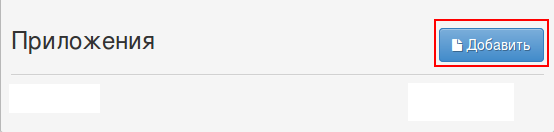

# PrivatBank exchange rates for legal entities

To access the service you need to log in on page https://link.privatbank.ua/console/auth/p24business/start.

Add new application:

and get **clientId** and **clientSecret**.

Clone ["PrivatBank exchange rates for legal entities" folder](https://admin.corezoid.com/folder/conv/3553) to get the process and dashboard.

For testing the process go to `dashboard` and click` Add task` - to add the request.

In the opened window specify parameters of the request and click on "Send task".

*   `clientId` - Customer id received after adding of the application
*   `clientSecret` - Customer password received after adding of the application
*   `login` - Privat24 login for business
*   `password` - Privat24 password for business
*   `action` - identified of rates in the bank system: 3 – NBU rates, 5 – PrivatBank rates on all currencies.

**In case of success** the following parameters are added to the request:

* `Rate`- PrivatBank exchange rates for legal entities

**In case of error** the request is transferred to the escalation node with the parameter:
* `Error`- Error description
