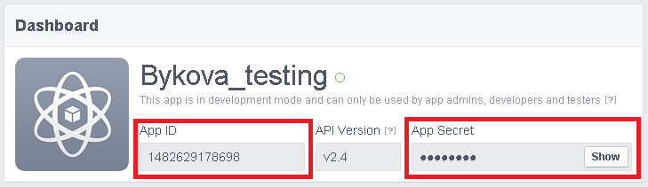
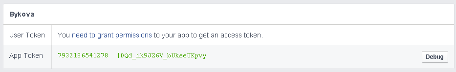

# Authorization

Create Facebook app on website [https://developers.facebook.com/apps](https://developers.facebook.com/apps)

After creation you will get ID (`App ID`) and password (`App Secret`) to your application. 

Open `"Tools&Support`" - `"Access Token Toll`" tabs

Here you can get autorization keys - **"access_token"** parameter's value in  in queries to Facebook API  

**App Token** = app_id|app_secret

In order to get **"User Token"** press `"need to grant permissions"`.

More about app authorization in queries to Facebook API in ["Access Tokens"] section (https://developers.facebook.com/docs/facebook-login/access-tokens#apptokens).
