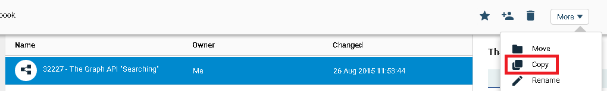
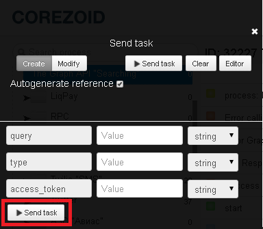

# Public objects search

For searching any public objects of Facebook social network, clone [process template "The Graph API "Searching""](https://admin.corezoid.com/folder/conv/8838).

## Description of incoming parameters of process

1. **query** - search request
2. **type** - search request type
    *   `user` - Facebook user name
    *   `page` - Page name 
    *   `event` - Event name
    *   `group` - Group name
    *   `place` - place. With this parameter you can use additional: center (latitude and longitude) and distance (radius)
How to fill in the parameters of this type of request: 
q=coffee&
type=place&
center=37.76,-122.427&
distance=1000
3. **access_token** - autorization key
    *  for such types of searching requests as `Page` and `Place` you can use "App Token" = app_id|app_secret. For example, 7932301794081|76f2681c01df1d0c190bc6a503
    *   for all other "User Token" types (it's generated in Facebook app settings)  

## Process launch

**1)** Switch to 'dashboard' mode and press 'add task' button - to add request.

**2)** Specify required paramenters in appeared window
*   query
*   type
*   access_token

**3)** After specifiyng all parameters, press button 'Send task'

## Description of outcoming parameters of process

There will be parameter added in request **in case of success**
* `Result` - an array of data with the result of the query

**In case if API Facebook returns error**, the request will go to escalation node and some parameters will be added 

* `Code` - error code
* `Type` - error type
* `Message` - error text

**In the case of API Facebook call error** the request will go to escalation node and parameter will be added

* `Code` - error code

More details [Graph API "Searching"](https://developers.facebook.com/docs/graph-api/using-graph-api/v2.0)

