# TicketsBot

Clone ["TicketsBot" folder](https://admin.corezoid.com/folder/conv/8838)

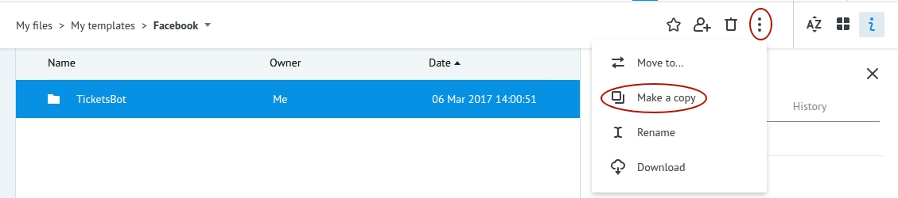

There are four processes in the folder:

* `Set Welcome Message` is designed for setting a greeting message to the user. He will see it at the first time in chat with Bot.

* `Main` - receives all messages coming to Bot's chat, defines is this message text - "message" or it is button pressing "postback". Renews task in **TicketsBot** process.

Renew task in **TicketsBot** process = continue chat with user within unique chat ID.

It becomes possible because of creation of new task in **TicketsBot** process, when user sends `Start Chatting` command.

This task is created with reference equal to chat's ID (`{{entry[0].messaging[0].sender.id}}`).

If nothing was found when updating the task for the chat id, then we do not yet have an open dialogue in this chat - no task in **TicketsBot** process.

Then check which command has been received from user:

  **start** - user will be offered to start chat - click on `Start Chatting` button.

  **Start Chatting** - create task in **TicketsBot** process (as described below).

  **More information** - send message “For getting more information, please contact your airline”.

If you receive something different from these commands - send an appropriate message to the user about unknown command.

* `TicketsBot` - this process receives tasks from **Main** process, if user sent `Start Chatting` command and firstly there's a message sent with offer to specify sender's name.

Remember, task reference in this process is unique chat's ID `{{entry[0].messaging[0].sender.id}}`.

It allows receiving updates (new commands or messages from user to Bot's chat) from **Main** process when task in the node with [CALLBACK logic](https://doc.corezoid.com/en/interface/nodes/callback.html).

So after sending the message with offer to specify sender's city, task will wait for this selection.

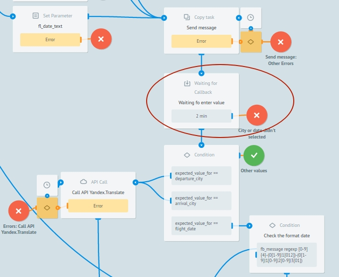

If user is not putting anything in 2 minutes (task will not renew from **Main process**, then task will go to final node and if it is required to start chat over - select `Start Chatting` or `Start`.

If the sender's city is specified, we suggest the user enter the name of the city of arrival and the date of sending in the specified format.

Aftere every offer to user, we are waiting in the node with CALLBACK.

With every incorrect input of city name or departure date, we send an appropriate message with error to the user.

On every stage of making a mistake by putting wrong city name or date, user will be offered to replace incorrect data without changing already specified correct data.

If there was `Start Chatting` command and all data is specified correctly, receive all information about flight and return the cheapest ticket (without transfer, with one or two transfers) and send in message.

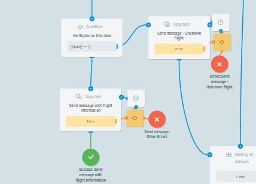

* `Send Message` - send messages to FB Messenger.

Both Main and TicketsBot processes contact it via [Copy task logic](https://doc.corezoid.com/en/interface/nodes/copy.html).

## Webhook setup

**1)** Create Facebook [application](https://developers.facebook.com/quickstarts/?platform=web) and [page](https://www.facebook.com/pages/create/). Receive 'Page ID'.

**2)** In settings of Facebook application click on `"+Add product"` and select `Messenger`

**3)** Receive page access marker - `Page Access Token`
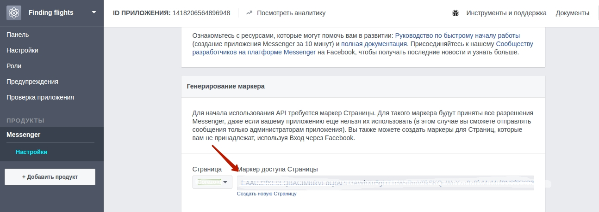

**4)** Connect **Main** process to FB Messenger by specifying your page access marker:

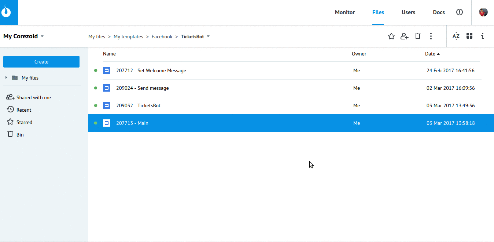

**5)** Receive webhook-url of **Main** process for FB Messenger

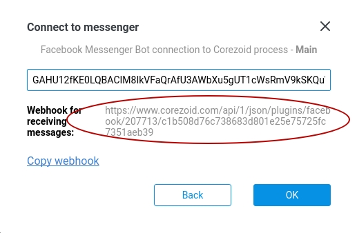

**6)** Set up webhook in settings of Facebook application by specifying received webhook-url of **Main** process in `Reverse, URL-address`, and page access marker- in `Confirm marker` filed

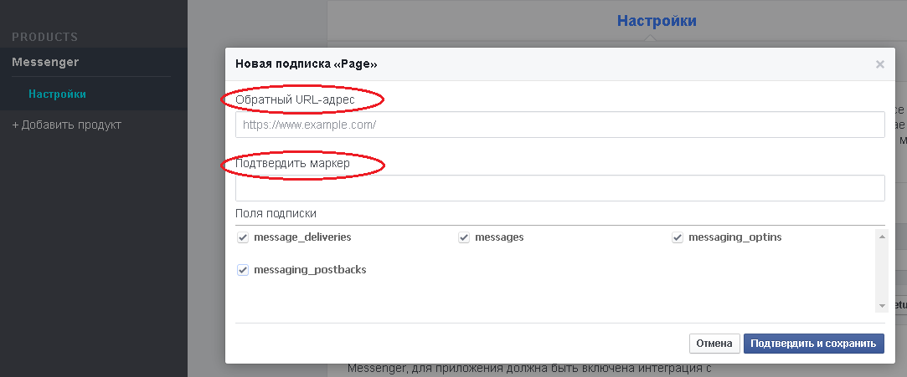

**7)** After selection of required page, subscribe webhook to its events

[More details on Facebook](https://developers.facebook.com/docs/messenger-platform/product-overview)

##Integration with Travelpayouts

For users comfort, **API Travelpayouts** token has been added to the [TicketsBot template](https://admin.corezoid.com/editor/126761/211905) .
(we use API for access for aviatickets data).

In order to receive your API Travelpayouts token, go to the [link](https://www.travelpayouts.com/developers/api) and register.

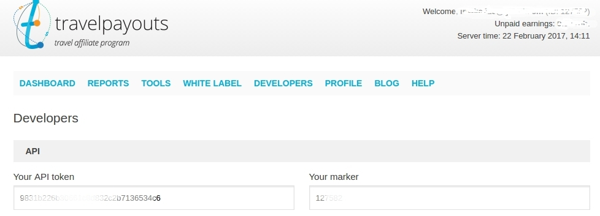

In **Main** process, in `Set tokens` mode, replace test token for API Travelpayouts by the one that you received in value of parameter `X-Access-Token`.

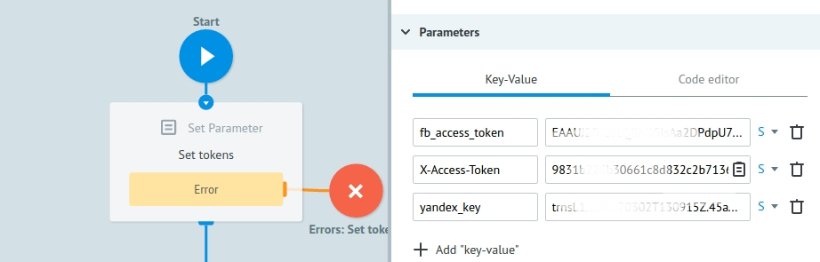

##Integration with Yandex.Translate

For work with API Travel payouts, there was **API Yandex.Translate** used for translation of English test, specified by user, to Russian.
To receive more detailed information for work with API Yandex.Translate, follow the [link](https://tech.yandex.ru/translate/doc/dg/reference/translate-docpage/)

You need to receive **API-key**. You can get it for free [here](https://tech.yandex.ru/keys/get/?service=trnsl).

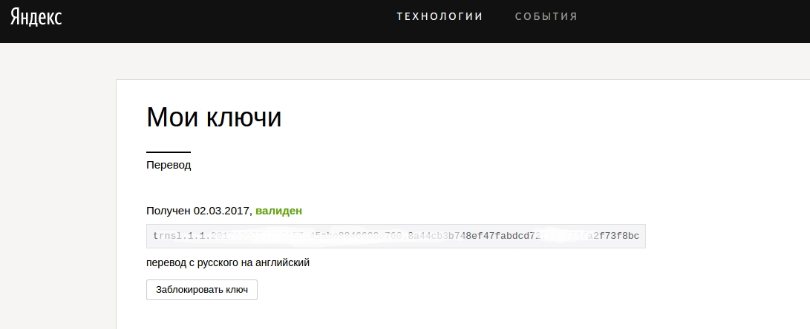

In **Main** process, in `Set tokens` node, replace test Yandex.Translate API_key by the one you receive in `yandex_key` parameter value.

##Testing and launch

**Set Bot's welcome message**

For this:
- go to `View` mode of [Set Welcome Message process](https://admin.corezoid.com/editor/126761/211907)
- press `Add task` button - add task.
- in appeared window specify required parameters:
* **access_token** - page access marker
* **welcome_text** - welcome message for your Bot. For example, `Hi! Here you can get the cheapest tickets for selected flight (without a transfer, with one or two transfers) to the specified direction.`
- after all parameters are specified, press `Send task` button.

And then, just add your Bot to **Facebook Messenger** and start chat.

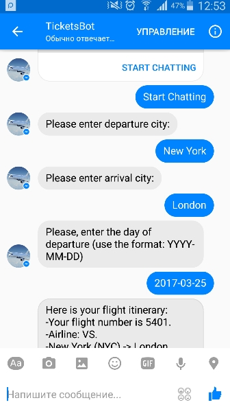

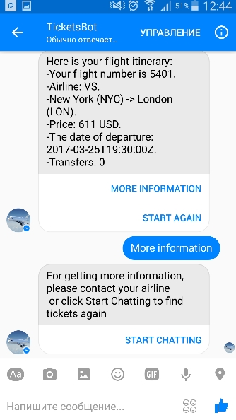

If you enter a wrong city or send date, the user receives an error message:

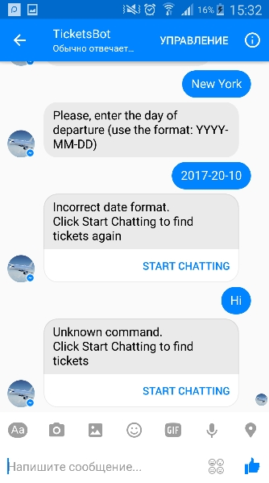

The user is encouraged to correct incorrect values without changing the data already entered:

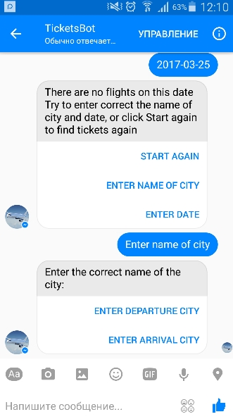

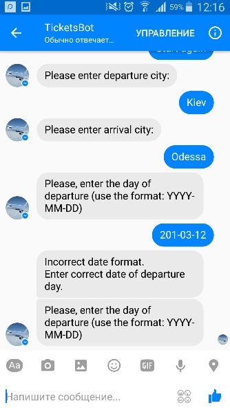

Go to `View` or `Debug` mode [TicketsBot](https://admin.corezoid.com/editor/126761/211905) to see request flow, its movement and distributing by process nodes.

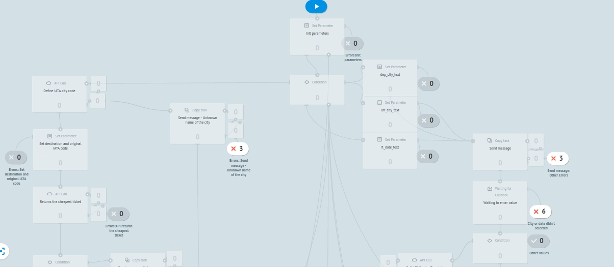

&gt;As long as you application is in development mode, its functionality and API is working only for administrators, developers and testers. After your application will be approved and published, it will become available for the public.