# WeatherBot

Make a copy of the folder ["WeatherBot"](https://admin.corezoid.com/folder/conv/8838)

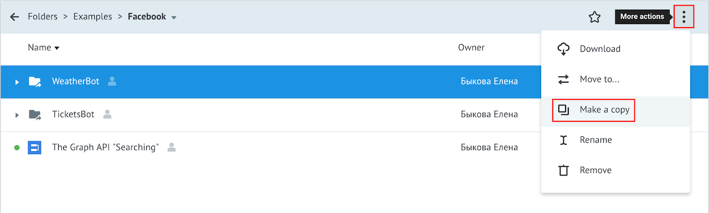

There are two processes in this folder:

* [**Set Welcome Message**](https://admin.corezoid.com/editor/94444/140229) - is used to set a welcome message for your bot.

* [**WeatherBot**](https://admin.corezoid.com/editor/94444/140228) - receives webhooks with a city name, get weather information from OpenWeatherMap API and sends answer to user.

If message does not contain city name or city name is entered incorrectly, or there re any other error in process, process send an appropriate message with error description.

## Webhook install

**1)** Create Facebook [page](https://www.facebook.com/pages/create/). Get it's **Page ID**.

**2)** Create Facebook [application](https://developers.facebook.com/quickstarts/?platform=web):

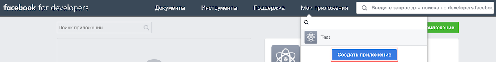

**3)** Add to your facebook application a new product - **Messenger**:

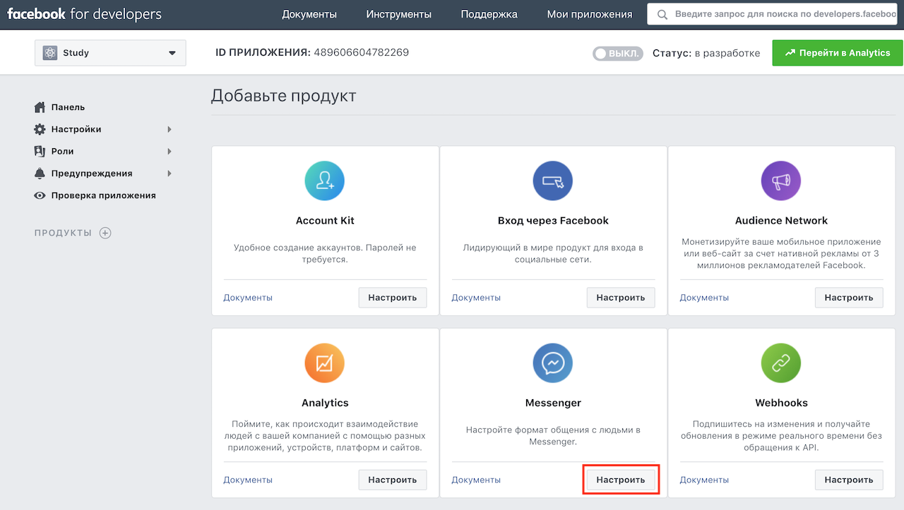

**4)** Open product **Messenger** settings, generate and copy **Page Access Token**.

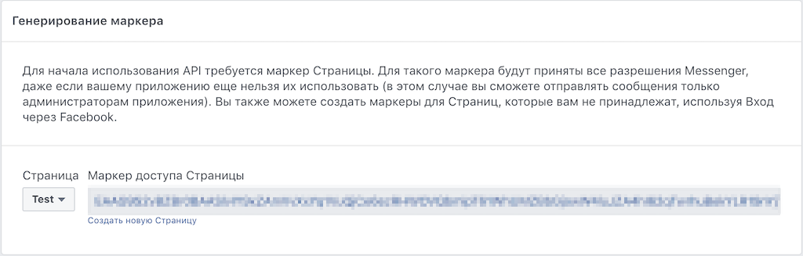

**5)** Connect **WeatherBot** to Facebook Messenger. Click **View details** for this process, select tab Webhook and press button **Connect to messengers**.

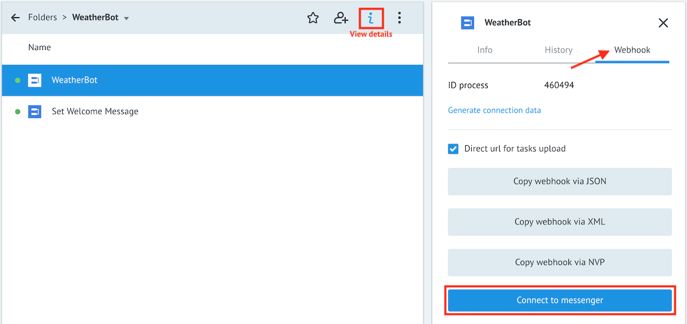

Select **Messenger** and paste your **Page Access Token**. Copy Webhook (process URL for Facebook Messenger) and press button **ОК**.

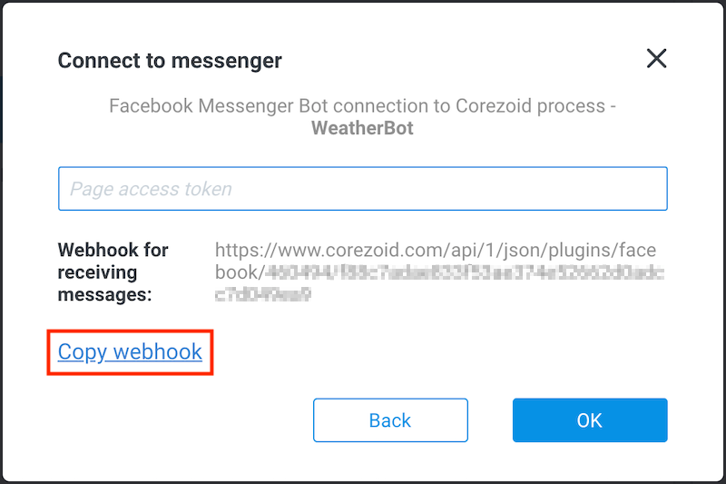

**6)** Set Webhook for Facebook application.

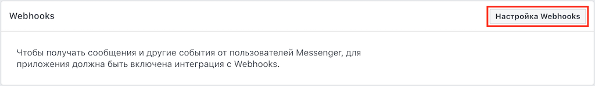

Paste copied URL to the field **Callback URL** and paste page access token.

Specify [events](https://developers.facebook.com/docs/messenger-platform/webhook#setup) to subscribe and confirm changes.

**7)** Select page and subscribe webhook to this events:

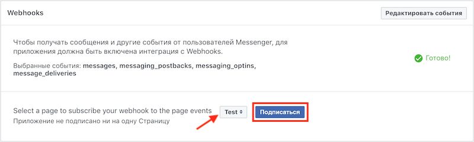

## Integration with OpenWeatherMap

There is a test key for OpenWeatherMap API in [WeatherBot template] (https://admin.corezoid.com/editor/94444/140228).

In order to get your own OpenWeatherMap API access key, follow the [link] (http://openweathermap.org/register) and register.

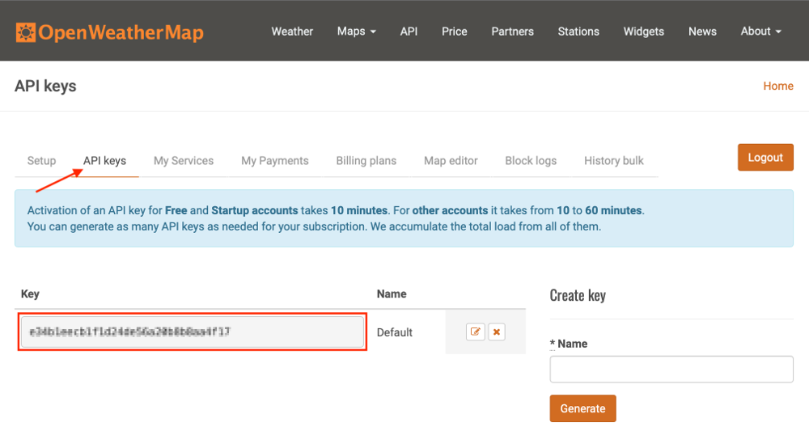

In **Set APPID_key** node replace test OpenWeatherMap API key by the one that you received in **APPID_key** parameter value

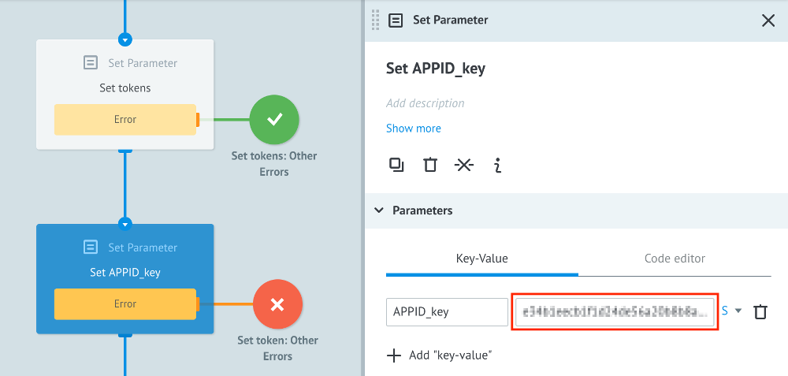

## Testing and launch

**Set Bot's welcome message**

For this:

  - open your copy of the process **Set Welcome Message**
  - switch it to **View** mode
  - press button **+ New task** to add a new task
  - enter required parameters:
       - **access_token** for your page
       - **welcome_text**, e.g. `Hi! Enter city name to get the weather.`
  - click **Add task**.

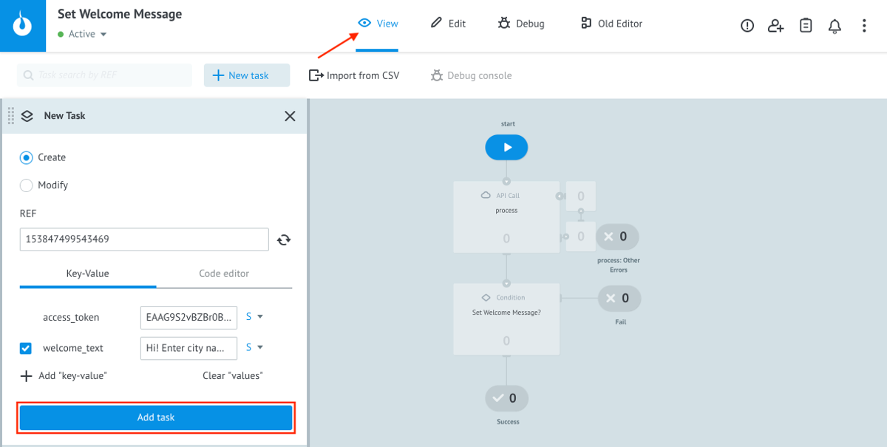

**And next, just add your bot to Facebook and start chat**

Switch to **View** mode:

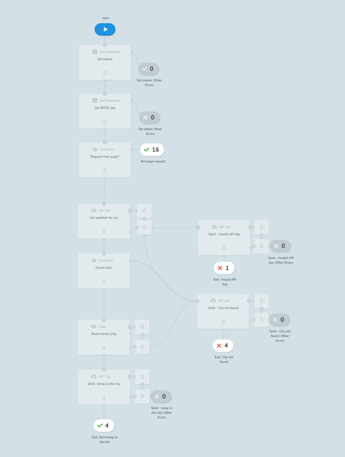

in order to see request flow, their transit and node distribution process.

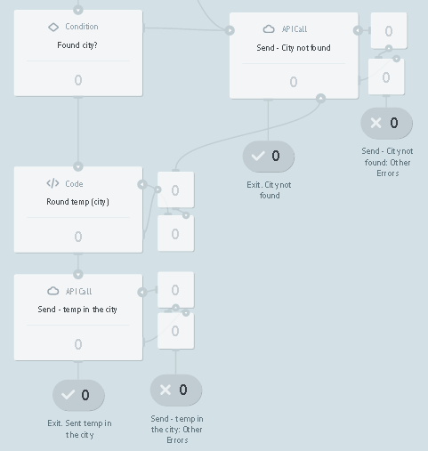

> As long as your app is in development mode, its functionality and API will work only for administrators, developers and testers. After approval and publishing, your app will be available to the general public.

> See more about approving your application on [developers.facebook.com](https://developers.facebook.com/docs/messenger-platform/app-review/).
