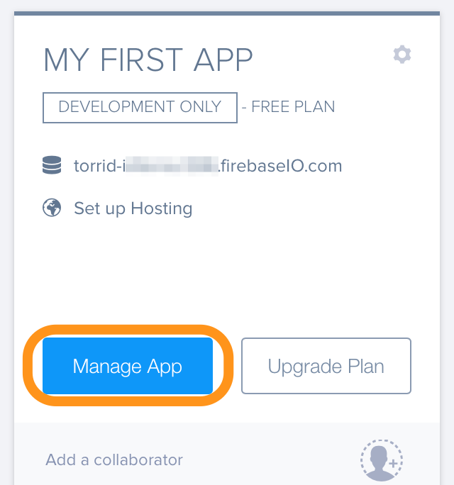
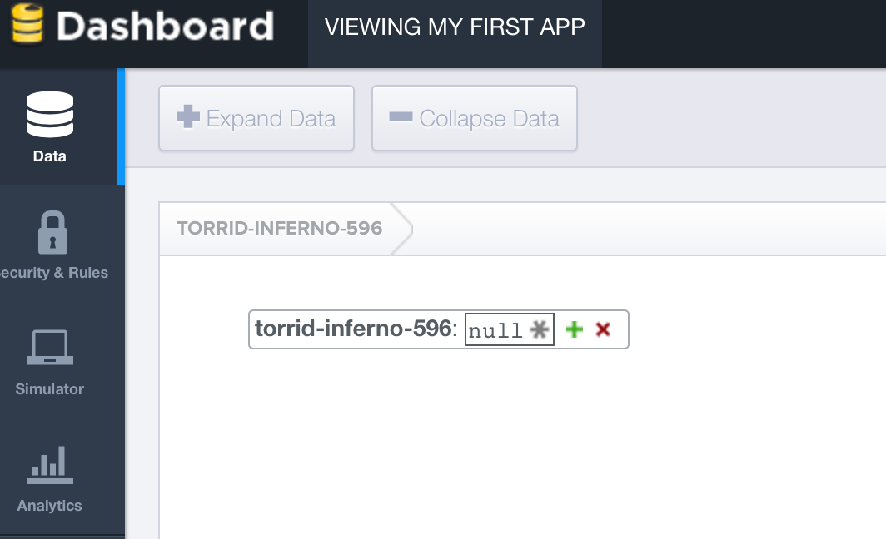
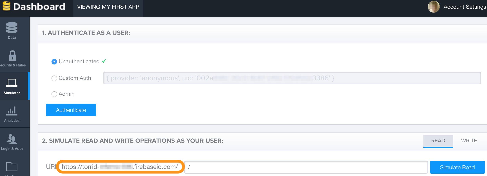
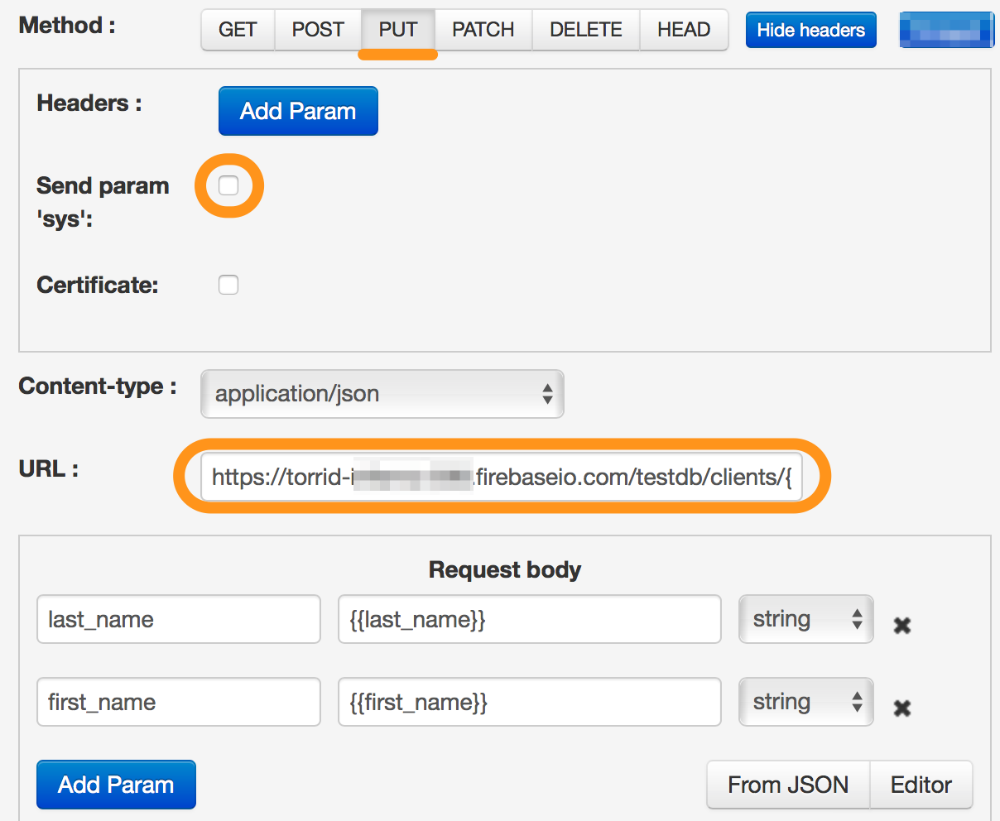
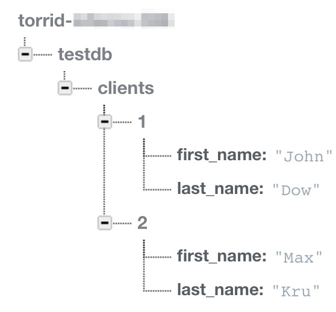
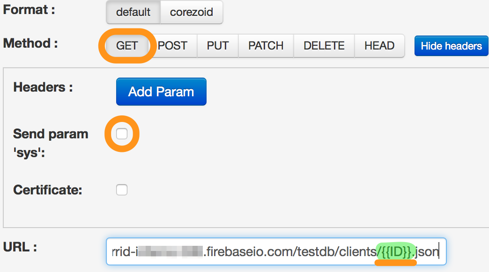

# Firebase

##[Description of REST API methods](https://www.firebase.com/docs/rest/api/)

Firebase allows to save and get data via API, actually providing the database with API to users.

1.  [Getting test Database](#получение-тестовой-бд)
2.  [URL structure](#структура-url)
3.  [Addition of entries (PUT)](#добавление-записи-put)
4.  [Getting entries (GET](#получение-записей-get)

## Getting test Database

After registration you will automatically receive Database and API to it


You may look, add or delete data in the Database via `Data` interface


Using the `Simulator` section, you may test API operation with the Database. The URL for sending GET/POST requests will be immediately available for you.



## URL structure

Let's see the example of the provided URL
`https://torrid-xxx.firebaseio.com/`

All parameters which you will add after "/" will define the structure of your Database.

As a first step, we recommend to add the catalogue, for example, testdb:
`https://torrid-xxx.firebaseio.com/testdb`

As the next URL element, we recommend to add the name of the objects table (collection) which you are going to save:
`https://torrid-xxx.firebaseio.com/testdb/clients/`

## Addition of entries (PUT)

In order to add an entry to the `clients` table of the `testdb` catalogue, it is necessary to select:
*   `PUT` method
*   URL https://torrid-xxx.firebaseio.com/testdb/clients/{{ID}}.json
*   Specify the object variables in parameters, for example:
    *   first_name
    *   last_name

The example of set up logic:


> Pay attention to:
*   clear the checkbox from parameter `sys param`
*   client’s ID is transmitted as a parameter to URL


Aggregate result in the firebase interface:


## Getting entries (GET)

In order to get data from firebase it is necessary to use:
*   `GET` method
*   URL https://torrid-xxx.firebaseio.com/testdb/clients/{{ID}}.json

where `ID` is a client identifier in our Database



You may view the output of the GET request in `Task archive`. It will look as follows:
```json
"data": {
                "last_name": "Dow",
                "first_name": "John",
                "ID": "1"
        }
```
