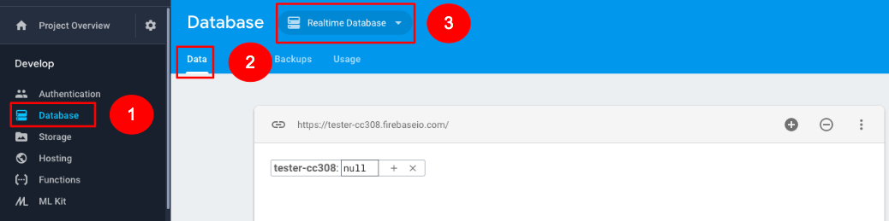
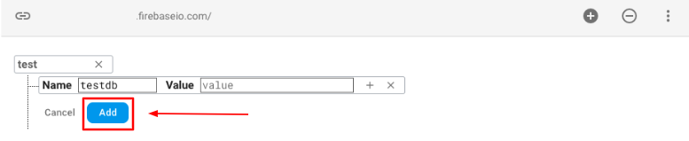
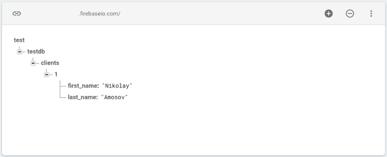
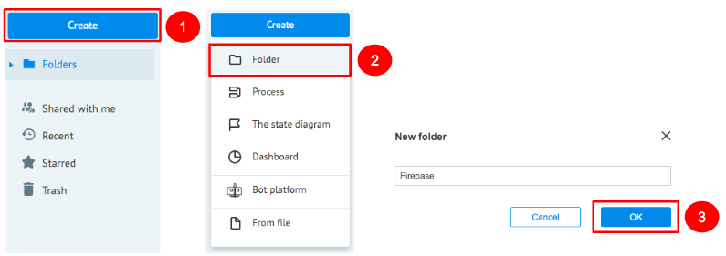
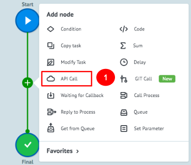
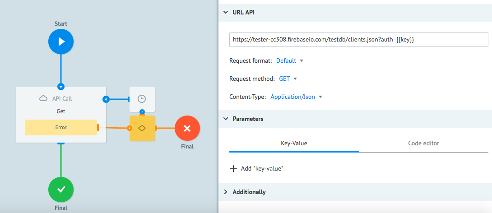
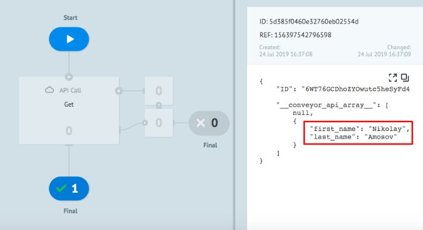
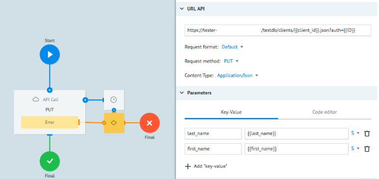

# Firebase

**Firebase** is a cloud database with ready-to-use **API** for integration.

Before customizing the process, we recommend that you read and understand [Firebase documentation](https://firebase.google.com/docs).

Before you start, let’s create a project in **Firebase**

### How to create a Firebase project
1. Go to [Firebase console](https://console.firebase.google.com/) and click the **Create a Project** button.

    

2. In the form opened, enter the name of your project in the ***Project Name*** field.
    
    2.1. Add a new or leave the proposed **ID** in the ***Project ID*** field. 
    
    2.2. Select the country of your organization in the ***Analytics Location*** field.
    
    2.3. Check the appropriate checkboxes, if you agree with the terms and conditions of **Firebase**.
     
    2.4. Click the **Create a Project** button.
    
    

    If the project is created successfully, a window with the **Continue** button will be displayed.
    
    

    Next, we learn how to obtain an access key to the API Firebase. 
    
### How to obtain a key to the API Firebase

1. To call **API Firebase**, a ***Firebase API Secret Key*** is required. To receive it, click **Settings** and select **Project Settings** in the dropdown menu.

    

2. Go to the **Service Accounts** tab.

    2.1. In the appeared window, select the **Database Accounts** section.
    
    2.2. Click the **Show** button in the lower right corner and copy the ***Firebase API Secret Key***.
    
    

    2.3. To call **API Firebase** you need to receive a unique URL that will identify your project. To do this, go to the **Database** section.

    2.4. Select the **Data** tab.

    2.5. Select **Realtime Database** in the upper menu.
    
    URL to call **Firebase API** will be available in the appeared window.

    
 
    In the next window you can see the structure of the database created which can be customized according to your requirements. 
 
    For example, let’s consider the storage of 3 fields in the database as follows: 
    
    - ID 
    - client's first name
    - client’s last name. 

    2.4. Start with entering the name for your database. 
    
    When the name of the database is added, **API Firebase** URL query will change to `https://test-xxx.firebaseio.com/{{name_DB}}`
    
    Within this tutorial, we will use **testdb** as the name:
 
   

    2.5. We recommend you to add the name of the table (collection) of objects you will save, for example, **clients**, as the next element in the **URL**, as follows:
    
    ```
    https://test-xxx.firebaseio.com/testdb/clients
    ```

    2.6. To store information about a client, create an index with number **1**. Each client in the DB will have his own unique number of the table to store his first and last names.
 
    2.7. Enter **first name** and **last name** parameters of the client to index **1**.
    
    As a result, you will get a tree-like structure for storage of client’s first and last names, as shown in the figure below:

    

    You have learned how to create a structured database in **Firebase**.
     
    Next, you will learn how to setup 2 processes in Corezoid to be able to export information from the DB and enter new client data to the DB.
    
### How to export entries from the database

1. Create a **Firebase** folder for convenience of work with projects.

     

2. Go to the **Firebase** folder and create a **Get Data** process which will get data from the DB table using **API Firebase**.

     

3. In the process created, add an **API Call** node which will call **API Firebase** to get information from the database.

     

    3.1. After you have added the node, click it and fill in the ***URL*** field

    ```
    URL: {{url}}/testdb/clients.json?auth={{key}}
    ```
 
    Set up the following values in the **API Call** node settings:
 
    ```   
    Request format: Default
    Request method: GET
    Content-Type: Application/Json
    ```  
    
    where:

    - **url**: you obtained at step 2.3 of [How to obtain a key to the API Firebase](#how-to-obtain-a-key-to-the-api-firebase) section.

    - **testdb**: the name of the catalogue assigned by you at step 2.3 of [How to obtain a key to the API Firebase](#how-to-obtain-a-key-to-the-api-firebase) section.
    
    - **clients**: the name of the table assigned by you at step 2.3 of [How to obtain a key to the API Firebase](#how-to-obtain-a-key-to-the-api-firebase) section.
    
    - **key**: DB access key you obtained at step 2.2 of [How to obtain a key to the API Firebase](#how-to-obtain-a-key-to-the-api-firebase) section.
    
    Example of URL: 
    ```
    https://test-xxxx.firebaseio.com/testdb/clients.json?auth={{key}}
    ```
    
    

4. To ensure automatic insertion of the ***Firebase API Secret Key*** when **API Firebase** is called, add a **Set Parameter** node with the name **key** after the start node.

    4.1. In the **Parameters** section of the **Set Parameter** node, add the ***key*** parameter having the ***Firebase API Secret Key*** value obtained at step 2.2 of [How to obtain a key to the API Firebase](#how-to-obtain-a-key-to-the-api-firebase) section.

     

    To make sure the **API Call** node is set correctly, call **API Firebase** and you will get a response with information from the database.
    
5. To do this, go to the **View** mode

    5.1. Click the **New Task** button

    5.2. In the **Task** window, fill in the ***key*** field with the ***Firebase API Secret Key*** obtained at step 2.2. of [How to obtain a key to the API Firebase](#how-to-obtain-a-key-to-the-api-firebase) section and click **Add Task**.
    
    If the **API Firebase** call is successful, your request will be in the **Final** node. Click it to look through the contents of the request that contains parameters which you have manually entered to the **clients** table of the **testdb** database.

    ```
    "first_name": "Nikolay",
    "last_name": "Amosov"
    ```
    

### How to save data in Firebase
 
At step 2.4. of [How to obtain a key to the API Firebase](#how-to-obtain-a-key-to-the-api-firebase) section you have learned how to manually add entries to the **Firebase** database. In practice, recording of data to the **clients** table of the **testdb** catalogue is performed using **API Firebase**. 

1. To do this, create a new process named **PUT Data**.

    

2. In the **PUT Data** process, create the **API Call** node named **PUT**, which will add data to the **Firebase** via **API**.

    2.1. After you have added the **PUT** node, click it and fill in the ***URL*** field and request settings in the ***Parameters*** section. 
    
    Rules of ***URL*** formation:
    
     ```
     {{url}}/testdb/clients/{{client_id}}.json?auth={{key}}
     ```
    
    where:
    
    - **url**: you obtained at step 2.3 of [How to obtain a key to the API Firebase](#how-to-obtain-a-key-to-the-api-firebase) section.
    
    - **testdb**: the name of the catalogue assigned by you at step 2.3 of [How to obtain a key to the API Firebase](#how-to-obtain-a-key-to-the-api-firebase) section.
    
    - **clients**: the name of the table assigned by you at step 2.3 of [How to obtain a key to the API Firebase](#how-to-obtain-a-key-to-the-api-firebase) section.
    
    - **key**: DB access key you obtained at step 2.2 of [How to obtain a key to the API Firebase](#how-to-obtain-a-key-to-the-api-firebase) section.
     
    Example of ***URL***:
    ```
    https://tester-xxxx.firebaseio.com/testdb/clients/2.json?auth=rwer4545fgdfb534...
    ```
 
    ```   
    Request format: Default
    Request method: PUT
    Content-Type: Application/X-Www-Form-Urlencoded
    ```
 
    2.2. Add the following in the ***Parameters*** section. 
    ```
    {
        "last_name": "{{last_name}}",
        "first_name": "{{first_name}}"
    }
    ```
      
    Values of the ***{{first_name}}, {{last_name}}*** parameters are the first and last names of a new client to be added to the **clients** table of the **testdb** catalogue. 
 
    
 
    If the **API Firebase** call is successful, your request will be in the **Final** node. Click to look through the contents of the request that contains parameters which you have successfully entered to the DB table
    
     ```
    "first_name": "Nikola",
    "last_name": "Tesla"
     ```
     
    

**Congratulations! You have learned to create processes using API Firebase.**
 

