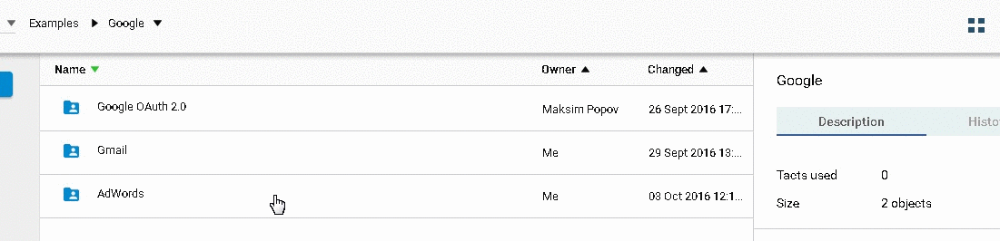
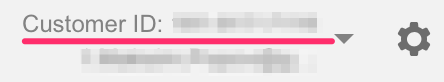
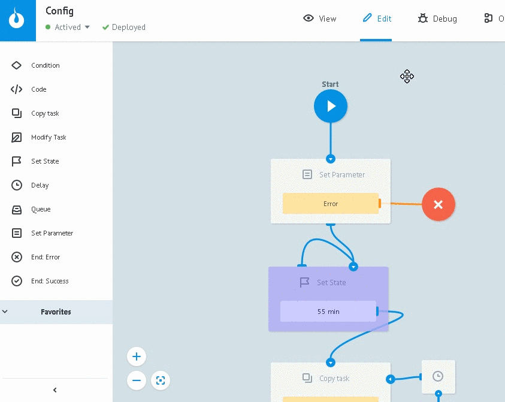

# AdWords

*   Start work with AdWords.
*   Getting developer's token
*   Getting Google OAuth 2.0 access_token
*   Setting up tokens in Config state diagram
*   Object description in AdWords folder

##Start work with AdWords

Copy [AdWords](https://admin.corezoid.com/folder/conv/105609) folder to your environment.

In order to work wth AdWords API you need account details and Google OAuth 2.0 token.

###Getting developer's token

Create your separate (control) account, get its ID and developer's token.

*   **clientCustomerId** - you account ID.

Copy it from upper right corner in AdWords account.

>You have to specify account ID where the companies run, not the control account ID, where you got the token.

*   **developerToken** - developer's token.

In order to get it, use [tutorial](https://developers.google.com/adwords/api/docs/signingup?hl=ru).

###Getting Google OAuth 2.0 access_token

**1)** Customize processes and get `access_token` as it was written in [OAuth authentication](oauth.md) section  with one difference in p.8:

>Create request to get access_token with **Reference = adwords**

**2)** Copy `State token` diagram ID from information block its start node.

You'll need this value later.

## Setting up tokens in Config state diagram

**1)** Go to `View` mode of [Config](https://admin.corezoid.com/editor/106173/164137) state diagram and press `New task`

**2)** Fill up next parameters:
* **Reference** = config
* **clientCustomerId** - you account ID
* **developerToken** - developer's token
* **state_diagram_id** - `State token` diagram ID Google OAuth 2.0 

**3)** Press `Add task`

Now all required parameters for autorization in AdWords API are set and ready for getiing their values from other processes.

##Description of objects in AdWords folder.

**State diagram [Config](https://admin.corezoid.com/editor/106173/164137)** - autorization data storage

____________

**Process [Get campaings](https://admin.corezoid.com/editor/106173/164143)** - getting companies list

There are no incoming parameters

Outcoming parameters "success":
* `array` - json array with request result

Outcoming parameters "error":
* `code` - error code

______________

**Process [Report](https://admin.corezoid.com/editor/106173/164138)** - getting [reports](https://developers.google.com/adwords/api/docs/appendix/reports/all-reports)

Incoming parameters:
* `reportType` - report type

Outcoming parameters "success":
* `array` - json array with request result

Outcoming parameters "error":
* `code` - error code

_______________

**Folder [AdGroupService](https://admin.corezoid.com/folder/conv/106171)** - ad group control

**Process [adGroup - GET by CampaignId](https://admin.corezoid.com/editor/106171/164140)** - getting ad group list by company ID

Incoming parameters:
* `CampaignId` - company id 

Outcoming parameters "success":
* `array` - json array with request result

Outcoming parameters "error":
* `code` - error code
* `faultstring` - error text

____________________

Folder **[AdGroupService](https://admin.corezoid.com/folder/conv/106171)** - ad group management

**Process [adGroup - UPDATE](https://admin.corezoid.com/editor/106171/164139)** - status change by ad group

Incoming parameters:
* `adGroupId` - group id
* `status` - group new status

Outcoming parameters "success":
* `result` - new status

Outcoming parameters "error":
* `code` - error code
* `faultstring` - error text

_________________

Folder **[AdGroupAdService](https://admin.corezoid.com/folder/conv/106172)** - ad management

**Process [AD - GET by AdGroupId](https://admin.corezoid.com/editor/106172/164142)** - getting ad list by ad group ID

Incoming parameters:
* `adGroupId` - group id

Outcoming parameters "success":
* `array` - json array with request result

Outcoming parameters "error":
* `code` - error code
* `faultstring` - error text

______________________

Folder **[AdGroupAdService](https://admin.corezoid.com/folder/conv/106172)** - ad management

**Process [AD - UPDATE](https://admin.corezoid.com/editor/106172/164141)** - status change by ad

Incoming parameters:
* `adGroupId` - group id
* `status` - ad new status
* `adId` -  ad id 

Outcoming parameters "success":
* `result` - new status

Outcoming parameters "error":
* `code` - error code
* `faultstring` - error text