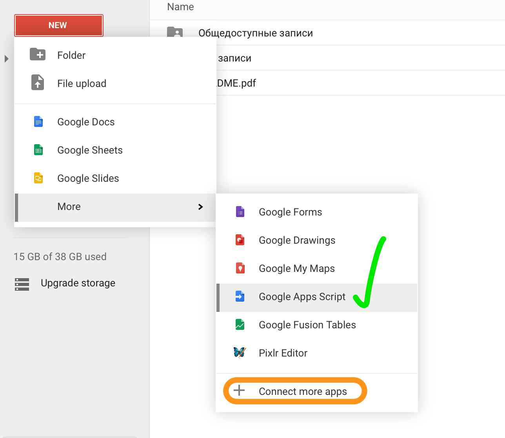
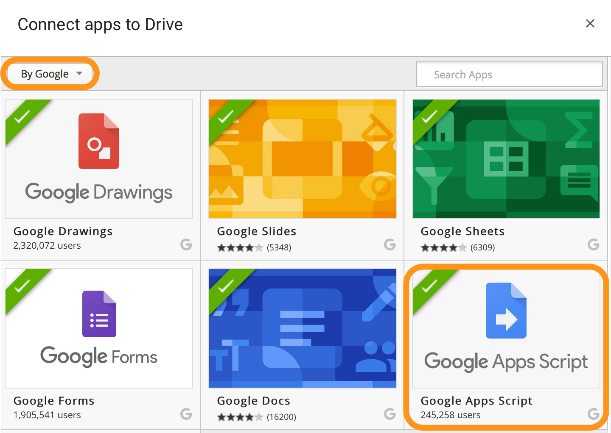

# AppScripts

Using [Google Apps Script](https://developers.google.com/apps-script/) it is possible to join to every Google service. For example:
*   [Fusion tables](fusion_tables.md)
*   [Sheets](sheets.md)

##How to connect Apps Script in Google Drive?

If you still don't have "Google Apps Script" in "New" menu, than you can add it by choosing "Connect more apps" in menu

And then choose "By Google" application filter in opened window and set "Google Apps Script".
