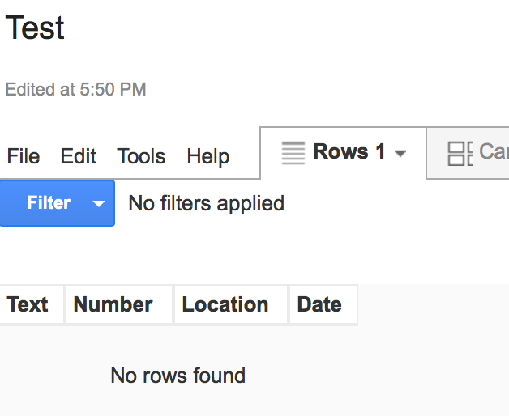
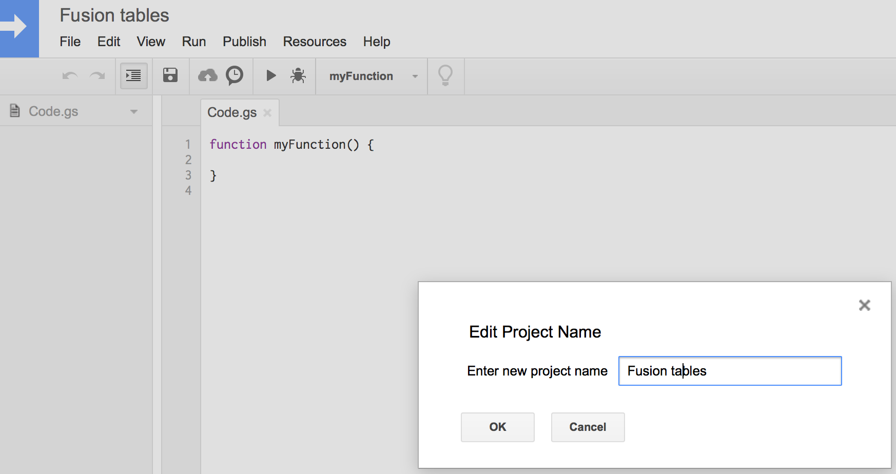
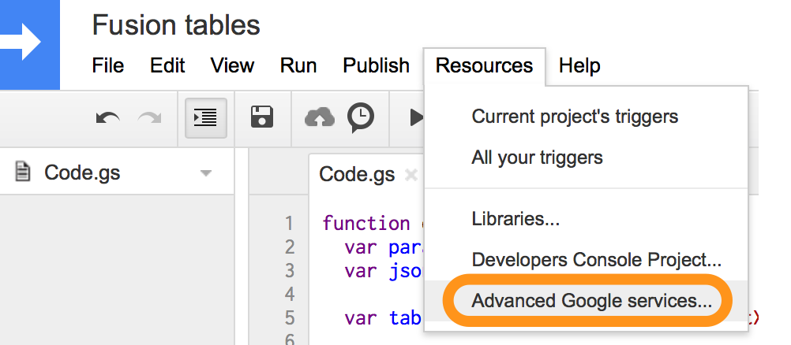
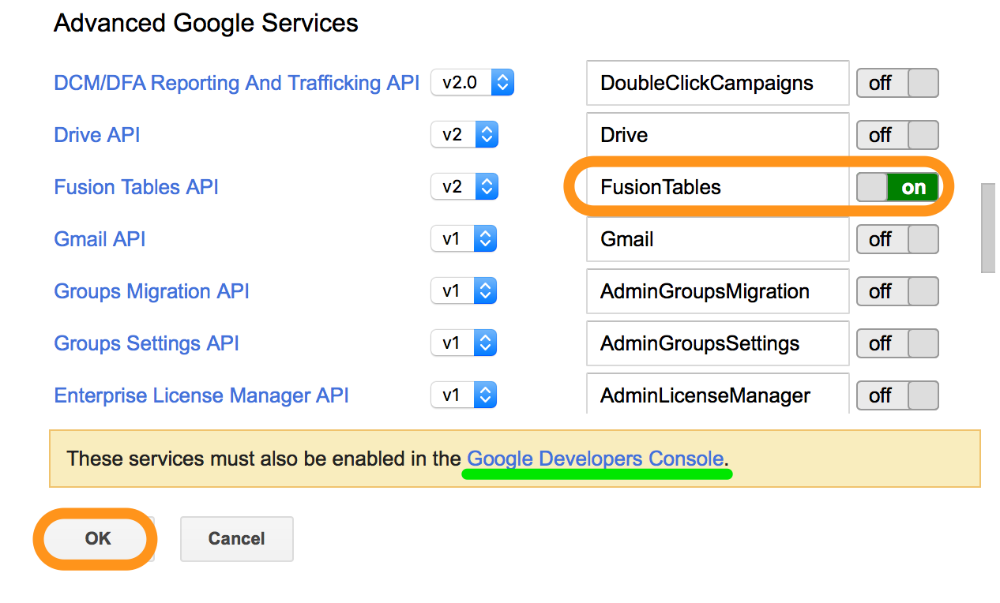
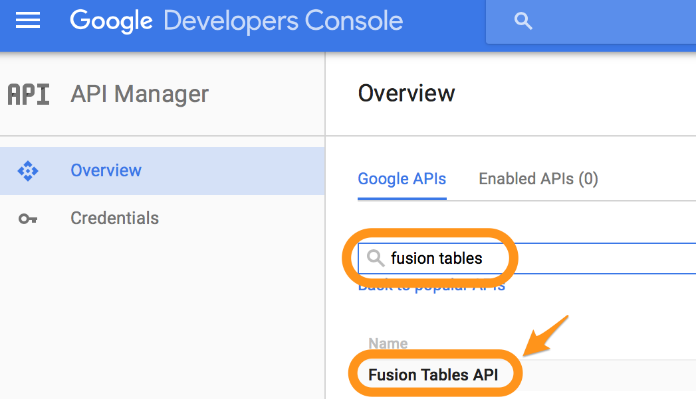
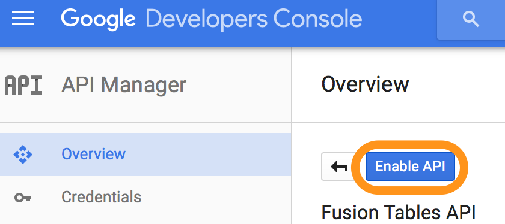
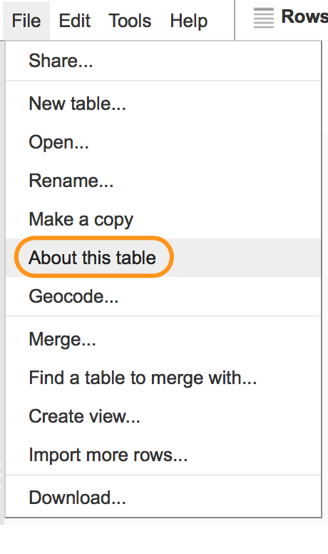
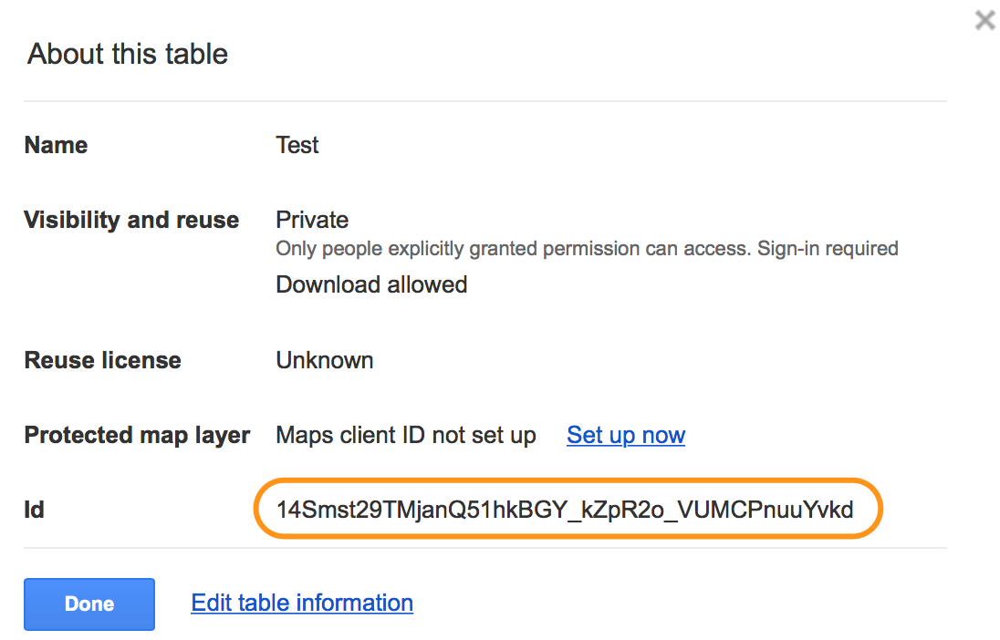

# Fusion Tables

Let's concider the example of saving data into Fusion tables :
*   Text
*   Number
*   Location
*   Date



For this we'll create [Google Apps Script](appscripts.md)


Immidiately rename project in "Fusion tables"


And turn on access to Fusion Tables from Google Apps Script




Additionaly it's neccessary to go to Google Developers Console and turn on API mode for Fusion Tables




After this, put the following code:
```js
function doPost(request) {

  var table = "Insert ID Table";

  var content = JSON.parse(request.postData.contents);

  var column = "";
  var value = "";
  for (var elem in content) {
    column += elem + ",";
    value += "'" + content[elem] + "',";
  }

  column = column.substr(0, column.length-1);
  value = value.substr(0, value.length-1);

  var sql = "INSERT INTO " + table
  + " ( " + column + ") "
  + " VALUES (" + value + ")";

  Logger.log(sql);

  var sqlResult = FusionTables.Query.sql(sql);

  var result = {"result":"ok"};

  return ContentService.createTextOutput(JSON.stringify(result))
    .setMimeType(ContentService.MimeType.JSON);
}
```

In variable value`table` replace text `Insert ID Table` by ID tables, which are required to copy as it shown below:



###Script publication

Now let's publish our code as web-application with access for all:


After publication  we have an access to URL, where we need to send JSON with data for save using POST method.


Names of the keys on JSON should match with Fusion Tables fields. In this particular case, JSON for sending to API will look the following way:
```json
{
  "Text":"d",
  "Number":1,
  "Location":24.5455545,
  "Date":"2016-01-01"
}
```
